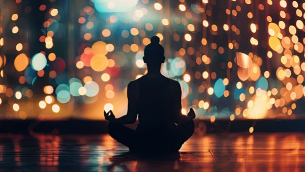

**\> Feeling burnt out? Subscribe to my [**Everyday Self-Care Newsletter**](https://seffsaid.com/newsletter/) for self-care tips and doable habits that support your well-being.**

If you are new to [affirmations](https://en.wikipedia.org/wiki/Affirmations_\(New_Age\)) you may be wondering what are normal affirmations, let alone powerful affirmations! Well, it is said that you are what you think. If you believe that you’re destined to fail, you probably will. Harboring negative emotions, even unconsciously, can affect and influence your actions and success. But if you believe you will be successful, you’ll be far more likely to achieve your goals, dreams, and desires.

An affirmation is a proven technique of [self-improvement](https://seffsaid.com/6-self-improvement-tips-that-will-change-your-life/). It is usually a phrase that you repeat regularly to make a declaration to yourself of your intention for it to be the truth and are a great way to tackle negative emotions and transform them into life-changing actions.

When you repeat affirmations over and over again something very special happens, you send a very clear message to your brain that the content of the affirmation is important to you. Once that happens, your subconscious will start finding ways to help you achieve your goals.

So don’t delay, begin constructing your future with the following 50 powerful affirmations that have the power to [change your life](https://seffsaid.com/5-simple-daily-habits-that-can-actually-change-your-life/) forever:

1.  I am enough.
2.  I am in charge of how I feel today, and I choose happiness.
3.  Every day I grow stronger and more resilient.
4.  I am worthy of achieving my dreams and deserve to live a fulfilling life.
5.  I easily see the lesson or the blessing in all that is.
6.  A river of compassion washes away my anger and replaces it with love.
7.  I am peaceful in my body, heart and soul.
8.  I am superior to negative thoughts and low actions.
9.  All is well in my world. Everything is working out for my highest good. Out of this situation only good will come. I am safe.
10.  I forgive those who have harmed me in my past and peacefully detach from them.
11.  My body is healthy; my mind is brilliant; my soul is tranquil.
12.  I am healthy, whole, and complete.
13.  As I say yes to life, life says yes to me.
14.  I possess the qualities needed to be extremely successful.
15.  Everything that is happening now is happening for the ultimate good.
16.  Creative energy surges through me and leads me to new and brilliant ideas.
17.  Today, I abandon my old habits and take up new, more positive ones.
18.  The point of power is always in the present moment.
19.  I press on because I believe in my path.
20.  I am courageous and I stand up for myself.
21.  My thoughts are filled with positivity and my life is plentiful with prosperity.
22.  Happiness is a choice. I base my happiness on my own accomplishments and the blessings I’ve been given.
23.  Many people look up to me and recognize my worth; I am admired.
24.  Every thought we think is creating our future.
25.  I now go beyond other people’s fears and limitations.
26.  Everything that is happening now is happening for my ultimate good.
27.  I am a powerhouse; I am indestructible.
28.  Though these times are difficult, they are only a short phase of life.
29.  I am deeply fulfilled by all that I do.
30.  My efforts are being supported by the universe; my dreams manifest into reality before my eyes.
31.  The perfect partner for me is coming into my life sooner than I expect.
32.  I trust the process of life.
33.  I am conquering my illness; I am defeating it steadily each day.
34.  I am at peace with all that has happened, is happening, and will happen.
35.  I wake up today with strength in my heart and clarity in my mind.
36.  I forgive myself and set myself free.
37.  My obstacles are moving out of my way; my path is carved towards greatness.
38.  I claim my power and move beyond all limitations.
39.  My life is just beginning.
40.  I am the architect of my life; I build its foundation and choose its contents.
41.  My ability to conquer my challenges is limitless; my potential to succeed is infinite.
42.  Today, I am brimming with energy and overflowing with joy.
43.  I radiate beauty, charm, and grace.
44.  I am blessed with an incredible family and wonderful friends.
45.  I have been given endless talents which I begin to utilise today.
46.  My fears of tomorrow are simply melting away.
47.  I acknowledge my own self-worth; my confidence is soaring.
48.  My nature is Divine; I am a spiritual being.
49.  My future is an ideal projection of what I envision now.
50.  I possess the strength to overcome any challenges that come my way.

## Final Thoughts

Affirmations, if used correctly, can help cultivate the necessary mindset to enable you to accomplish your dreams. So begin saying them, writing them down or even singing them several times a day and [start changing your life for the better](https://seffsaid.com/change-your-life-for-the-better/).

[Share](https://www.facebook.com/share.php?u=https%3A%2F%2Fseffsaid.com%2F50-powerful-affirmations-that-can-change-life%2F)

Pin1.28K

[Tweet](https://twitter.com/intent/tweet?text=Begin+constructing+your+future+today+with+these+50+powerful+affirmations+that+have+the+power+to+change+your+life+forever.&url=https%3A%2F%2Fseffsaid.com%2F50-powerful-affirmations-that-can-change-life%2F&via=SeffSaid)

[Reddit](https://www.reddit.com/submit?url=https%3A%2F%2Fseffsaid.com%2F50-powerful-affirmations-that-can-change-life%2F)

[Share](https://www.linkedin.com/cws/share?url=https%3A%2F%2Fseffsaid.com%2F50-powerful-affirmations-that-can-change-life%2F)

[More](#)

1.28K Shares
