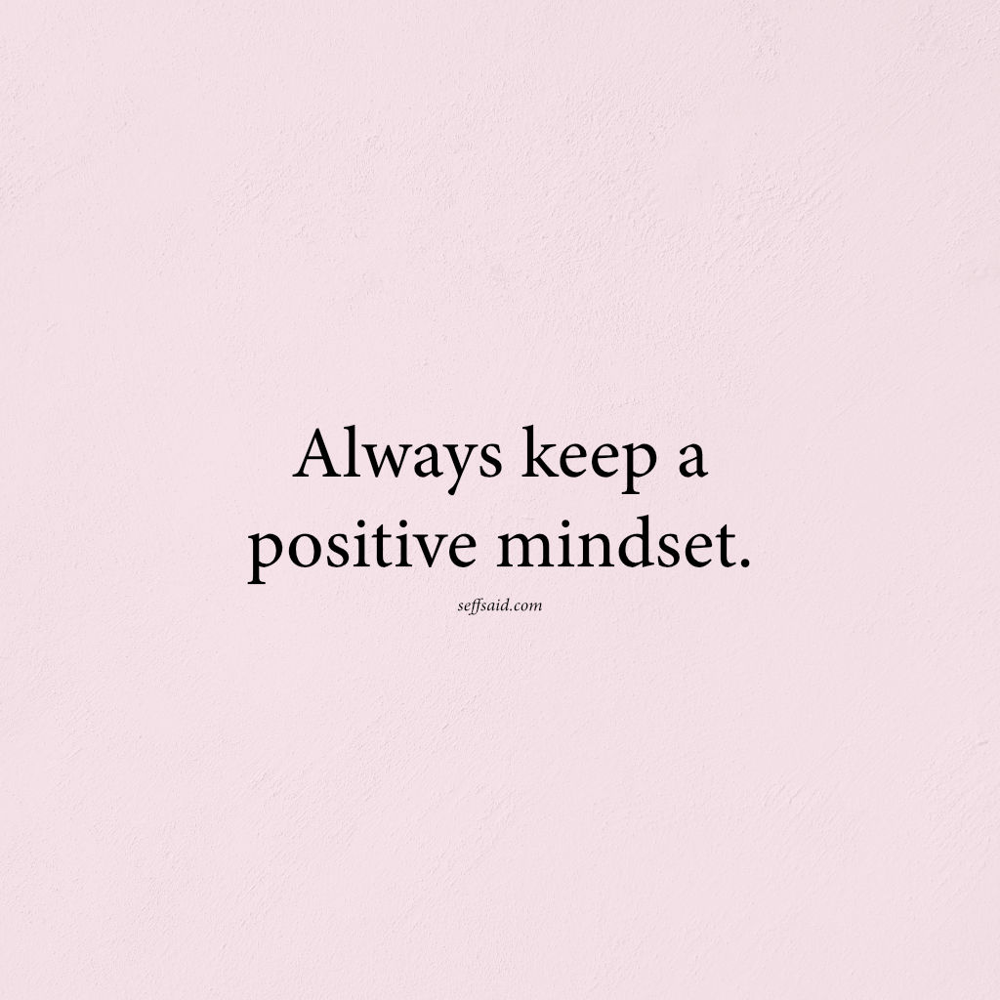

**\> Feeling burnt out? Subscribe to my [**Everyday Self-Care Newsletter**](https://seffsaid.com/newsletter/) for self-care tips and doable habits that support your well-being.**

## Always Keep A Positive Mindset

The quote “Always keep a positive mindset” is a piece of advice emphasizing the importance of maintaining an optimistic and hopeful attitude regardless of the circumstances. Here’s a breakdown of its meaning:

1.  **Always**: This word suggests consistency and persistence. It implies that one should strive to maintain a positive mindset at all times, not just in easy or favorable situations.
2.  **Keep**: This indicates an active, ongoing effort. It’s not just about having a positive mindset but actively working to sustain it.
3.  **A positive mindset**: A positive mindset is a way of thinking that focuses on the good aspects of situations, expects positive outcomes, and approaches challenges with a can-do attitude. It involves seeing opportunities in difficulties, staying hopeful in the face of adversity, and maintaining a general outlook of optimism.

The underlying message of the quote is that consistently nurturing a positive attitude can significantly influence one’s overall experience of life. It can affect how one handles challenges, interacts with others, and perceives events. A positive mindset is often linked with increased happiness, better stress management, and even improved health outcomes.

[Share](https://www.facebook.com/share.php?u=https%3A%2F%2Fseffsaid.com%2Falways-keep-a-positive-mindset%2F)

[Pin1](https://pinterest.com/pin/create/button/?url=https://seffsaid.com/always-keep-a-positive-mindset/&media=https%3A%2F%2Fseffsaid.com%2Fwp-content%2Fuploads%2FAlways-keep-a-positive-mindset.jpg&description=Discover+the+transformative+power+of+optimism+with+our+page+dedicated+to+the+quote+-+Always+keep+a+positive+mindset.+via+%40SeffSaid)

[Tweet](https://twitter.com/intent/tweet?text=Always+Keep+A+Positive+Mindset&url=https%3A%2F%2Fseffsaid.com%2Falways-keep-a-positive-mindset%2F&via=SeffSaid)

[Reddit](https://www.reddit.com/submit?url=https%3A%2F%2Fseffsaid.com%2Falways-keep-a-positive-mindset%2F)

[Share](https://www.linkedin.com/cws/share?url=https%3A%2F%2Fseffsaid.com%2Falways-keep-a-positive-mindset%2F)

[More](#)

1 Shares
