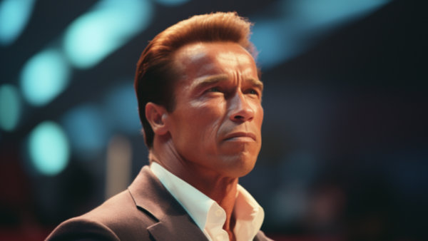

**\> Feeling burnt out? Subscribe to my [**Everyday Self-Care Newsletter**](https://seffsaid.com/newsletter/) for self-care tips and doable habits that support your well-being.**

Welcome to a compilation of The 86 Best Arnold Schwarzenegger Quotes, a collection that showcases his unique blend of humor, determination, [perseverance](https://seffsaid.com/quotes-about-perseverance/), philosophy, strength, ambition, and an extraordinary perspective on life and success. These quotes are not just words; they are reflections of a man who turned dreams into reality, showing what you can achieve with relentless drive and confidence.

From his early days as a bodybuilder to his illustrious film career and political endeavors, Schwarzenegger’s quotes inspire and motivate. Among these words, you’ll also find some [rare quotes](https://seffsaid.com/rare-inspirational-quotes/) that encapsulate his bold approach to life’s challenges and opportunities. This collection serves as a reminder of how attitude, hard work, and self-belief can shape one’s destiny, and you may find yourself inspired to pursue your goals with a bit more of Schwarzenegger’s legendary tenacity and vision.

1.  “Trust yourself, no matter what anyone else thinks.” – Arnold Schwarzenegger
2.  “The last three or four reps is what makes the muscle grow.” – Arnold Schwarzenegger
3.  “I always stay hungry, never satisfied with current accomplishments.” – Arnold Schwarzenegger
4.  “I am a big believer in hard work, grinding it out, and not stopping until it’s done.” – Arnold Schwarzenegger
5.  “The better you get, the less you run around showing off as a muscle guy. You know, you wear regular shirts.” – Arnold Schwarzenegger
6.  “What we face may look insurmountable. But I learned something from all those years of training and competing. I learned something from all those sets and reps when I didn’t think I could lift another ounce of weight. What I learned is that we are always stronger than we know.” – Arnold Schwarzenegger
7.  “Your clothes. Give them to me, now.” – Arnold Schwarzenegger
8.  “The pain you feel today will be the strength you feel tomorrow.” – Arnold Schwarzenegger
9.  “It’s not what you get out of life that counts. Break your mirrors! In our society, that is so self-absorbed, begin to look less at yourself and more at each other. Learn more about the face reflected in your fellow man’s mirror than your own.” – Arnold Schwarzenegger
10.  “The mind is the most important thing. Visualize what you want. Think about it all the time. Then go and get it!” – Arnold Schwarzenegger
11.  “You have to remember that the hard times are what shape you.” – Arnold Schwarzenegger
12.  “You can’t be afraid of failing. It’s the only way you succeed—you’re not gonna succeed all the time, and I know that.” – Arnold Schwarzenegger
13.  “If you don’t believe in yourself, then how will anyone else believe in you?” – Arnold Schwarzenegger
14.  “I’ve always been interested in people who are not satisfied with the status quo, who want to see things go further.” – Arnold Schwarzenegger
15.  “Life may be full of pain, but that’s not an excuse to give up.” – Arnold Schwarzenegger
16.  “You can’t climb the ladder of success with the costume of failure.” – Arnold Schwarzenegger
17.  “The most satisfying feeling you can get in the gym is the pump.” – Arnold Schwarzenegger
18.  “Determination, hard work, and a little luck is all you need to move ahead in this world.” – Arnold Schwarzenegger
19.  “If you want to turn a vision into reality, you have to give 100% and never stop believing in your dream.” – Arnold Schwarzenegger
20.  “Never let pride get in your way.” – Arnold Schwarzenegger
21.  “There are no shortcuts—everything is reps, reps, reps.” – Arnold Schwarzenegger
22.  “You have to think big to be big.” – Arnold Schwarzenegger
23.  “No matter what you do in life, selling is part of it.” – Arnold Schwarzenegger
24.  “Just because you’re paranoid doesn’t mean they aren’t after you.” – Arnold Schwarzenegger
25.  “I don’t walk away from things—I run as fast as I can.” – Arnold Schwarzenegger
26.  “Every morning you have two choices: continue to sleep with your dreams, or wake up and chase them.” – Arnold Schwarzenegger
27.  “The key to success is to keep growing in all areas of life – mental, emotional, spiritual, as well as physical.” – Arnold Schwarzenegger
28.  “I like the color red because it’s a fire. And I see myself as always being on fire.” – Arnold Schwarzenegger
29.  “The bigger your challenges, the bigger your opportunity for growth.” – Arnold Schwarzenegger
30.  “If it can bleed, we can kill it.” – Arnold Schwarzenegger
31.  “I don’t walk away from things that I think are unfinished.” – Arnold Schwarzenegger
32.  “I don’t suffer of anything that I’ve lost.” – Arnold Schwarzenegger
33.  “I live by the principle that [nothing is impossible](https://seffsaid.com/nothing-is-impossible-quotes/).” – Arnold Schwarzenegger
34.  “We all have great inner power. The power is self-faith. There’s really an attitude to winning.” – Arnold Schwarzenegger
35.  “If it’s hard to remember, it’ll be difficult to forget.” – Arnold Schwarzenegger
36.  “The mind is absolutely instrumental in achieving results, even for athletes.” – Arnold Schwarzenegger
37.  “The more you give, the more you get. When you go all out, you always get back more than you gave.” – Arnold Schwarzenegger
38.  “Just like in bodybuilding, failure is also a necessary experience for growth in our own lives, for if we’re never tested to our limits, how will we know how strong we really are? How will we ever grow?” – Arnold Schwarzenegger
39.  “I welcome and seek your ideas, but do not bring me small ideas; bring me big ideas to match our future.” – Arnold Schwarzenegger
40.  “Leave no stone unturned.” – Arnold Schwarzenegger
41.  “I’m addicted to exercising and I have to do something every day.” – Arnold Schwarzenegger
42.  “I feel good because I believe I have made progress in rebuilding the people’s trust in their government.” – Arnold Schwarzenegger
43.  “To those critics who are so pessimistic about our economy, I say: Don’t be economic girlie men!” – Arnold Schwarzenegger
44.  “I am the most helpful and open up doors for everyone and I like to share.” – Arnold Schwarzenegger
45.  “I have a love interest in every one of my films: a gun.” – Arnold Schwarzenegger
46.  “If you don’t find the time, if you don’t do the work, you don’t get the results.” – Arnold Schwarzenegger
47.  “I never felt that I was very talented; I felt that I was very ambitious.” – Arnold Schwarzenegger
48.  “You can’t be paralyzed by fear of failure or you will never push yourself.” – Arnold Schwarzenegger
49.  “I’m not looking for sympathy at all.” – Arnold Schwarzenegger
50.  “I saw a woman wearing a sweatshirt with ‘Guess’ on it. I said, ‘Thyroid problem?'” – Arnold Schwarzenegger
51.  “For me life is about continuously being hungry. The meaning of life is not simply to exist, to survive, but to move ahead, to go up, to achieve, to conquer.” – Arnold Schwarzenegger
52.  “I was striving to be the most muscular man, and it got me into the movies. It got me everything that I have.” – Arnold Schwarzenegger
53.  “I think that gay marriage should be between a man and a woman.” – Arnold Schwarzenegger
54.  “My body is like breakfast, lunch, and dinner. I don’t think about it, I just have it.” – Arnold Schwarzenegger
55.  “You have to think outside the box. That’s what I did. And it worked.” – Arnold Schwarzenegger
56.  “It’s simple, if it jiggles, it’s fat.” – Arnold Schwarzenegger
57.  “The worst thing I can be is the same as everybody else. I hate that.” – Arnold Schwarzenegger
58.  “Strength does not come from winning. Your struggles develop your strengths.” – Arnold Schwarzenegger
59.  “For me, life is continuously being hungry. The meaning of life is not simply to exist, to survive, but to move ahead, to go up, to achieve, to conquer.” – Arnold Schwarzenegger
60.  “Failure is not an option. Everyone has to succeed.” – Arnold Schwarzenegger
61.  “What is the point of being on this Earth if you are going to be like everyone else?” – Arnold Schwarzenegger
62.  “You can’t climb the ladder of success with your hands in your pockets.” – Arnold Schwarzenegger
63.  “The mind is the limit. As long as the mind can envision the fact that you can do something, you can do it.” – Arnold Schwarzenegger
64.  “I never listen to the naysayers.” – Arnold Schwarzenegger
65.  “You have to remember something: Everybody pities the weak; jealousy you have to earn.” – Arnold Schwarzenegger
66.  “The more knowledge you have, the more you’re free to rely on your instincts.” – Arnold Schwarzenegger
67.  “Dreams are for dreamers. Goals are for achievers.” – Arnold Schwarzenegger
68.  “I do not like to fail. I like to succeed.” – Arnold Schwarzenegger
69.  “When you go through hardships and decide not to surrender, that is strength.” – Arnold Schwarzenegger
70.  “Money doesn’t make you happy. I now have $50 million but I was just as happy when I had $48 million.” – Arnold Schwarzenegger
71.  “Bodybuilding is much like any other sport. To be successful, you must dedicate yourself 100% to your training, diet and mental approach.” – Arnold Schwarzenegger
72.  “If you work hard and play by the rules, this country is truly open to you. You can achieve anything.” – Arnold Schwarzenegger
73.  “The resistance that you fight physically in the gym and the resistance that you fight in life can only build a strong character.” – Arnold Schwarzenegger
74.  “To be successful, however, you must be brutal with yourself and focus on the flaws.” – Arnold Schwarzenegger
75.  “Positive thinking can be contagious. Being surrounded by winners helps you develop into a winner.” – Arnold Schwarzenegger
76.  “The mind is the limit. As long as the mind can envision that you can do something, you can do it.” – Arnold Schwarzenegger
77.  “Help others and give something back. I guarantee you will discover that while public service improves the lives and the world around you, its greatest reward is the enrichment and new meaning it will bring your own life.” – Arnold Schwarzenegger
78.  “Just remember, you can’t climb the ladder of success with your hands in your pockets.” – Arnold Schwarzenegger
79.  “You’ll get more from being a peacemaker than a [warrior](https://seffsaid.com/unleashing-your-inner-warrior/).” – Arnold Schwarzenegger
80.  “I knew I was a winner back in the late sixties. I knew I was destined for great things.” – Arnold Schwarzenegger
81.  “I’ll be back.” – Arnold Schwarzenegger
82.  “Milk is for babies. When you grow up you have to drink beer.” – Arnold Schwarzenegger
83.  “The best activities for your health are pumping and humping.” – Arnold Schwarzenegger
84.  “I was always dreaming about very powerful people – dictators and things like that. I was just always impressed by people who could be remembered for hundreds of years, or even, like Jesus, be for thousands of years remembered.” – Arnold Schwarzenegger
85.  “You can have results or excuses. Not both.” – Arnold Schwarzenegger
86.  “Start wide, expand further, and never look back.” – Arnold Schwarzenegger

[Share](https://www.facebook.com/share.php?u=https%3A%2F%2Fselfsaid.30tools.com%2Farnold-schwarzenegger-quotes%2F)

[Pin4](https://pinterest.com/pin/create/button/?url=https://seffsaid.com/arnold-schwarzenegger-quotes/&media=https%3A%2F%2Fselfsaid.30tools.com%2Fwp-content%2Fuploads%2Farnold-schwarzenegger-quotes-PIN.jpg&description=Discover+the+power+of+determination+with+86+of+the+best+Arnold+Schwarzenegger+Quotes.+Get+both+inspired+and+motivated+today%21+via+%40SeffSaid)

[Tweet](https://twitter.com/intent/tweet?text=Discover+the+power+of+determination+with+86+of+the+best+Arnold+Schwarzenegger+Quotes.+Get+both+inspired+and+motivated+today%21&url=https%3A%2F%2Fselfsaid.30tools.com%2Farnold-schwarzenegger-quotes%2F&via=SeffSaid)

[Reddit](https://www.reddit.com/submit?url=https%3A%2F%2Fselfsaid.30tools.com%2Farnold-schwarzenegger-quotes%2F)

[Share](https://www.linkedin.com/cws/share?url=https%3A%2F%2Fselfsaid.30tools.com%2Farnold-schwarzenegger-quotes%2F)

[More](#)

4 Shares
