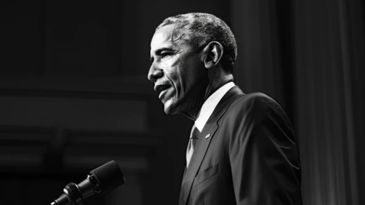

**\> Feeling burnt out? Subscribe to my [**Everyday Self-Care Newsletter**](https://seffsaid.com/newsletter/) for self-care tips and doable habits that support your well-being.**

Barack Obama, the 44th President of the United States, has inspired many with his words, leadership, and vision for a better future. This collection of 60 inspiring quotes by Obama offers a glimpse into his perspective on change, hope, and the power of community.

If you’re looking for a dose of inspiration or a new way to think about the challenges we face, these quotes are a valuable resource. They remind us that with perseverance, understanding, and a collective effort, positive change is within our reach.

1.  “Change will not come if we wait for some other person or some other time. We are the ones we’ve been waiting for. We are the change that we seek.” – Barack Obama
2.  “The best way to not feel hopeless is to get up and do something. Don’t wait for good things to happen to you. If you go out and make some good things happen, you will fill the world with hope, you will fill yourself with hope.” – Barack Obama
3.  “Yes, we can.” – Barack Obama
4.  “We are the change we have been waiting for.” – Barack Obama
5.  “Hope is the bedrock of this nation; the belief that our destiny will not be written for us, but by us.” – Barack Obama
6.  “If you’re walking down the right path and you’re willing to keep walking, eventually you’ll make progress.” – Barack Obama
7.  “In the unlikely story that is America, there has never been anything false about hope.” – Barack Obama
8.  “Money is not the only answer, but it makes a difference.” – Barack Obama
9.  “We didn’t come here to fear the future. We came here to shape it.” – Barack Obama
10.  “Change is never easy, but always possible.” – Barack Obama
11.  “Our destiny is not written for us, but by us.” – Barack Obama
12.  “The future rewards those who press on. I don’t have time to feel sorry for myself. I don’t have time to complain. I’m going to press on.” – Barack Obama
13.  “Democracy cannot work without compromise, but it also can’t work without conviction.” – Barack Obama
14.  “We need to internalize this idea of excellence. Not many folks spend a lot of time trying to be excellent.” – Barack Obama
15.  “No one is pro-abortion.” – Barack Obama
16.  “Making your mark on the world is hard. If it were easy, everybody would do it. But it’s not. It takes patience, it takes commitment, and it comes with plenty of failure along the way.” – Barack Obama
17.  “The cynics may be the loudest voices – but I promise you, they will accomplish the least.” – Barack Obama
18.  “It’s not whether you get knocked down, it’s whether you get up.” – Barack Obama
19.  “A change is brought about because ordinary people do extraordinary things.” – Barack Obama
20.  “We are not as divided as our politics suggests. We’re not as cynical as the pundits believe. We are greater than the sum of our individual ambitions, and we remain more than a collection of red states and blue states.” – Barack Obama
21.  “There’s not a liberal America and a conservative America – there’s the United States of America.” – Barack Obama
22.  “What we have already achieved gives us hope – the audacity to hope – for what we can and must achieve tomorrow.” – Barack Obama
23.  “The true test of leadership is how well you function in a crisis.” – Barack Obama
24.  “We did not come to fear the future. We came here to shape it.” – Barack Obama
25.  “Our journey is not complete until our gay brothers and sisters are treated like anyone else under the law.” – Barack Obama
26.  “Empathy is a quality of character that can change the world.” – Barack Obama
27.  “To be successful, you must be willing to, at any moment, sacrifice what you are, for what you will become.” – Barack Obama
28.  “When times get tough, we don’t give up. We get up.” – Barack Obama
29.  “The true strength of our nation comes not from the might of our arms or the scale of our wealth, but from the enduring power of our ideals: democracy, liberty, opportunity, and unyielding hope.” – Barack Obama
30.  “We cannot solve our problems with the same thinking we used when we created them.” – Barack Obama
31.  “Focusing your life solely on making a buck shows a certain poverty of ambition. It asks too little of yourself. Because it’s only when you hitch your wagon to something larger than yourself that you realize your true potential.” – Barack Obama
32.  “I believe that every single one of us has a responsibility to get involved and try to make a difference in the world, and if you try to do that, I guarantee you will find that satisfaction of spirit that comes from knowing that you are trying to make the world a better place.” – Barack Obama
33.  “The Audacity of Hope” is not just the title of a book; it’s a feeling that we can and will make a difference.” – Barack Obama
34.  “Our stories may be singular, but our destination is shared.” – Barack Obama
35.  “We are our brother’s keeper. We are our sister’s keeper.” – Barack Obama
36.  “We need to keep making our streets safer and our criminal justice system fairer; our homeland more secure, our world more peaceful and sustainable for the next generation.” – Barack Obama
37.  “One voice can change a room, and if one voice can change a room, then it can change a city, and if it can change a city, it can change a state, and if it can change a state, it can change a nation, and if it can change a nation, it can change the world.” – Barack Obama
38.  “Let us be our brother’s keeper, Scripture tells us. Let us be our sister’s keeper. Let us find that common stake we all have in one another, and let our politics reflect that spirit as well.” – Barack Obama
39.  “I’m asking you to believe. Not in my ability to create change — but in yours.” – Barack Obama
40.  “We can’t help everyone, but everyone can help someone.” – Barack Obama
41.  “America is not the project of any one person. The single most powerful word in our democracy is the word ‘We.’ ‘We the People.’ ‘We shall overcome.'” – Barack Obama
42.  “You can’t let your failures define you. You have to let your failures teach you.” – Barack Obama
43.  “It was the labor movement that helped secure so much of what we take for granted today. The 40-hour work week, the minimum wage, family leave, health insurance, Social Security, Medicare, retirement plans. The cornerstones of the middle-class security all bear the union label.” – Barack Obama
44.  “Each of us has the freedom to make of our own lives what we will, but we also have the obligation to treat each other with kindness, respect, and compassion.” – Barack Obama
45.  “Let’s be clear: Islam is not our adversary. Muslims are peaceful and tolerant people and have nothing whatsoever to do with terrorism.” – Barack Obama
46.  “Reading is the gateway skill that makes all other learning possible.” – Barack Obama
47.  “You can’t separate peace from freedom because no one can be at peace unless he has his freedom.” – Barack Obama
48.  “The strongest families are built on the foundation of love, trust, and patience.” – Barack Obama
49.  “We need to steer clear of this poverty of ambition, where people want to drive fancy cars and wear nice clothes and live in nice apartments but don’t want to work hard to accomplish these things. Everyone should try to realize their full potential.” – Barack Obama
50.  “Our greatness is grounded in who we are, in our history, in our diversity, in our tolerance, in our ideals, and our determination to fight on even when the odds are against us.” – Barack Obama
51.  “I’m convinced that most people want to do what’s right and, most of the time, they’re trying to figure out how.” – Barack Obama
52.  “We’ve been through tough times, but we always come out the other side, better, stronger, more united as a nation.” – Barack Obama
53.  “Justice grows out of recognition of ourselves in each other. My liberty depends on you being free, too.” – Barack Obama
54.  “Let us remember: One book, one pen, one child, and one teacher can change the world.” – Barack Obama
55.  “The true mark of maturity is when somebody hurts you and you try to understand their situation instead of trying to hurt them back.” – Barack Obama
56.  “We have a responsibility to join together on behalf of the world we seek, a world where extremists no longer threaten our people, and American troops have come home; a world where Israelis and Palestinians are each secure in a state of their own, and nuclear energy is used for peaceful purposes; a world where governments serve their citizens, and the rights of all God’s children are respected.” – Barack Obama
57.  “If you’re walking the right path and you’re willing to keep walking, eventually you’ll make progress.” – Barack Obama
58.  “We see ourselves in each other, in our victories and in our vulnerabilities, in our hopes and in our fears.” – Barack Obama
59.  “To all who serve or have served, we salute you – not only on Veterans Day but every day.” – Barack Obama
60.  “In America, we don’t let our differences tear us apart. Not because we don’t have differences, but because we know that we’re stronger together than we are on our own.” – Barack Obama

[Share](https://www.facebook.com/share.php?u=https%3A%2F%2Fselfsaid.30tools.com%2Fbarack-obama-quotes%2F)

[Pin2](https://pinterest.com/pin/create/button/?url=https://seffsaid.com/barack-obama-quotes/&media=https%3A%2F%2Fselfsaid.30tools.com%2Fwp-content%2Fuploads%2Fbarack-obama-quotes-PIN.jpg&description=Elevate+your+day+with+Barack+Obama%27s+60+most+memorable+and+inspiring+quotes.+via+%40SeffSaid)

[Tweet](https://twitter.com/intent/tweet?text=60+Inspiring+Quotes+by+Barack+Obama&url=https%3A%2F%2Fselfsaid.30tools.com%2Fbarack-obama-quotes%2F&via=SeffSaid)

[Reddit](https://www.reddit.com/submit?url=https%3A%2F%2Fselfsaid.30tools.com%2Fbarack-obama-quotes%2F)

[Share](https://www.linkedin.com/cws/share?url=https%3A%2F%2Fselfsaid.30tools.com%2Fbarack-obama-quotes%2F)

[More](#)

2 Shares
