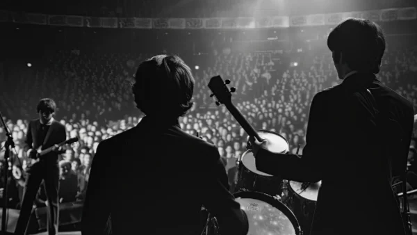

**\> Feeling burnt out? Subscribe to my [**Everyday Self-Care Newsletter**](https://seffsaid.com/newsletter/) for self-care tips and doable habits that support your well-being.**

The Beatles were not just musical innovators and cultural icons; they also had a way with words, offering insights that were sometimes humorous, often insightful, and always memorable. Whether it was [John Lennon’s reflections on life and peace](https://seffsaid.com/john-lennon-quotes/), [Paul McCartney’s quotes](https://seffsaid.com/paul-mccartney-quotes/) on love and creativity, [George Harrison’s spiritual wisdom](https://seffsaid.com/george-harrison-quotes/), or [Ringo Starr’s unique take on life, love, and music](https://seffsaid.com/ringo-starr-quotes/), each member of the band contributed to a rich legacy of quotes that continue to inspire and entertain fans around the world.

This collection of Beatles quotes goes beyond their lyrics to explore the thoughts and philosophies of these legendary musicians on a variety of topics. From the power of love to the importance of peace, and the value of living in the moment, these quotes show that The Beatles had much to say about life, and they said it well. Whether you’re a lifelong fan or someone just discovering the magic of The Beatles, these quotes will give you a closer look at the men behind the music and the wisdom they shared with the world. So, if you’re ready to see what John, Paul, George, and Ringo had to say, read on and find some inspiration from the Fab Four.

## 100 Beatles Quotes

1.  “Life is what happens when you’re busy making other plans.” – John Lennon
2.  “Time you enjoy wasting, was not wasted.” – John Lennon
3.  “We’re more popular than Jesus now; I don’t know which will go first – rock ‘n’ roll or Christianity.” – John Lennon
4.  “Reality leaves a lot to the imagination.” – John Lennon
5.  “A dream you dream alone is only a dream. A dream you dream together is reality.” – John Lennon
6.  “When you do something noble and beautiful and nobody noticed, do not be sad. For the sun every morning is a beautiful spectacle and yet most of the audience still sleeps.” – John Lennon
7.  “Peace is not something you wish for; it’s something you make, something you do, something you are, and something you give away!” – John Lennon
8.  “If everyone demanded peace instead of another television set, then there’d be peace.” – John Lennon
9.  “Life is very short, and there’s no time for fussing and fighting, my friend.” – Paul McCartney
10.  “And in the end, the love you take is equal to the love you make.” – Paul McCartney
11.  “I don’t work at being ordinary.” – Paul McCartney
12.  “Think globally, act locally.” – Paul McCartney
13.  “If slaughterhouses had glass walls, everyone would be a vegetarian.” – Paul McCartney
14.  “You can judge a man’s true character by the way he treats his fellow animals.” – Paul McCartney
15.  “It’s also not unusual for writers to look backward. Because that’s your pool of resources.” – Paul McCartney
16.  “I’ve got to admit it’s getting better. It’s a little better all the time.” – Paul McCartney
17.  “With our love, we could save the world.” – George Harrison
18.  “All the world is birthday cake, so take a piece, but not too much.” – George Harrison
19.  “It’s all in the mind.” – George Harrison
20.  “The Beatles saved the world from boredom.” – George Harrison
21.  “As long as you hate, there will be people to hate.” – George Harrison
22.  “Try to realize it’s all within yourself, no one else can make you change.” – George Harrison
23.  “The world is ready for a mystic revolution, a discovery of the God in each of us.” – George Harrison
24.  “Sometimes I feel like I’m actually on the wrong planet, and it’s great when I’m in my garden, but the minute I go out the gate I think, ‘What the hell am I doing here?'” – George Harrison
25.  “I got my mind set on you.” – George Harrison
26.  “Ringo isn’t the best drummer in the world… He’s not even the best drummer in The Beatles.” – John Lennon (Note: This quote is often attributed to John Lennon, but its authenticity is disputed and may be apocryphal.)
27.  “I get by with a little help from my friends.” – Ringo Starr
28.  “Everything government touches turns to crap.” – Ringo Starr
29.  “I’m a musician. I’m not really good at posing and being a model, like, ‘Look at me.'” – Ringo Starr
30.  “At the end of the day, I can end up just totally wacky, because I’ve made mountains out of molehills. With meditation, I can keep them as molehills.” – Ringo Starr
31.  “I don’t want to spend the rest of my life being a Beatle.” – Ringo Starr
32.  “I think the most exciting thing is that you expect people our age to know the music, but actually a lot of kids know the music, and if anything is left, we have left really good music, and that’s the important part, not the mop-tops or whatever.” – Ringo Starr
33.  “Peace and love, peace and love!” – Ringo Starr
34.  “I feel the older I get, the more I’m learning to handle life. Being on this quest for a long time, it’s all about finding yourself.” – Ringo Starr
35.  “The Beatles will go on and on.” – George Harrison
36.  “To discover the light within, it’s important to go through the darkness.” – George Harrison
37.  “Trying to please everybody is impossible – if you did that, you’d end up in the middle with nobody liking you. You’ve just got to make the decision about what you think is your best, and do it.” – John Lennon
38.  “Everybody loves you when you’re six foot in the ground.” – John Lennon
39.  “Music is everybody’s possession. It’s only publishers who think that people own it.” – John Lennon
40.  “One thing you can’t hide – is when you’re crippled inside.” – John Lennon
41.  “Limitless undying love which shines around me like a million suns, it calls me on and on across the universe.” – John Lennon
42.  “There’s nowhere you can be that isn’t where you’re meant to be…” – John Lennon
43.  “You don’t need anybody to tell you who you are or what you are. You are what you are!” – John Lennon
44.  “We all shine on, like the moon, and the stars, and the sun.” – John Lennon
45.  “The more I see, the less I know for sure.” – John Lennon
46.  “Only by trying to live in peace can we build a peaceful world.” – John Lennon
47.  “I’m not going to change the way I look or the way I feel to conform to anything. I’ve always been a freak. So I’ve been a freak all my life and I have to live with that, you know. I’m one of those people.” – John Lennon
48.  “Happiness is just how you feel when you don’t feel miserable.” – John Lennon
49.  “You either get tired fighting for peace, or you die.” – John Lennon
50.  “War is over, if you want it.” – John Lennon
51.  “The love you take is equal to the love you make.” – Paul McCartney
52.  “I used to think anyone doing anything weird was weird. Now I know that it is the people that call others weird that are weird.” – Paul McCartney
53.  “I don’t ever try to make a serious social comment.” – Paul McCartney
54.  “In the end, the love you get is equal to the love you give.” – Paul McCartney
55.  “Sometimes the biggest problem is in your head. You’ve got to believe you can play a shot instead of wondering where your next bad shot is coming from.” – Paul McCartney
56.  “I don’t take me seriously. If we get some giggles, I don’t mind.” – Paul McCartney
57.  “Love is all you need.” – Paul McCartney
58.  “You can’t reheat a soufflé.” – Paul McCartney
59.  “I’ve often been accused of being in love with my own voice.” – Paul McCartney
60.  “It’s a fine line between being private and being ashamed.” – Paul McCartney
61.  “For me, the Beatles are proof of the existence of God.” – Rick Rubin (about The Beatles)
62.  “The nicest thing is to open the newspapers and not to find yourself in them.” – George Harrison
63.  “The biggest break in my career was getting into the Beatles in 1962. The second biggest break since then is getting out of them.” – George Harrison
64.  “Gossip is the Devil’s radio.” – George Harrison
65.  “It’s all too much.” – George Harrison
66.  “The Beatles will exist without us.” – George Harrison
67.  “After all is said and done, you’ll be remembered for what you’ve done, not for what you’ve accumulated.” – George Harrison
68.  “The world used us as an excuse to go mad.” – George Harrison
69.  “It’s being here now that’s important. There’s no past and there’s no future. Time is a very misleading thing. All there is ever, is the now.” – George Harrison
70.  “The Beatles gave the British a feeling of pride.” – George Harrison
71.  “Don’t pass me by, don’t make me cry, don’t make me blue.” – Ringo Starr
72.  “I like Beethoven, especially the poems.” – Ringo Starr (humorously misattributed)
73.  “I’m not trying to be anybody but myself.” – Ringo Starr
74.  “The main thing is I’m happy with who I am. I’m not trying to be anybody else.” – Ringo Starr
75.  “I’ve got blisters on my fingers!” – Ringo Starr
76.  “I feel the Beatles were just a great band who made some great music.” – Ringo Starr
77.  “We were just four guys that loved each other. That’s all we’ll ever be.” – Ringo Starr
78.  “It’s all too much for me to take.” – George Harrison
79.  “With our love, we could save the world, if they only knew.” – George Harrison
80.  “As far as I’m concerned, there won’t be a Beatles reunion as long as John Lennon remains dead.” – George Harrison
81.  “I don’t believe in Beatles, I just believe in me.” – John Lennon
82.  “Part of me suspects that I’m a loser, and the other part of me thinks I’m God Almighty.” – John Lennon
83.  “We’re just trying to make music, man. We’re not trying to save the world.” – John Lennon
84.  “The thing the sixties did was to show us the possibilities and the responsibility that we all had. It wasn’t the answer. It just gave us a glimpse of the possibility.” – John Lennon
85.  “You have to be a bastard to make it, and that’s a fact.” – John Lennon
86.  “Nobody controls me. I’m uncontrollable. The only one who controls me is me, and that’s just barely possible.” – John Lennon
87.  “We were all on this ship in the sixties, our generation, a ship going to discover the New World. And The Beatles were in the crow’s nest of that ship.” – John Lennon
88.  “I’m not claiming divinity. I’ve never claimed purity of soul. I’ve never claimed to have the answers to life. I only put out songs and answer questions as honestly as I can… But I still believe in peace, love, and understanding.” – John Lennon
89.  “If being an egomaniac means I believe in what I do and in my art or music, then in that respect you can call me that… I believe in what I do, and I’ll say it.” – John Lennon
90.  “We all want to change the world.” – John Lennon
91.  “You don’t need a weatherman to know which way the wind blows.” – Bob Dylan (influenced The Beatles)
92.  “I’m really glad that most of our songs were about love, peace, and understanding.” – Paul McCartney
93.  “There are only four people who knew what the Beatles were about anyway.” – Paul McCartney
94.  “The Beatles was a gift to the world.” – Paul McCartney
95.  “If we ever get out of here, thought of giving it all away to a registered charity. All I need is a pint a day.” – Paul McCartney
96.  “One of my biggest thrills for me still is sitting down with a guitar or a piano and just out of nowhere trying to make a song happen.” – Paul McCartney
97.  “I think people who create and write, it actually does flow – just flows from into their head, into their hand, and they write it down. It’s simple.” – Paul McCartney
98.  “Animation is not just for children – it’s also for adults who take drugs.” – Paul McCartney
99.  “In the end, we will remember not the words of our enemies, but the silence of our friends.” – Martin Luther King Jr. (influenced The Beatles’ message of peace)
100.  “I don’t believe in yesterday, I believe in today.” – Paul McCartney

[Share](https://www.facebook.com/share.php?u=https%3A%2F%2Fselfsaid.30tools.com%2Fbeatles-quotes%2F)

[Pin](https://pinterest.com/pin/create/button/?url=https%3A%2F%2Fselfsaid.30tools.com%2Fbeatles-quotes%2F)

[Tweet](https://twitter.com/intent/tweet?text=100+Famous+Quotes+From+The+Beatles&url=https%3A%2F%2Fselfsaid.30tools.com%2Fbeatles-quotes%2F&via=SeffSaid)

[Reddit](https://www.reddit.com/submit?url=https%3A%2F%2Fselfsaid.30tools.com%2Fbeatles-quotes%2F)

[Share](https://www.linkedin.com/cws/share?url=https%3A%2F%2Fselfsaid.30tools.com%2Fbeatles-quotes%2F)

[More](#)

0 Shares
