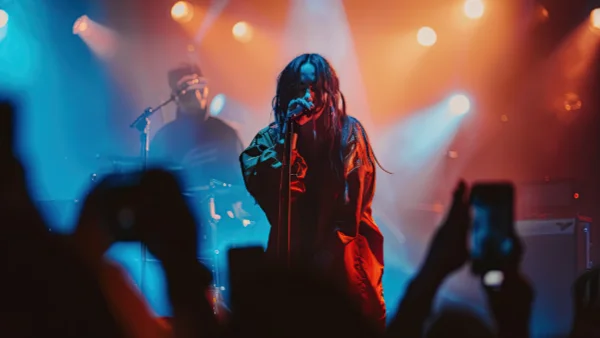

**\> Feeling burnt out? Subscribe to my [**Everyday Self-Care Newsletter**](https://seffsaid.com/newsletter/) for self-care tips and doable habits that support your well-being.**

This article compiles 50 quotes from Billie Eilish that shed light on her views about life, music, and self-expression. Each quote offers a glimpse into the mindset of one of today’s most influential artists.

1.  “I don’t want to be dark, but I don’t want to be happy all the time either.” – Billie Eilish
2.  “I’ve always done whatever I want and always been exactly who I am.” – Billie Eilish
3.  “You can write a song about being in love with someone, but you don’t have to be in love with anyone.” – Billie Eilish
4.  “I hate smiling. It makes me feel weak and powerless and small. I’ve always been like that; I don’t smile in any pictures.” – Billie Eilish
5.  “I’m not going to say I’m cool, because I don’t really believe that.” – Billie Eilish
6.  “If I’m inspired to make a certain kind of song, I’m going to make that kind of song, no matter if it’s what they expect or not.” – Billie Eilish
7.  “I don’t like to follow the rules. And that’s been my whole life.” – Billie Eilish
8.  “I really wanted to be a model when I was little. I loved photography, and I loved being on camera. But I was short and chubby, so I couldn’t.” – Billie Eilish
9.  “I’ve always liked being busy. If I have nothing to do for a week, it just makes me mad.” – Billie Eilish
10.  “Music is always there for me. It sounds cheesy, but I think it’s true.” – Billie Eilish
11.  “I’m just always talking about things that are frustrating to me. I think it’s important to have a voice and to use it.” – Billie Eilish
12.  “It’s rare for anyone to value the opinions of a teenage girl.” – Billie Eilish
13.  “Pretty much my whole life, I’ve been a performer and have loved singing and writing songs in my room for my own ears.” – Billie Eilish
14.  “Everything I wanted was to be something that everyone could connect to, and that everyone could relate to.” – Billie Eilish
15.  “I don’t think I’ve ever felt anything for anyone but myself.” – Billie Eilish
16.  “Boredom is literally the worst thing in the world.” – Billie Eilish
17.  “I like to be in control of how I look and how I feel and how I act.” – Billie Eilish
18.  “I never thought a career as a musician was possible.” – Billie Eilish
19.  “I have always been a very solitary person.” – Billie Eilish
20.  “The music industry is weird and exclusive, but it is not impossible to [be successful](https://seffsaid.com/mindsets-for-success/).” – Billie Eilish
21.  “I think it’s really important to [be confident](https://seffsaid.com/10-ways-to-appear-more-confident/) about what you do.” – Billie Eilish
22.  “The internet is a great platform but also a very dangerous place.” – Billie Eilish
23.  “I don’t feel pressured to be like anyone else.” – Billie Eilish
24.  “I don’t belong to anyone, but everybody knows my name.” – Billie Eilish
25.  “You should make sure everything you do is something you genuinely want to do.” – Billie Eilish
26.  “There’s nothing wrong with not knowing yourself.” – Billie Eilish
27.  “We’re all born with a completely blank canvas, and your life paints that canvas.” – Billie Eilish
28.  “I think I’m a very empathetic person, which can be a blessing and a curse.” – Billie Eilish
29.  “Clothing is a form of self-expression – there are hints about who you are in what you wear.” – Billie Eilish
30.  “I want to be remembered for how I made people feel and not just what I did.” – Billie Eilish
31.  “I’m not your [party](https://seffsaid.com/party-quotes/) favor.” – Billie Eilish
32.  “You can pretend you don’t miss me, you can pretend you don’t care.” – Billie Eilish
33.  “You should see me in a crown. I’m gonna run this nothing town.” – Billie Eilish
34.  “I’m in their secondhand smoke, still just drinking canned Coke.” – Billie Eilish
35.  “I’ve got a fire in my eyes, I’m going higher than your mind.” – Billie Eilish
36.  “I like the way they all scream.” – Billie Eilish
37.  “Tell the mirror what you know she’s heard before.” – Billie Eilish
38.  “I don’t need a Xanny to feel better.” – Billie Eilish
39.  “I guess I’m pretty glad that you’re alone.” – Billie Eilish
40.  “I’m not mad, I’m just bored. And everything I do is only because I’ve got too much time.” – Billie Eilish
41.  “I should’ve known I’d leave alone.” – Billie Eilish
42.  “Isn’t it lovely, all alone? Heart made of glass, my mind of stone.” – Billie Eilish
43.  “Please, I don’t want to be any form of a model. I want to be a role model.” – Billie Eilish
44.  “I’ve learned that I have to stay true to myself from what I’ve started from and stick to my roots.” – Billie Eilish
45.  “My boy loves his friends like I love my split ends…by that I mean he cuts ’em off.” – Billie Eilish
46.  “The good thing about writing songs is that you can say anything you want with almost no consequences.” – Billie Eilish
47.  “I don’t feel comfortable telling anyone ‘no’ or telling someone they’re doing something wrong.” – Billie Eilish
48.  “Just because the story isn’t being told by a perfect person, doesn’t mean the story isn’t worth being told.” – Billie Eilish
49.  “I’m an open book with a torn out page and my ink’s run out.” – Billie Eilish
50.  “I never really feel like I’m supposed to be anywhere else doing anything other than what I’m doing right now.” – Billie Eilish

Read more [quotes by famous people](https://seffsaid.com/quotes-by-famous-people/) here.

[Share](https://www.facebook.com/share.php?u=https%3A%2F%2Fseffsaid.com%2Fbillie-eilish-quotes%2F)

[Pin3](https://pinterest.com/pin/create/button/?url=https://seffsaid.com/billie-eilish-quotes/&media=https%3A%2F%2Fseffsaid.com%2Fwp-content%2Fuploads%2FBillie-Eilish-Quotes-PIN.jpg&description=Explore+the+mind+of+a+music+icon+through+this+collection+of+50+Billie+Eilish%27s+quotes+on+life%2C+love+and+music.+via+%40SeffSaid)

[Tweet](https://twitter.com/intent/tweet?text=50+Billie+Eilish+Quotes+on+Life%2C+Love+and+Music&url=https%3A%2F%2Fseffsaid.com%2Fbillie-eilish-quotes%2F&via=SeffSaid)

[Reddit](https://www.reddit.com/submit?url=https%3A%2F%2Fseffsaid.com%2Fbillie-eilish-quotes%2F)

[Share](https://www.linkedin.com/cws/share?url=https%3A%2F%2Fseffsaid.com%2Fbillie-eilish-quotes%2F)

[More](#)

3 Shares
