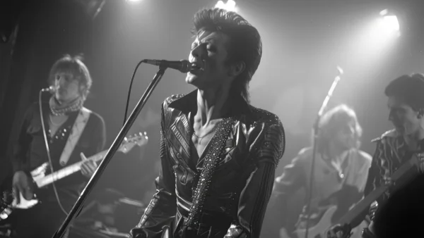

**\> Feeling burnt out? Subscribe to my [**Everyday Self-Care Newsletter**](https://seffsaid.com/newsletter/) for self-care tips and doable habits that support your well-being.**

David Bowie was a master of [reinvention](https://seffsaid.com/reinvent-yourself/) and a pioneer in the music and fashion world. His words, like his music, often carried deep meaning and a unique perspective on life and art. Here are some of his best quotes that capture his wit, wisdom, and distinctive outlook. Read more [quotes from famous people](https://seffsaid.com/quotes-by-famous-people/) here.

## David Bowie Quotes

1.  “I don’t know where I’m going from here, but I promise it won’t be boring.” – David Bowie
2.  “Aging is an extraordinary process where you become the person you always should have been.” – David Bowie
3.  “I always had a repulsive need to be something more than human.” – David Bowie
4.  “The truth is, of course, that there is no journey. We are arriving and departing all at the same time.” – David Bowie
5.  “Tomorrow belongs to those who can hear it coming.” – David Bowie
6.  “I reinvented my image so many times that I’m in denial that I was originally an overweight Korean woman.” – David Bowie
7.  “I’m an instant star. Just add water and stir.” – David Bowie
8.  “I think fame itself is not a rewarding thing. The most you can say is that it gets you a seat in restaurants.” – David Bowie
9.  “The only art I’ll ever study is stuff that I can steal from.” – David Bowie
10.  “I find only freedom in the realms of eccentricity.” – David Bowie
11.  “On the other hand, what I like my music to do to me is awaken the ghosts inside of me. Not the demons, you understand, but the ghosts.” – David Bowie
12.  “I don’t have stylistic loyalty. That’s why people perceive me changing all the time. That’s really not the case at all. I have the same kinds of thoughts and feelings, but they are in a very different dimension.” – David Bowie
13.  “Confront a corpse at least once. The absolute certainties of our world vanish.” – David Bowie
14.  “I’m always amazed that people take what I say seriously. I don’t even take what I am seriously.” – David Bowie
15.  “I suspect that dreams are an integral part of existence, with far more use for us than we’ve made of them.” – David Bowie
16.  “All art really does is keep you focused on questions of humanity, and it really is about how do we get on with our maker.” – David Bowie
17.  “I think it’s terribly dangerous for an artist to fulfill other people’s expectations.” – David Bowie
18.  “As an artist, I feel that we must try many things – but above all we must dare to fail.” – David Bowie
19.  “I think there is a difference between being a dreamer and someone who has really great vision and can execute on that vision.” – David Bowie
20.  “I had to resign myself, many years ago, that I’m not too articulate when it comes to explaining how I feel about things.” – David Bowie
21.  “I think it’s rather a waste of time endlessly singing the same songs every night for a year.” – David Bowie
22.  “I’m in awe of the universe, but I don’t necessarily believe there’s an intelligence or agent behind it.” – David Bowie
23.  “I’m not a prophet or a stone aged man, just a mortal with potential of a superman. I’m living on.” – David Bowie
24.  “I think my spaceship knows which way to go.” – David Bowie
25.  “I’m an instant star. Just add water and stir.” – David Bowie
26.  “The truth is, of course, that there is no journey. We are arriving and departing all at the same time.” – David Bowie
27.  “Aging is an extraordinary process where you become the person you always should have been.” – David Bowie
28.  “I find only freedom in the realms of eccentricity.” – David Bowie
29.  “I’m always amazed that people take what I say seriously. I don’t even take what I am seriously.” – David Bowie
30.  “I suspect that dreams are an integral part of existence, with far more use for us than we’ve made of them.” – David Bowie
31.  “All art really does is keep you focused on questions of humanity, and it really is about how do we get on with our maker.” – David Bowie
32.  “I think it’s terribly dangerous for an artist to fulfill other people’s expectations.” – David Bowie
33.  “As an artist, I feel that we must try many things – but above all we must dare to fail.” – David Bowie
34.  “I think there is a difference between being a dreamer and someone who has really great vision and can execute on that vision.” – David Bowie
35.  “I think it’s rather a waste of time endlessly singing the same songs every night for a year.” – David Bowie
36.  “I’m in awe of the universe, but I don’t necessarily believe there’s an intelligence or agent behind it.” – David Bowie
37.  “I’m not a prophet or a stone aged man, just a mortal with potential of a superman. I’m living on.” – David Bowie
38.  “I’m always amazed that people take what I say seriously. I don’t even take what I am seriously.” – David Bowie
39.  “What I like to do is try to make a difference with the work I do.” – David Bowie
40.  “I always had a sense of a duality within me. I’ve always felt that there’s this very puritanical side to me, and then there’s a very free and easy going side to me.” – David Bowie
41.  “I don’t have stylistic loyalty. That’s why people perceive me changing all the time.” – David Bowie
42.  “I’ve never responded well to entrenched negative thinking.” – David Bowie

[Share](https://www.facebook.com/share.php?u=https%3A%2F%2Fselfsaid.30tools.com%2Fdavid-bowie-quotes%2F)

[Pin31](https://pinterest.com/pin/create/button/?url=https://seffsaid.com/david-bowie-quotes/&media=https%3A%2F%2Fselfsaid.30tools.com%2Fwp-content%2Fuploads%2FDavid-Bowie-Quotes-PIN.jpg&description=Explore+the+unique+and+thought-provoking+words+of+David+Bowie+that+showcase+his+remarkable+perspective+on+fame%2C+life+and+art.+via+%40SeffSaid)

[Tweet](https://twitter.com/intent/tweet?text=David+Bowie%27s+Best+Quotes&url=https%3A%2F%2Fselfsaid.30tools.com%2Fdavid-bowie-quotes%2F&via=SeffSaid)

[Reddit](https://www.reddit.com/submit?url=https%3A%2F%2Fselfsaid.30tools.com%2Fdavid-bowie-quotes%2F)

[Share](https://www.linkedin.com/cws/share?url=https%3A%2F%2Fselfsaid.30tools.com%2Fdavid-bowie-quotes%2F)

[More](#)

31 Shares
