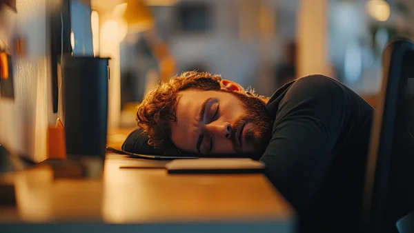

**\> Feeling burnt out? Subscribe to my [**Everyday Self-Care Newsletter**](https://seffsaid.com/newsletter/) for self-care tips and doable habits that support your well-being.**

Even the most energetic and motivated people have times when they simply don’t want to do anything, and some of us feel like that more often. When you really don’t feel like doing anything at all, you can just sink into the lethargy or you can do small things that will [change your mindset](https://seffsaid.com/how-to-develop-a-winning-mindset/) and jump-start your motivation again. Here are some things that have helped me through some energy slumps:

## 1\. Get moving

Sometimes a lack of energy is simply due to a lack of exercise, daylight or fresh air. A short brisk walk in the daylight may be just the thing to wake you up and restore your motivation. Stretching, dancing and any other sports or physical activities that you enjoy are great choices too. Get out of your chair and do what feels good!

## 2\. Take a break

Feeling lethargic is sometimes simply your body’s way of telling that you’ve been doing too much and you need some rest. Think about how tired you are and how much of a break could be helpful, and give yourself the rest that you need.

It may be a case of enjoying a relaxing morning, a longer lunch break, a whole day off, a long weekend or even a week or two’s holiday. Listen to your body and mind and, if you can afford the time and expense, then take the time you need.

Shelve all expectations and rest and enjoy some downtime. You may be surprised how even a short break can restore your energy and motivation.

## 3\. Talk to a friend

Having a chat with a family member, a friend, a therapist or even a stranger can help shift that feeling of lethargy. You might want to talk about your lack of energy or you might just want to chat about anything and nothing, enjoying the interaction to lift your mood.

Sometimes just being amongst people can help: people-watching at the mall or sitting in a busy café and enjoying the chatter around you can raise your energy and [change your outlook](https://seffsaid.com/how-to-keep-a-positive-outlook-in-life/) enough to feel better and get going in life again.

## 4\. Music

Many people find that music can change their mood completely. If you’re feeling low in energy then some favourite up-tempo songs can [lift your mood](https://seffsaid.com/easy-ways-to-quickly-improve-your-mood/) very quickly. If you’re stressed or irritable then some soothing classical music or meditation music might help you relax and feel better. Compile some playlists for different moods and let the music take you where you want to be.

## 5\. Get cooking

Sometimes tiredness and lethargy are caused by a lack of good food. Maybe you’ve been too busy and have been living off snacks and fast food. Planning and preparing a good nutritious home-cooked meal could be just the thing to lift your spirits and get your energy going again.

If you are chronically tired then you should consider consulting your doctor. But if it’s just a case of a little lethargy and lack of motivation then hopefully some of these tips will help you get your energy back and get going in life. Best of luck and let me know how you get on!

[Share](https://www.facebook.com/share.php?u=https%3A%2F%2Fselfsaid.30tools.com%2Fdont-want-to-do-anything-anymore%2F)

[Pin1](https://pinterest.com/pin/create/button/?url=https://seffsaid.com/dont-want-to-do-anything-anymore/&media=https%3A%2F%2Fselfsaid.30tools.com%2Fwp-content%2Fuploads%2Fhow-to-regain-motivation-PIN.jpg&description=Don%27t+want+to+do+anything+anymore%3F+These+tips+will+help+you+get+your+energy+and+motivation+back+and+get+you+going+in+life.+via+%40SeffSaid)

[Tweet](https://twitter.com/intent/tweet?text=How+To+Regain+Motivation&url=https%3A%2F%2Fselfsaid.30tools.com%2Fdont-want-to-do-anything-anymore%2F&via=SeffSaid)

[Reddit](https://www.reddit.com/submit?url=https%3A%2F%2Fselfsaid.30tools.com%2Fdont-want-to-do-anything-anymore%2F)

[Share](https://www.linkedin.com/cws/share?url=https%3A%2F%2Fselfsaid.30tools.com%2Fdont-want-to-do-anything-anymore%2F)

[More](#)

1 Shares
