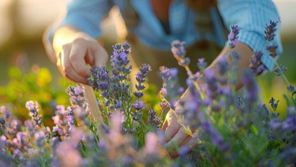

**\> Feeling burnt out? Subscribe to my [**Everyday Self-Care Newsletter**](https://seffsaid.com/newsletter/) for self-care tips and doable habits that support your well-being.**

I’ve been trimming and tidying my lavender bed today. It’s a small area near the end of my property, a beautiful row of lavender bushes that my husband helped me plant shortly after my father’s death a few years ago. It’s a special little place for me and I go there often, enjoying the scented tranquillity, the contented hum of bees and the circling of passionate butterflies.

I’m lucky enough to have a pretty big garden. In the typical English way, there’s a large part laid to lawn, various beds and some shrubs and trees. But I have to be honest, I’m not much of a gardener…

I have the _intention_ of being a good gardener, of spending hours out there, of establishing new and wonderful areas and beds, but somehow my intentions and reality never seem to align. Added to that, I’m quite small and slight, not able to tackle anything big or heavy without some brawn at my side.

This causes me some frustration at times and I find myself out in the garden looking at the areas that I haven’t been able to tame, tidy or finish. I used to find that this spoiled my time in the garden by filling my head with ‘if onlys’. _If only I had cleared the nettles in the far corner before they went to seed… If only I had pruned the fruit trees earlier…. If only I had the time to weed the beds more regularly… If only I’d planted the borders last year instead of waiting…_ The unsaid conclusion to these sentences is…_. I would be happy_.

And of course all of this really has nothing whatsoever to do with gardening. It is just a way of getting down on myself, spoiling what should be a peaceful and enjoyable moment in the garden by telling myself that I’m not measuring up to some arbitrary standard I set myself at some point in the past. It’s a form of misplaced perfectionism (okay, _all_ perfectionism is misplaced…) and it can make us be our own worst critics in a mean and cruel fashion.

This self-scrutiny, practised by so many of us, has a way of robbing us of happiness in the here and now. It’s an over-active conscience that sees no difference between the things we really should feel guilty about and these small trivial things, like delaying weeding a bed or trimming a hedge.

But in the garden I have found a way to cheat this over-active conscience and my solution is very simple.

I focus on just one small area. And in my case, it’s my lavender hedge.

I let my perfectionist streak loose on that one smaller area of the garden. I spend time trimming, weeding and mulching, creating the perfect edging to the bed and generally being an anally-retentive PITA. And when I step back, I can look at a perfection that I craved, that I promised myself, and I can triumphantly say to that [inner critic](https://seffsaid.com/how-i-silenced-my-inner-critic/) _hah, see, I did it!_

In an ideal world I would be able to quieten my inner critic internally rather than having to resort to external actions, but for me this system is a rewarding compromise. I have the satisfaction of a beautiful, albeit small, area in my garden, and I can enjoy the feeling of satisfaction of having created it and maintained it.

And the rest of the garden? Well, that can wait for another day…

[Share](https://www.facebook.com/share.php?u=https%3A%2F%2Fseffsaid.com%2Fhow-i-cheated-my-need-for-perfectionism%2F)

[Pin1](https://pinterest.com/pin/create/button/?url=https://seffsaid.com/how-i-cheated-my-need-for-perfectionism/&media=https%3A%2F%2Fseffsaid.com%2Fwp-content%2Fuploads%2FHow-I-Cheated-My-Need-For-Perfectionism-PIN.jpg&description=A+short+story+of+a+frustrated+gardener%27s+search+for+perfectionism.+via+%40SeffSaid)

[Tweet](https://twitter.com/intent/tweet?text=How+I+Cheated+My+Need+For+Perfectionism&url=https%3A%2F%2Fseffsaid.com%2Fhow-i-cheated-my-need-for-perfectionism%2F&via=SeffSaid)

[Reddit](https://www.reddit.com/submit?url=https%3A%2F%2Fseffsaid.com%2Fhow-i-cheated-my-need-for-perfectionism%2F)

[Share](https://www.linkedin.com/cws/share?url=https%3A%2F%2Fseffsaid.com%2Fhow-i-cheated-my-need-for-perfectionism%2F)

[More](#)

1 Shares
