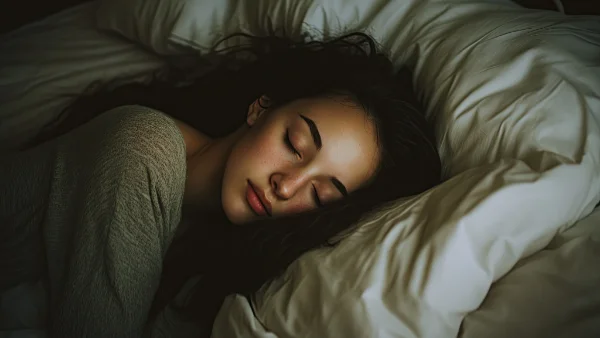

**\> Feeling burnt out? Subscribe to my [**Everyday Self-Care Newsletter**](https://seffsaid.com/newsletter/) for self-care tips and doable habits that support your well-being.**

I think most people appreciate that a good night’s sleep is vital to our emotional well-being and physical health. A lack of regular good quality sleep is detrimental to most aspects of our day to day lives, from our overall health to our mood and our energy levels.

Unfortunately, studies have shown that insomnia (difficulty in falling or staying asleep) affects 1 in 3 people. This may not be a problem if bad sleep happens only occasionally, but if insomnia becomes a regular occurrence you really should start taking steps to improve your sleep.

This article focuses on those of us who have difficulty in falling asleep and features tips and techniques on not only how to fall asleep, but how to fall asleep fast.

Scientists call the measure of how long it takes to reach sleep as sleep latency and in a healthy person this should take between 10 – 20 minutes. Don’t worry though if you take longer than 20 minutes to nod off, as I have 12 simple yet effective techniques you can practice to help you fall asleep faster.

## 1\. Lower the temperature of your bedroom

Did you know that as you fall asleep your body temperature drops? Studies have shown that reducing the temperature of your bedroom can help decrease your body’s core temperature and trigger the process that initiates sleep.

## 2\. Try to stay awake

Ever heard of reverse psychology? This is a technique involving the belief that practicing a behavior that is opposite to the behavior desired will encourage the subject of the persuasion to do what actually is desired, the opposite of what is suggested.

A [2003 study](https://www.cambridge.org/core/journals/behavioural-and-cognitive-psychotherapy/article/initial-insomnia-and-paradoxical-intention-an-experimental-investigation-of-putative-mechanisms-using-subjective-and-actigraphic-measurement-of-sleep/D4631FDBB4640E0CF58FFBC17E8CCD98) conducted at a Glasgow hospital discovered that participants in this study who laid in bed and tried to stay awake fell asleep quicker than participants not using this technique.

## 3\. The 4-7-8 breathing technique

Andrew Weil, a medical doctor and best-selling author adopted this breathing exercise from an Indian yogi meditation practice. The 4-7-8 technique is said to help you fall asleep in under a minute by increasing the amount of oxygen in your bloodstream, releasing more carbon dioxide from the lungs, and slowing your heart rate. Here’s how you do it:

First place the tip of your tongue against the ridge of tissue just behind your upper front teeth, and keep it there throughout the entire exercise. Then:

*   Exhale completely through your mouth, making a whoosh sound.
*   Close your mouth and inhale quietly through your nose to a mental count of four.
*   Hold your breath for a count of seven.
*   Exhale completely through your mouth, making a whoosh sound to a count of eight.
*   Repeat the cycle three more times for a total of four breaths.

## 4\. Smelling the scent of lavender

Some studies have suggested that lavender scent may be useful as a sleep aid for insomnia and enjoying a good night’s sleep. A [study](https://www.ncbi.nlm.nih.gov/pubmed/16298774) done in 2005 at Wesleyan University in Middletown, Connecticut discovered that participants who smelled lavender oil before bedtime enjoyed better quality sleep. Try applying a few drops on a cotton ball and placing it close to your pillow. Use only pure essential oil and not a room fragrance.

## 5\. Listen to classical music

A [2008 study](https://www.ncbi.nlm.nih.gov/pubmed/18426457) at the Semmelweis University, Institute of Behavioural Sciences, Budapest, Hungary found that listening to relaxing classical music for 45 minutes before bedtime led to better sleep.

## 6\. Don’t look at your clock

Clock watching is a common practice among insomnia sufferers and can cause the insomniac to obsess about the fact they cannot fall asleep. This can cause further worry, anxiety, and sleeplessness. If possible, remove all clocks from your bedroom or if you use your clock also as an alarm, face the clock away from you and out of reach.

## 7\. Avoid daytime naps

Insomniacs are usually tired and sleepy during the day and are likely to nap. Although short daytime naps have been shown to improve energy levels, alertness, and concentration, other studies have shown they can affect the ability to fall asleep and reduce sleep quality.

## 8\. Exercise

Physical activity is known to increase the duration and quality of sleep by increasing the levels of serotonin (a chemical that regulates the sleep/wake cycle in the brain) and decreasing levels of the stress hormone cortisol. The time of day that you exercise is important though. A [2014 study](https://www.ncbi.nlm.nih.gov/pubmed/25350038) at the Faculdade de Ciências Aplicadas Universidade Estadual de Campinas, São Paulo, Brazil found that exercising earlier in the day can lead to better quality sleep.

## 9\. Don’t look at screens before bedtime

Melatonin is a hormone made by your body’s pineal gland that signals the brain that it is time to sleep. During the day the pineal gland is inactive. During the evening when the sun goes down and it starts to get dark, the pineal begins to produce melatonin which is released into the blood making you feel sleepy.

A [2014 study](https://www.ncbi.nlm.nih.gov/pubmed/24394730) found that viewing the bright light from smartphones, tablets, computers, and televisions for just 1.5 hours during the evening can block the release of melatonin making it more difficult to fall asleep and stay asleep during the night.

## 10\. Limit caffeine intake at least 6 hours before bedtime

Caffeine is a stimulant that promotes alertness by acting as an ‘adenosine receptor antagonist’. Adenosine is a chemical in your body that promotes sleepiness and caffeine blocks the adenosine receptor which then stops you from feeling sleepy.

A [2013 study](http://jcsm.aasm.org/viewabstract.aspx?pid=29198) found that caffeine taken 6 hours before bedtime had disruptive and detrimental effects on sleep. Try drinking non-caffeinated drinks instead such as herbal teas or hot chocolate.

## 11\. Get more natural outdoor light

A [2017 study](https://academic.oup.com/sleep/article/40/12/zsx165/4439587#.WeheQPAzCjs.email) by chronobiology researchers at the Groningen Institute for Evolutionary Life Sciences of the University of Groningen found that exposure to sunlight causes people to sleep more deeply the following night. The study also found that the earlier in the day people are exposed to bright sunlight, the earlier they will fall asleep in the evening.

## 12\. Practice daily meditation

[Meditation](https://seffsaid.com/benefits-of-meditation/) has been shown to reduce levels of the stress hormone cortisol, helping you [feel less stressed](https://seffsaid.com/simple-living-how-to-live-a-simple-life/), less anxious, relaxed, and more likely to fall asleep quickly. People who meditate have also been found to have considerably higher levels of melatonin (a hormone that regulates sleep) than non-meditators.

A [2015 study](https://www.health.harvard.edu/blog/mindfulness-meditation-helps-fight-insomnia-improves-sleep-201502187726) by Harvard Medical School showed that meditation focusing on [breathing](https://seffsaid.com/breath-a-bridge-to-conscious-and-mindful-living/) and awareness of the present moment can be a powerful weapon in overcoming insomnia and other sleep disorders. Another [clinical trial in 2015](https://www.ncbi.nlm.nih.gov/pmc/articles/PMC4407465/) found that mindfulness mediation helped improve sleep quality among older adults.

## Final thoughts

Experiencing difficulty in falling asleep can be frustrating, however, there is no need to get anxious or stressed as this will only exacerbate the problem. Instead, try practicing some of the techniques above, and insomnia should soon be a problem of the past.

[Share](https://www.facebook.com/share.php?u=https%3A%2F%2Fselfsaid.30tools.com%2Fhow-to-fall-asleep-fast%2F)

Pin20

[Tweet](https://twitter.com/intent/tweet?text=How+To+Fall+Asleep+Fast&url=https%3A%2F%2Fselfsaid.30tools.com%2Fhow-to-fall-asleep-fast%2F&via=SeffSaid)

[Reddit](https://www.reddit.com/submit?url=https%3A%2F%2Fselfsaid.30tools.com%2Fhow-to-fall-asleep-fast%2F)

[Share](https://www.linkedin.com/cws/share?url=https%3A%2F%2Fselfsaid.30tools.com%2Fhow-to-fall-asleep-fast%2F)

[More](#)

20 Shares
