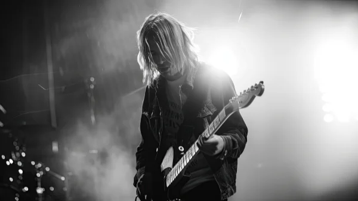

**\> Feeling burnt out? Subscribe to my [**Everyday Self-Care Newsletter**](https://seffsaid.com/newsletter/) for self-care tips and doable habits that support your well-being.**

  
Kurt Cobain’s quotes often reflect the raw emotion and unfiltered thoughts of a rock legend. This article brings together 52 of his best quotes, each offering a glimpse into his perspective on life, art, and fame. Whether you’re a longtime Nirvana fan or just discovering Cobain’s impactful words, his quotes resonate with honesty and depth.

1.  Wanting to be someone else is a waste of who you are.” – Kurt Cobain
2.  “The duty of youth is to challenge corruption.” – Kurt Cobain
3.  “I’d rather be hated for who I am, than loved for who I am not.” – Kurt Cobain
4.  “If my eyes could show my soul, everyone would cry when they saw me smile.” – Kurt Cobain
5.  “It’s better to burn out than to fade away.” – Kurt Cobain
6.  “Music is first, lyrics are secondary.” – Kurt Cobain
7.  “Nobody dies a virgin… Life fucks us all.” – Kurt Cobain
8.  “I’m not well-read, but when I read, I read well.” – Kurt Cobain
9.  “We have no right to express an opinion until we know all of the answers.” – Kurt Cobain
10.  “Drugs are a waste of time. They destroy your memory and your self-respect and everything that goes along with your self-esteem.” – Kurt Cobain
11.  “I started being really proud of the fact that I was gay even though I wasn’t.” – Kurt Cobain
12.  “Just because you’re paranoid doesn’t mean they aren’t after you.” – Kurt Cobain
13.  “I’m so happy because today I found my friends – they’re in my head.” – Kurt Cobain
14.  “Birds scream at the top of their lungs in horrified hellish rage every morning at daybreak to warn us all of the truth, but sadly we don’t speak bird.” – Kurt Cobain
15.  “Practice makes perfect, but nobody’s perfect, so why practice?” – Kurt Cobain
16.  “Thank you for the tragedy. I need it for my art.” – Kurt Cobain
17.  “If you die you’re completely happy and your soul somewhere lives on. I’m not afraid of dying. Total peace after death, becoming someone else is the best hope I’ve got.” – Kurt Cobain
18.  “There’s good in all of us and I think I simply love people too much, so much that it makes me feel too fucking sad.” – Kurt Cobain
19.  “I like the comfort in knowing that women are the only future in rock and roll.” – Kurt Cobain
20.  “I don’t care what you think unless it is about me.” – Kurt Cobain
21.  “The worst crime is faking it.” – Kurt Cobain
22.  “Punk is musical freedom. It’s saying, doing and playing what you want.” – Kurt Cobain
23.  “Forever in debt to your priceless advice.” – Kurt Cobain
24.  “I use bits and pieces of others personalities to form my own.” – Kurt Cobain
25.  “The sun is gone, but I have a light.” – Kurt Cobain
26.  “I’m worse at what I do best.” – Kurt Cobain
27.  “I had a really good childhood up until I was nine, then a classic case of divorce really affected me.” – Kurt Cobain
28.  “I have a hard time carrying on a conversation with people who have nothing to say.” – Kurt Cobain
29.  “I like guitars in the Fender style because they have skinny necks.” – Kurt Cobain
30.  “I won’t eat anything green.” – Kurt Cobain
31.  “A friend is nothing but a known enemy.” – Kurt Cobain
32.  “I’m not gay, although I wish I were, just to piss off homophobes.” – Kurt Cobain
33.  “I’m a much happier guy than a lot of people think I am.” – Kurt Cobain
34.  “If you ever need anything please don’t hesitate to ask someone else first.” – Kurt Cobain
35.  “They laugh at me because I’m different; I laugh at them because they’re all the same.” – Kurt Cobain
36.  “I really haven’t had that exciting of a life. There are a lot of things I wish I would have done, instead of just sitting around and complaining about having a boring life.” – Kurt Cobain
37.  “I’m not interested in sounding like a sloppy version of bands that influenced me.” – Kurt Cobain
38.  “I don’t have the passion anymore, and so remember, it’s better to burn out than to fade away.” – Kurt Cobain
39.  “Rather be dead than cool.” – Kurt Cobain
40.  “Peace, love, empathy.” – Kurt Cobain
41.  “My heart is broke, but I have some glue.” – Kurt Cobain
42.  “It amazes me the will of instinct.” – Kurt Cobain
43.  “The finest day I ever had was when tomorrow never came.” – Kurt Cobain
44.  “I feel as if I should be a more tortured soul.” – Kurt Cobain
45.  “I miss the comfort in being sad.” – Kurt Cobain
46.  “Our generation has had no Great Depression, no Great War. Our war is spiritual. Our depression is our lives.” – Kurt Cobain
47.  “It’s okay to eat fish because they don’t have any feelings.” – Kurt Cobain
48.  “The only difference between me and a madman is that I’m not mad.” – Kurt Cobain
49.  “I learned [how to be happy](https://seffsaid.com/how-to-live-a-happy-life/) because I know what unhappiness felt like.” – Kurt Cobain
50.  “I’m not afraid of the dark; I’m more afraid of not finding that creative spark.” – Kurt Cobain
51.  “Sometimes I feel as if I should have a punch-in time clock before I walk out on stage.” – Kurt Cobain
52.  “I never wanted to sing. I just wanted to play rhythm guitar – hide in the back and just play.” – Kurt Cobain

Enjoyed this page? Discover more [famous people quotes](https://seffsaid.com/quotes-by-famous-people/) here!

[Share](https://www.facebook.com/share.php?u=https%3A%2F%2Fseffsaid.com%2Fkurt-cobain-quotes%2F)

[Pin5](https://pinterest.com/pin/create/button/?url=https://seffsaid.com/kurt-cobain-quotes/&media=https%3A%2F%2Fseffsaid.com%2Fwp-content%2Fuploads%2Fkurt-cobain-quotes-PIN.jpg&description=Discover+the+mind+of+a+grunge+legend+with+this+collection+of+Kurt+Cobain%27s+52+best+quotes.+via+%40SeffSaid)

[Tweet](https://twitter.com/intent/tweet?text=Kurt+Cobain%27s+52+Best+Quotes&url=https%3A%2F%2Fseffsaid.com%2Fkurt-cobain-quotes%2F&via=SeffSaid)

[Reddit](https://www.reddit.com/submit?url=https%3A%2F%2Fseffsaid.com%2Fkurt-cobain-quotes%2F)

[Share](https://www.linkedin.com/cws/share?url=https%3A%2F%2Fseffsaid.com%2Fkurt-cobain-quotes%2F)

[More](#)

5 Shares
