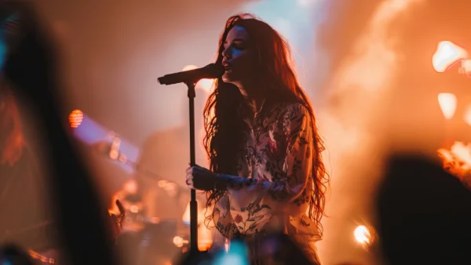

**\> Feeling burnt out? Subscribe to my [**Everyday Self-Care Newsletter**](https://seffsaid.com/newsletter/) for self-care tips and doable habits that support your well-being.**

Lana Del Rey’s quotes offer a glimpse into her unique perspective on life and art. Below, you’ll discover some of her most memorable and thought-provoking sayings. These quotes reflect the depth and originality that make her such an intriguing artist.

1.  “I believe in the person I want to become.” – Lana Del Rey
2.  “I was always an unusual girl.” – Lana Del Rey
3.  “I have kind of a funny relationship with L.A.” – Lana Del Rey
4.  “Being brave means knowing that when you fail, you don’t fail forever.” – Lana Del Rey
5.  “I have a personal ambition to live my life honestly and honor the true love that I’ve had and also the people I’ve had around me.” – Lana Del Rey
6.  “I used to be more involved with every aspect of my career. Now I am not as involved.” – Lana Del Rey
7.  “When you’re an artist, you have to stay open to the world around you.” – Lana Del Rey
8.  “I don’t really have any gimmicks. I don’t actually do anything that’s strange. I don’t even wear weird things.” – Lana Del Rey
9.  “I have taken taking my music seriously, and I want it to be the best it can be.” – Lana Del Rey
10.  “I think there’s a lot of people out there who make their art and make their money and don’t really think about the people who are buying their music.” – Lana Del Rey
11.  “I’m always just trying to do what I do. I don’t really care who comes out of the woodwork to try to steal my thunder.” – Lana Del Rey
12.  “I used to be a singer for the money. I was just singing in bars and clubs because I wanted to sing.” – Lana Del Rey
13.  “I just want to have a [good life](https://seffsaid.com/how-to-live-the-good-life/), and be the person that I am.” – Lana Del Rey
14.  “It’s hard to just stop one day and say, ‘I won’t do it anymore.’ But I have to learn to prioritize.” – Lana Del Rey
15.  “I’m not a perfectionist, but I like to feel that things are done well.” – Lana Del Rey
16.  “My baby lives in shades of blue.” – Lana Del Rey
17.  “I have a lust for life.” – Lana Del Rey
18.  “When I feel like I’m being overwhelmed, I have a bunch of great people who help me.” – Lana Del Rey
19.  “I’m always just trying to stay in the zone of being the best version of myself.” – Lana Del Rey
20.  “I just like a beautiful song. A beautiful song is like a window to another world.” – Lana Del Rey
21.  “I’m not really interested in a ton of celebrity people. But of course, I am star-struck by certain people.” – Lana Del Rey
22.  “I don’t know what you’re talking about. My fans are not about that kind of stuff.” – Lana Del Rey
23.  “I don’t want to sound like I’m dissing the music business, but my specialty is writing songs and singing.” – Lana Del Rey
24.  “I’m not trying to be cool. I’m just being myself.” – Lana Del Rey
25.  “I think there’s a lot of people out there who are happy to be misunderstood. But I’m not one of them.” – Lana Del Rey
26.  “I never thought I would be known for my looks.” – Lana Del Rey
27.  “My idea of a true romantic is someone who treats you like you’re the only person in the world.” – Lana Del Rey
28.  “I believe in free love and that’s just the way I feel.” – Lana Del Rey
29.  “I don’t believe in ageism or sexism. I don’t believe in hating someone because of their sex or their age.” – Lana Del Rey
30.  “I’m just a normal girl.” – Lana Del Rey
31.  “I like a lot of classic movies, like old-time black and white ones.” – Lana Del Rey
32.  “I’ve got nothing but love for my fans.” – Lana Del Rey
33.  I’ve made a lot of [mistakes in my life](https://seffsaid.com/5-common-life-mistakes-to-avoid/). But I’m proud of them. I wouldn’t be who I am if I hadn’t made them.” – Lana Del Rey
34.  “I think people can appreciate someone who’s just trying to be themselves.” – Lana Del Rey
35.  “I try to live my life with the same respect that I give to others.” – Lana Del Rey
36.  “I don’t think I’ve ever had a true friend.” – Lana Del Rey
37.  “I’m definitely not the person to ask for relationship advice.” – Lana Del Rey
38.  “I love making music, but I also love the business side of things.” – Lana Del Rey
39.  “I just want to be happy, and I want everyone else to be happy too.” – Lana Del Rey
40.  “I don’t think there’s anything more beautiful than the way the ocean refuses to stop kissing the shoreline, no matter how many times it’s sent away.” – Lana Del Rey
41.  “Sometimes I feel like my only friend is my little dog.” – Lana Del Rey
42.  “I think the most important thing in life is to be happy and to be yourself.” – Lana Del Rey
43.  “I don’t believe in the glorification of any one person over another.” – Lana Del Rey
44.  “I don’t think I’ll ever be content. But that’s okay.” – Lana Del Rey
45.  “I don’t want to be a queen. I just want to be myself.” – Lana Del Rey
46.  “I just try and do my best with everything that I do.” – Lana Del Rey
47.  “I love the creative process. I love the idea of making something from nothing.” – Lana Del Rey
48.  “I don’t really listen to much modern music.” – Lana Del Rey
49.  “I’m just really grateful to be able to make music for a living.” – Lana Del Rey
50.  “I’m a dreamer. And I always will be.” – Lana Del Rey

Read more [quotes by famous singers](https://seffsaid.com/quotes-by-famous-people/) here.

[Share](https://www.facebook.com/share.php?u=https%3A%2F%2Fselfsaid.30tools.com%2Flana-del-rey-quotes%2F)

[Pin3](https://pinterest.com/pin/create/button/?url=https://seffsaid.com/lana-del-rey-quotes/&media=https%3A%2F%2Fselfsaid.30tools.com%2Fwp-content%2Fuploads%2FLana-Del-Rey-quotes-PIN.jpg&description=Explore+the+poetic+brilliance+and+heartfelt+reflections+of+Lana+Del+Rey+with+this+collection+of+her+most+iconic+quotes.+via+%40SeffSaid)

[Tweet](https://twitter.com/intent/tweet?text=Lana+Del+Rey%27s+Best+Quotes&url=https%3A%2F%2Fselfsaid.30tools.com%2Flana-del-rey-quotes%2F&via=SeffSaid)

[Reddit](https://www.reddit.com/submit?url=https%3A%2F%2Fselfsaid.30tools.com%2Flana-del-rey-quotes%2F)

[Share](https://www.linkedin.com/cws/share?url=https%3A%2F%2Fselfsaid.30tools.com%2Flana-del-rey-quotes%2F)

[More](#)

3 Shares
