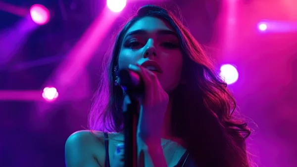

**\> Feeling burnt out? Subscribe to my [**Everyday Self-Care Newsletter**](https://seffsaid.com/newsletter/) for self-care tips and doable habits that support your well-being.**

Madison Beer’s best quotes that reflect her thoughts on self-love, authenticity, and personal growth.

*   “Stay true to yourself, stay grounded, stay humble.” – Madison Beer
*   “You can’t let anyone tell you what your worth is. You have to decide that for yourself.” – Madison Beer
*   “The most important relationship you’ll ever have is with yourself.” – Madison Beer
*   “I’ve learned to love my imperfections because they make me who I am.” – Madison Beer
*   “Success isn’t just about the fame and money; it’s about doing what you love.” – Madison Beer
*   “It’s okay not to have everything figured out. Life is about the journey, not the destination.” – Madison Beer
*   “In a world where you can be anything, [be kind](https://seffsaid.com/simple-acts-of-kindness-that-can-make-us-live-longer/).” – Madison Beer
*   “I always remind myself that it’s okay to feel down sometimes, as long as I don’t stay there.” – Madison Beer
*   “The people who belong in your life will stay, and those who don’t, won’t. It’s as simple as that.” – Madison Beer
*   “I’ve learned that [happiness](https://seffsaid.com/how-to-live-a-happy-life/) comes from within, not from other people or things.” – Madison Beer
*   “Confidence is something you have to build on your own; it’s not given to you by others.” – Madison Beer
*   “You don’t have to be perfect to inspire others. Let them be inspired by how you deal with your imperfections.” – Madison Beer
*   “I believe in being vulnerable and open, because that’s how you connect with people.” – Madison Beer
*   “It’s important to surround yourself with people who uplift you and make you a better person.” – Madison Beer
*   “Don’t be afraid to stand up for what you believe in, even if it means standing alone.” – Madison Beer
*   “Your dreams are valid, no matter how big or small they are.” – Madison Beer
*   “Sometimes, the hardest battles are the ones you fight within yourself.” – Madison Beer
*   “Self-love is the best love. It’s essential to nurture and care for yourself first.” – Madison Beer
*   “It’s okay to walk away from things that no longer serve you, even if it’s hard.” – Madison Beer
*   “You have to trust the timing of your life. Everything happens when it’s supposed to.” – Madison Beer
*   “I’m constantly learning and evolving, and that’s what life is all about.” – Madison Beer
*   “Negativity only has power if you let it.” – Madison Beer
*   “Your mind is a powerful tool, so fill it with positive thoughts and ideas.” – Madison Beer
*   “Dream big, work hard, and stay humble.” – Madison Beer
*   “It’s not about being the best, it’s about being better than you were yesterday.” – Madison Beer
*   “Be someone who makes everyone feel like someone.” – Madison Beer
*   “The only person you should try to be better than is the person you were yesterday.” – Madison Beer
*   “Live your truth, even if it scares others.” – Madison Beer
*   “When you love yourself, you open up a world of possibilities.” – Madison Beer
*   “Be yourself; everyone else is already taken.” – Madison Beer

Read more [quotes by celebrities](https://seffsaid.com/quotes-by-famous-people/) here.

[Share](https://www.facebook.com/share.php?u=https%3A%2F%2Fseffsaid.com%2Fmadison-beer-quotes%2F)

[Pin1](https://pinterest.com/pin/create/button/?url=https://seffsaid.com/madison-beer-quotes/&media=https%3A%2F%2Fseffsaid.com%2Fwp-content%2Fuploads%2Fmadison-beer-quotes-PIN.jpg&description=A+collection+of+Madison+Beer%E2%80%99s+best+quotes+that+encourage+confidence%2C+authenticity+and+personal+growth+in+your+daily+life.+via+%40SeffSaid)

[Tweet](https://twitter.com/intent/tweet?text=Madison+Beer%27s+Best+Quotes&url=https%3A%2F%2Fseffsaid.com%2Fmadison-beer-quotes%2F&via=SeffSaid)

[Reddit](https://www.reddit.com/submit?url=https%3A%2F%2Fseffsaid.com%2Fmadison-beer-quotes%2F)

[Share](https://www.linkedin.com/cws/share?url=https%3A%2F%2Fseffsaid.com%2Fmadison-beer-quotes%2F)

[More](#)

1 Shares
