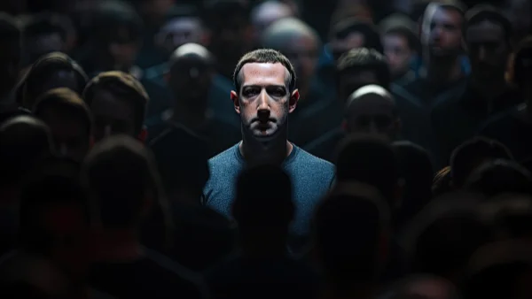

**\> Feeling burnt out? Subscribe to my [**Everyday Self-Care Newsletter**](https://seffsaid.com/newsletter/) for self-care tips and doable habits that support your well-being.**

Mark Zuckerberg is known not only for being the founder of FaceBook but also for his innovative ideas and leadership in the tech industry. His quotes provide insight into his mindset and the principles that drive his success. Here are some of his most memorable quotes that offer a glimpse into his philosophy and approach to business. Read more [quotes from successful entrepreneurs](https://seffsaid.com/quotes-by-famous-people/) here.

1.  “Move fast and break things. Unless you are breaking stuff, you are not moving fast enough.” – Mark Zuckerberg
2.  “The biggest risk is not taking any risk… In a world that is changing really quickly, the only strategy that is guaranteed to fail is not taking risks.” – Mark Zuckerberg
3.  “People don’t care about what you say, they care about what you build.” – Mark Zuckerberg
4.  “I think as a company, if you can get those two things right – having a clear direction on what you are trying to do and bringing in great people who can execute on the stuff – then you can do pretty well.” – Mark Zuckerberg
5.  “The question isn’t ‘What do we want to know about people?’ It’s ‘What do people want to tell about themselves?’” – Mark Zuckerberg
6.  “By giving people the power to share, we’re making the world more transparent.” – Mark Zuckerberg
7.  “Building a mission and building a business go hand in hand.” – Mark Zuckerberg
8.  “I’m here to build something for the long term. Anything else is a distraction.” – Mark Zuckerberg
9.  “Figuring out what the next big trend is tells us what we should focus on.” – Mark Zuckerberg
10.  “We don’t build services to make money; we make money to build better services.” – Mark Zuckerberg
11.  “Some people dream of success, while others wake up and work hard at it.” – Mark Zuckerberg
12.  “Advertising works most effectively when it’s in line with what people are already trying to do.” – Mark Zuckerberg
13.  “People think innovation is just having a good idea, but a lot of it is just moving quickly and trying a lot of things.” – Mark Zuckerberg
14.  “Our mission is to make the world more open and connected.” – Mark Zuckerberg
15.  “The biggest mistake we’ve made as a company is betting on HTML5 over native.” – Mark Zuckerberg
16.  “It’s not that every company doesn’t have a crisis. It’s how they respond to it.” – Mark Zuckerberg
17.  “In terms of doing work and in terms of learning and evolving as a person, you just grow more when you get more people’s perspectives.” – Mark Zuckerberg
18.  “People are more productive when they’re alone, but they’re more collaborative and innovative when they’re together.” – Mark Zuckerberg
19.  “Our goal is not to build a platform; it’s to be a cross-platform solution.” – Mark Zuckerberg
20.  “A squirrel dying in front of your house may be more relevant to your interests right now than people dying in Africa.” – Mark Zuckerberg
21.  “The Hacker Way is an approach to building that involves continuous improvement and iteration.” – Mark Zuckerberg
22.  “I started the site when I was 19. I didn’t know much about business back then.” – Mark Zuckerberg
23.  “Virtual reality is going to be an important technology. I’m pretty confident about this.” – Mark Zuckerberg
24.  “What really motivates people at Facebook is building stuff that they’re proud of.” – Mark Zuckerberg
25.  “The future is private.” – Mark Zuckerberg
26.  “Our philosophy is that we care about people first.” – Mark Zuckerberg
27.  “People don’t come to Facebook to see ads. They come to Facebook to see what’s up with their friends.” – Mark Zuckerberg
28.  “I think a simple rule of business is, if you do the things that are easier first, then you can actually make a lot of progress.” – Mark Zuckerberg
29.  “In a world that’s changing so quickly, the biggest risk you can take is not taking any risk.” – Mark Zuckerberg
30.  “You are better off trying something and having it not work and learning from that than not doing anything at all.” – Mark Zuckerberg
31.  “Our goal is to connect everyone in the world and to build the tools necessary to achieve this.” – Mark Zuckerberg
32.  “We’re running the company to serve more people.” – Mark Zuckerberg
33.  “People have really gotten comfortable not only sharing more information and different kinds, but more openly and with more people.” – Mark Zuckerberg
34.  “A lot of times, the decisions you make are less important than the conviction you bring to them.” – Mark Zuckerberg
35.  “One of things that you learn in leadership is that people have to feel like you’re sincere in what you’re trying to do.” – Mark Zuckerberg
36.  “Facebook was not originally created to be a company. It was built to accomplish a social mission — to make the world more open and connected.” – Mark Zuckerberg
37.  “Our society needs more heroes who are scientists, researchers, and engineers. We need to celebrate and reward the people who cure diseases, expand our understanding of humanity, and work to improve people’s lives.” – Mark Zuckerberg
38.  “The real story of Facebook is just that we’ve worked so hard for all this time. I mean, the real story is actually probably pretty boring, right? I mean, we just sat at our computers for six years and coded.” – Mark Zuckerberg
39.  “I’m most excited about seeing people use these tools to help themselves and the people around them.” – Mark Zuckerberg
40.  “People are using Facebook and the other social networking tools more and more to shape their lives and to find and share things that they care about.” – Mark Zuckerberg
41.  “There are a few things we can do to make Facebook better, and there are a lot of things we can do to make Facebook worse.” – Mark Zuckerberg
42.  “If you’re always under the pressure of real identity, I think that is somewhat of a burden.” – Mark Zuckerberg
43.  “When you give everyone a voice and give people power, the system usually ends up in a really good place.” – Mark Zuckerberg
44.  “You get a reputation for stability if you are stable for years.” – Mark Zuckerberg
45.  “Helping a billion people connect is amazing, humbling and by far the thing I am most proud of in my life.” – Mark Zuckerberg
46.  “I look at Google and think they have a strong academic culture. Elegant solutions to complex problems.” – Mark Zuckerberg
47.  “If you’re trying to build a company, it’s like baking a cake. You have to have all the ingredients in the right proportion.” – Mark Zuckerberg
48.  “I think that people just have this core desire to express who they are. And I think that’s always existed.” – Mark Zuckerberg
49.  “The biggest part of our job is making decisions. We constantly have to decide what to focus on.” – Mark Zuckerberg
50.  “Understanding people is not a waste of time.” – Mark Zuckerberg

[Share](https://www.facebook.com/share.php?u=https%3A%2F%2Fseffsaid.com%2Fmark-zuckerberg-quotes%2F)

[Pin5](https://pinterest.com/pin/create/button/?url=https://seffsaid.com/mark-zuckerberg-quotes/&media=https%3A%2F%2Fseffsaid.com%2Fwp-content%2Fuploads%2FMark-Zuckerberg-Quotes-PIN.jpg&description=Learn+what+drives+one+of+the+world%27s+most+successful+entrepreneurs+by+reading+this+collection+of+Mark+Zuckerberg%27s+best+quotes.+via+%40SeffSaid)

[Tweet](https://twitter.com/intent/tweet?text=Mark+Zuckerberg%27s+Best+Quotes&url=https%3A%2F%2Fseffsaid.com%2Fmark-zuckerberg-quotes%2F&via=SeffSaid)

[Reddit](https://www.reddit.com/submit?url=https%3A%2F%2Fseffsaid.com%2Fmark-zuckerberg-quotes%2F)

[Share](https://www.linkedin.com/cws/share?url=https%3A%2F%2Fseffsaid.com%2Fmark-zuckerberg-quotes%2F)

[More](#)

5 Shares
