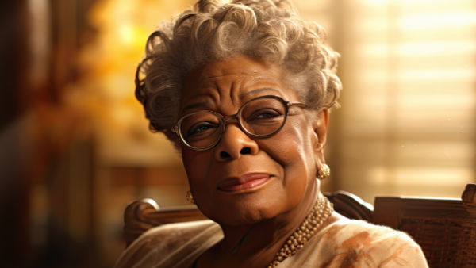

**\> Feeling burnt out? Subscribe to my [**Everyday Self-Care Newsletter**](https://seffsaid.com/newsletter/) for self-care tips and doable habits that support your well-being.**

This collection of 112 Maya Angelou quotes and sayings offer a window into the mind of one of the most influential writers and thinkers of our time. Her words reflect a deep understanding of life, love, human emotions, strength, [perseverance](https://seffsaid.com/quotes-about-perseverance/), and resilience. Each quote is a reflection of her [wisdom](https://seffsaid.com/deep-quotes-about-life/), offering insights into how to navigate the complexities of life with grace and courage. Through these sayings, you’ll find inspiration, encouragement, and a deeper appreciation for the beauty and challenges of human existence. Whether you’re seeking guidance, comfort, or a moment of reflection, these quotes from Maya Angelou provide a rich source of wisdom and inspiration.

## The Quotes

1.  “You may not control all the events that happen to you, but you can decide not to be reduced by them.” – Maya Angelou
2.  “My mission in life is not merely to survive, but to thrive; and to do so with some passion, some compassion, some humor, and some style.” – Maya Angelou
3.  “Love recognizes no barriers. It jumps hurdles, leaps fences, penetrates walls to arrive at its destination full of hope.” – Maya Angelou
4.  “Do the best you can until you know better. Then when you know better, do better.” – Maya Angelou
5.  “Life is not measured by the number of breaths we take, but by the moments that take our breath away.” – Maya Angelou
6.  “Success is liking yourself, liking what you do, and liking how you do it.” – Maya Angelou
7.  “I know for sure that loves saves me and that it is here to save us all.” – Maya Angelou
8.  “If you’re always trying to be normal, you will never know how amazing you can be.” – Maya Angelou
9.  “When you learn, teach. When you get, give.” – Maya Angelou
10.  “Courage is the most important of all the virtues because without courage, you can’t practice any other virtue consistently.” – Maya Angelou
11.  “Bitterness is like cancer. It eats upon the host. But anger is like fire. It burns it all clean.” – Maya Angelou
12.  “The desire to reach for the stars is ambitious. The desire to reach hearts is wise.” – Maya Angelou
13.  “There’s a world of difference between truth and facts. Facts can obscure the truth.” – Maya Angelou
14.  “When someone shows you who they are, believe them the first time.” – Maya Angelou
15.  “A bird doesn’t sing because it has an answer, it sings because it has a song.” – Maya Angelou
16.  “I work very hard, and I play very hard. I’m grateful for life. And I live it – I believe life loves the liver of it. I live it.” – Maya Angelou
17.  “The ache for home lives in all of us, the safe place where we can go as we are and not be questioned.” – Maya Angelou
18.  “Without courage, we cannot practice any other virtue with consistency. We can’t be kind, true, merciful, generous, or honest.” – Maya Angelou
19.  “I don’t trust people who don’t love themselves and tell me, ‘I love you.’” – Maya Angelou
20.  “You can’t really know where you are going until you know where you have been.” – Maya Angelou
21.  “Hope and fear cannot occupy the same space. Invite one to stay.” – Maya Angelou
22.  “Nothing can dim the light which shines from within.” – Maya Angelou
23.  “You can’t forgive without loving. And I don’t mean sentimentality. I don’t mean mush. I mean having enough courage to stand up and say, ‘I forgive. I’m finished with it.’” – Maya Angelou
24.  “In diversity there is beauty and there is strength.” – Maya Angelou
25.  “I have found that among its other benefits, giving liberates the soul of the giver.” – Maya Angelou
26.  “If one is lucky, a solitary fantasy can totally transform one million realities.” – Maya Angelou
27.  “The more you know of your history, the more liberated you are.” – Maya Angelou
28.  “We need joy as we need air. We need love as we need water. We need each other as we need the earth we share.” – Maya Angelou
29.  “I’ve learned that even when I’m in pain, I don’t have to be a pain.” – Maya Angelou
30.  “The most called-upon prerequisite of a friend is an accessible ear.” – Maya Angelou
31.  “I believe that the most important single thing, beyond discipline and creativity is daring to dare.” – Maya Angelou
32.  “Hate, it has caused a lot of problems in the world, but has not solved one yet.” – Maya Angelou
33.  “I know that love saves me and that it is here to save us all.” – Maya Angelou
34.  “One must know not just how to accept a gift, but with what grace to share it.” – Maya Angelou
35.  “History, despite its wrenching pain, cannot be unlived, but if faced with courage, need not be lived again.” – Maya Angelou
36.  “My great hope is to laugh as much as I cry; to get my work done and try to love somebody and have the courage to accept the love in return.” – Maya Angelou
37.  “Each of us needs to withdraw from the cares which will not withdraw from us.” – Maya Angelou
38.  “I have a son, who is my heart. A wonderful young man, daring and loving and strong and kind.” – Maya Angelou
39.  “Try to be a rainbow in someone’s cloud.” – Maya Angelou
40.  “I’ve learned that you can tell a lot about a person by the way he/she handles these three things: a rainy day, lost luggage, and tangled Christmas tree lights.” – Maya Angelou
41.  “I believe we are still so innocent. The species are still so innocent that a person who is apt to be murdered believes that the murderer, just before he puts the knife in, will have enough compassion to give him a cup of water.” – Maya Angelou
42.  “I did then what I knew how to do. Now that I know better, I do better.” – Maya Angelou
43.  “I long, as does every human being, to be at home wherever I find myself.” – Maya Angelou
44.  “My mother said I must always be intolerant of ignorance but understanding of illiteracy.” – Maya Angelou
45.  “I’ve learned that whenever I decide something with an open heart, I usually make the right decision.” – Maya Angelou
46.  “You can only become truly accomplished at something you love. Don’t make money your goal. Instead, pursue the things you love doing, and then do them so well that people can’t take their eyes off you.” – Maya Angelou
47.  “Nothing will work unless you do.” – Maya Angelou
48.  “One isn’t necessarily born with courage, but one is born with potential.” – Maya Angelou
49.  “While I know myself as a creation of God, I am also obligated to realize and remember that everyone else and everything else are also God’s creation.” – Maya Angelou
50.  “There is no greater agony than bearing an untold story inside you.” – Maya Angelou
51.  “If you don’t like something, change it. If you can’t change it, change your attitude. Don’t complain.” – Maya Angelou
52.  “Music was my refuge. I could crawl into the space between the notes and curl my back to loneliness.” – Maya Angelou
53.  “Surviving is important. Thriving is elegant.” – Maya Angelou
54.  “I don’t trust anyone who doesn’t laugh.” – Maya Angelou
55.  “Love is like a virus. It can happen to anybody at any time.” – Maya Angelou
56.  “I work very hard, and I play very hard. I’m grateful for life. And I live it – I believe life loves the liver of it. I live it.” – Maya Angelou
57.  “If I am not good to myself, how can I expect anyone else to be good to me?” – Maya Angelou
58.  “Courage – you develop courage by doing small things like just as if you wouldn’t want to pick up a 100-pound weight without preparing yourself.” – Maya Angelou
59.  “We may encounter many defeats but we must not be defeated.” – Maya Angelou
60.  “I’ve found that it’s a great deal easier to say ‘no’ when there’s a deeper ‘yes’ burning inside.” – Maya Angelou
61.  “Without courage, you cannot practice any other virtue consistently. You can practice any virtue erratically, but nothing consistently without courage.” – Maya Angelou
62.  “Seek patience and passion in equal amounts. Patience alone will not build the temple. Passion alone will destroy its walls.” – Maya Angelou
63.  “The main thing in one’s own private world is to try to laugh as much as you cry.” – Maya Angelou
64.  “A woman’s heart should be so hidden in God that a man has to seek Him just to find her.” – Maya Angelou
65.  “The idea is to write it so that people hear it and it slides through the brain and goes straight to the heart.” – Maya Angelou
66.  “My great hope is to laugh as much as I cry; to get my work done and try to love somebody and to have the courage to accept the love in return.” – Maya Angelou
67.  “As you grow older, you will discover that you have two hands, one for helping yourself, the other for helping others.” – Maya Angelou
68.  “Love is that condition in the human spirit so profound that it allows me to survive, and better than that, to thrive with passion, compassion, and style.” – Maya Angelou
69.  “I believe that each of us comes from the creator trailing wisps of glory.” – Maya Angelou
70.  “We need much less than we think we need.” – Maya Angelou
71.  “The need for change bulldozed a road down the center of my mind.” – Maya Angelou
72.  “I’ve learned that making a ‘living’ is not the same thing as ‘making a life’.” – Maya Angelou
73.  “Courage allows the successful woman to fail and learn powerful lessons from the failure, so that in the end, she didn’t fail at all.” – Maya Angelou
74.  “I don’t trust people who don’t love themselves and tell me, ‘I love you.'” – Maya Angelou
75.  “I’ve learned that whenever I decide something with an open heart, I usually make the right decision.” – Maya Angelou
76.  “If you don’t like something, change it. If you can’t change it, change your attitude.” – Maya Angelou
77.  “I’ve learned that people will forget what you said, people will forget what you did, but people will never forget how you made them feel.” – Maya Angelou
78.  “If you find it in your heart to care for somebody else, you will have succeeded.” – Maya Angelou
79.  “You can’t use up creativity. The more you use, the more you have.” – Maya Angelou
80.  “We delight in the beauty of the butterfly, but rarely admit the changes it has gone through to achieve that beauty.” – Maya Angelou
81.  “I can be changed by what happens to me, but I refuse to be reduced by it.” – Maya Angelou
82.  “Prejudice is a burden that confuses the past, threatens the future, and renders the present inaccessible.” – Maya Angelou
83.  “I don’t believe an accident of birth makes people sisters or brothers. It makes them siblings, gives them mutuality of parentage. Sisterhood and brotherhood is a condition people have to work at.” – Maya Angelou
84.  “I not only have the right to stand up for myself, but I have the responsibility.” – Maya Angelou
85.  “Life is not measured by the number of breaths you take but by the moments that take your breath away.” – Maya Angelou
86.  “A wise woman wishes to be no one’s enemy; a wise woman refuses to be anyone’s victim.” – Maya Angelou
87.  “You can never be great at anything unless you love it.” – Maya Angelou
88.  “I’ve learned that you shouldn’t go through life with a catcher’s mitt on both hands; you need to be able to throw some things back.” – Maya Angelou
89.  “Success is loving life and daring to live it.” – Maya Angelou
90.  “We can learn to see each other and see ourselves in each other and recognize that human beings are more alike than we are unalike.” – Maya Angelou
91.  “I’ve learned that even when I have pains, I don’t have to be one.” – Maya Angelou
92.  “Courage is the most important of all the virtues, because without courage you can’t practice any other virtue consistently.” – Maya Angelou
93.  “I believe that every person is born with talent.” – Maya Angelou
94.  “Love can be used for anything you can explain, any good thing that you can explain.” – Maya Angelou
95.  “The first time someone shows you who they are, believe them.” – Maya Angelou
96.  “It’s one of the greatest gifts you can give yourself, to forgive. Forgive everybody.” – Maya Angelou
97.  “I am grateful to be a woman. I must have done something great in another life.” – Maya Angelou
98.  “The idea is to write so that people hear it and it slides through the brain and goes straight to the heart.” – Maya Angelou
99.  “Whatever you want to do, if you want to be great at it, you have to love it and be able to make sacrifices for it.” – Maya Angelou
100.  “If you have only one smile in you, give it to the people you love.” – Maya Angelou
101.  “I’ve learned that you can tell a lot about a person by the way (s)he handles these three things: a rainy day, lost luggage, and tangled Christmas tree lights.” – Maya Angelou
102.  “The best comfort food will always be greens, cornbread, and fried chicken.” – Maya Angelou
103.  “I believe that the most important single thing, beyond discipline and creativity, is daring to dare.” – Maya Angelou
104.  “You may encounter many defeats, but you must not be defeated.” – Maya Angelou
105.  “I’ve learned that I still have a lot to learn.” – Maya Angelou
106.  “Ask for what you want and be prepared to get it.” – Maya Angelou
107.  “You alone are enough. You have nothing to prove to anybody.” – Maya Angelou
108.  “You can’t use up creativity. The more you use, the more you have.” – Maya Angelou
109.  “I respect myself and insist upon it from everybody. And because I do it, I then respect everybody, too.” – Maya Angelou
110.  “All great achievements require time.” – Maya Angelou
111.  “I sustain myself with the love of family.” – Maya Angelou
112.  “Making a living is not the same thing as making a life.” – Maya Angelou

## A Note from the Author

Thank you so much for taking the time to read through this extensive list of quotes from the incredible Maya Angelou. Please consider sharing this article and do visit again soon!

Best regards,

Seff Bray

[Share](https://www.facebook.com/share.php?u=https%3A%2F%2Fselfsaid.30tools.com%2Fmaya-angelou-quotes%2F)

[Pin56](https://pinterest.com/pin/create/button/?url=https://seffsaid.com/maya-angelou-quotes/&media=https%3A%2F%2Fselfsaid.30tools.com%2Fwp-content%2Fuploads%2FMaya-Angelou-Quotes-PIN.jpg&description=Explore+the+wisdom+of+a+literary+icon+with+these+112+famous+Maya+Angelou+quotes+and+sayings.+via+%40SeffSaid)

[Tweet](https://twitter.com/intent/tweet?text=112+Maya+Angelou+Quotes+And+Sayings&url=https%3A%2F%2Fselfsaid.30tools.com%2Fmaya-angelou-quotes%2F&via=SeffSaid)

[Reddit](https://www.reddit.com/submit?url=https%3A%2F%2Fselfsaid.30tools.com%2Fmaya-angelou-quotes%2F)

[Share](https://www.linkedin.com/cws/share?url=https%3A%2F%2Fselfsaid.30tools.com%2Fmaya-angelou-quotes%2F)

[More](#)

56 Shares
