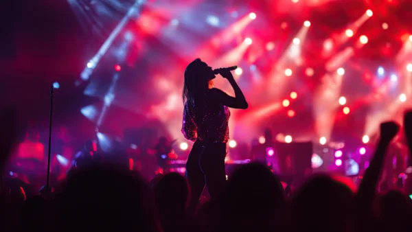

**\> Feeling burnt out? Subscribe to my [**Everyday Self-Care Newsletter**](https://seffsaid.com/newsletter/) for self-care tips and doable habits that support your well-being.**

A collection of Miley Cyrus’s best quotes on life, success, and personal growth.

*   “Life is a climb. But the view is great.” — Miley Cyrus
*   “I’m very confident in my ability to be different.” — Miley Cyrus
*   “People are always telling me that I’m not like other girls, that I don’t dress like other girls, that I don’t act like other girls.” — Miley Cyrus
*   “I’m not trying to be anybody’s role model. I just want to be an entertainer.” — Miley Cyrus
*   “There are multiple sides to all of us. Who we are and who we might be if we follow our dreams.” — Miley Cyrus
*   “The best part about being successful is that I can be me.” — Miley Cyrus
*   “The minute you stop making mistakes is the minute you stop learning.” — Miley Cyrus
*   “I am weird, you know. I’m a little strange. Everyone’s a little weird in their own way.” — Miley Cyrus
*   “Pink isn’t just a color; it’s an attitude!” — Miley Cyrus
*   “No one stays the same. People change, and sometimes you just have to let go.” — Miley Cyrus
*   “It’s the little things that make us who we are in the big picture.” — Miley Cyrus
*   “I don’t like to be put in a box. I’m a little bit of everything.” — Miley Cyrus
*   “Some of the worst things that have happened in my life actually made me who I am today.” — Miley Cyrus
*   “Only God can judge us. Forget the haters because somebody loves you.” — Miley Cyrus
*   “Music is what I breathe, what I love to do. It keeps me alive.” — Miley Cyrus
*   “I have an obsession with being rebellious. I always want to do the opposite of what everyone expects.” — Miley Cyrus
*   “Success isn’t measured by money or power or social rank. Success is measured by your discipline and inner peace.” — Miley Cyrus
*   “I’m not perfect. I make mistakes. I do things that I regret.” — Miley Cyrus
*   “Beauty is the enemy. We try to conquer not feeling beautiful all our lives. It’s a battle that can’t be won.” — Miley Cyrus
*   “I want to be remembered as someone who had fun in life, who took risks.” — Miley Cyrus
*   “You can’t live a [positive life](https://seffsaid.com/easy-ways-to-develop-a-positive-attitude/) with a negative mind.” — Miley Cyrus
*   “If you believe in yourself, anything is possible.” — Miley Cyrus
*   “Your dreams don’t expire. Take a deep breath and try again.” — Miley Cyrus
*   “You are only young once, but if you work it right, once is enough.” — Miley Cyrus
*   “It’s our decisions that define us, not the mistakes we make.” — Miley Cyrus
*   “Don’t let anyone tell you that you aren’t good enough.” — Miley Cyrus
*   “The minute you start thinking it’s not cool to care about other people, is the minute you’re losing.” — Miley Cyrus
*   “Never stop believing in yourself. Never let anyone tell you that you can’t achieve your dreams.” — Miley Cyrus
*   “I don’t have to be perfect. All I have to do is show up and enjoy the messy, imperfect, and beautiful journey of my life.” — Miley Cyrus
*   “I always say the minute I stop making mistakes is the minute I stop learning, and I’ve definitely learned a lot.” — Miley Cyrus

Read more [quotes by famous artists](https://seffsaid.com/quotes-by-famous-people/) here.

[Share](https://www.facebook.com/share.php?u=https%3A%2F%2Fselfsaid.30tools.com%2Fmiley-cyrus-quotes%2F)

[Pin2](https://pinterest.com/pin/create/button/?url=https://seffsaid.com/miley-cyrus-quotes/&media=https%3A%2F%2Fselfsaid.30tools.com%2Fwp-content%2Fuploads%2FMiley-Cyrus-Quotes-PIN.jpg&description=A+collection+of+Miley+Cyrus%27s+best+quotes+on+life%2C+success%2C+and+personal+growth.+via+%40SeffSaid)

[Tweet](https://twitter.com/intent/tweet?text=Miley+Cyrus%27s+Best+Quotes&url=https%3A%2F%2Fselfsaid.30tools.com%2Fmiley-cyrus-quotes%2F&via=SeffSaid)

[Reddit](https://www.reddit.com/submit?url=https%3A%2F%2Fselfsaid.30tools.com%2Fmiley-cyrus-quotes%2F)

[Share](https://www.linkedin.com/cws/share?url=https%3A%2F%2Fselfsaid.30tools.com%2Fmiley-cyrus-quotes%2F)

[More](#)

2 Shares
