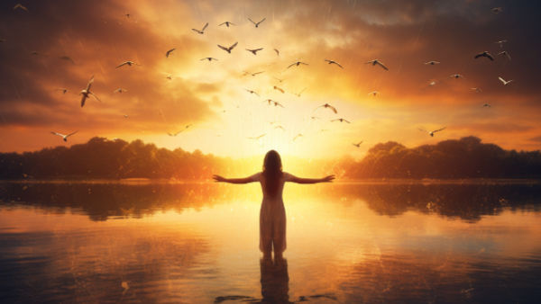

**\> Feeling burnt out? Subscribe to my [**Everyday Self-Care Newsletter**](https://seffsaid.com/newsletter/) for self-care tips and doable habits that support your well-being.**

Here’s a list of 99 New Beginning Quotes that focus on optimism, resilience, and the [courage](https://seffsaid.com/quotes-about-courage/) to face change and new opportunities. These quotes are not just words; they are [deep quotes](https://seffsaid.com/deep-quotes-about-life/) that [make you think](https://seffsaid.com/quotes-that-make-you-think/) about how to approach life’s changes. Each one offers a different view on what it means to start over and the strength it takes to do so. As you read these new beginning quotes, you might find encouragement and a fresh way to look at the changes in your life. They remind you that every new start is a chance to do things differently and better.

1.  “Every day is a new beginning. Take a deep breath and start again.” – Unknown
2.  “Every end is a new beginning.” – Proverb
3.  “And now we welcome the new year, full of things that have never been.” – Rainer Maria Rilke
4.  “Nothing in the universe can stop you from letting go and starting over.” – Guy Finley
5.  “Some of us think holding on makes us strong, but sometimes it is letting go.” – Hermann Hesse
6.  “Every day is a new beginning. Take a deep breath, smile, and start again.” – Unknown
7.  “Change can be scary, but you know what’s scarier? Allowing fear to stop you from growing, evolving, and progressing.” – Mandy Hale
8.  “You may have a fresh start any moment you choose, for this thing that we call ‘failure’ is not the falling down, but the staying down.” – Mary Pickford
9.  “Take the first step in faith. You don’t have to see the whole staircase, just take the first step.” – Martin Luther King Jr.
10.  “You don’t have to be great to start, but you have to start to be great.” – Zig Ziglar
11.  “New beginnings are disguised as painful endings.” – Lao Tzu
12.  “Start by doing what’s necessary; then do what’s possible; and suddenly you are doing the impossible.” – Francis of Assisi
13.  “Change is hard at first, messy in the middle and gorgeous at the end.” – Robin Sharma
14.  “Sometimes the smallest step in the right direction ends up being the biggest step of your life.” – Naeem Callaway
15.  “The only limit to our realization of tomorrow will be our doubts of today.” – Franklin D. Roosevelt
16.  “There’s a sunrise and a sunset every single day, and they’re absolutely free. Don’t miss so many of them.” – Jo Walton
17.  “Courage is the power to let go of the familiar.” – Raymond Lindquist
18.  “Don’t live the same year 75 times and call it a life.” – Robin Sharma
19.  “Change is the law of life. And those who look only to the past or present are certain to miss the future.” – John F. Kennedy
20.  “Realize that if a door closed, it’s because what was behind it wasn’t meant for you.” – Mandy Hale
21.  “Sometimes we can only find our true direction when we let the wind of change carry us.” – Mimi Novic
22.  “The secret of change is to focus all of your energy not on fighting the old, but on building the new.” – Socrates
23.  “Some changes look negative on the surface but you will soon realize that space is being created in your life for something new to emerge.” – Eckhart Tolle
24.  “And suddenly you know: It’s time to start something new and trust the magic of beginnings.” – Meister Eckhart
25.  “Your life does not get better by chance, it gets better by change.” – Jim Rohn
26.  “Getting over a painful experience is much like crossing monkey bars. You have to let go at some point in order to move forward.” – C.S. Lewis
27.  “The greatest of all capabilities of a human being is to become born again.” – J.R. Rim
28.  “There will come a time when you believe everything is finished; that will be the beginning.” – Louis L’Amour
29.  “The first step towards getting somewhere is to decide that you are not going to stay where you are.” – Chauncey Depew
30.  “New beginnings can feel like endings.” – Lianne Avila
31.  “Each new day is a blank page in the diary of your life. The secret of success is in turning that diary into the best story you possibly can.” – Douglas Pagels
32.  “Whatever you do, or dream you can, begin it. Boldness has genius and power and magic in it.” – Johann Wolfgang von Goethe
33.  “And suddenly you just know it’s time to start something new and trust the magic of beginnings.” – Meister Eckhart
34.  “The secret of getting ahead is getting started.” – Mark Twain
35.  “No matter how hard the past is, you can always begin again.” – Buddha
36.  “The magic in new beginnings is truly the most powerful of them all.” – Josiyah Martin
37.  “Although no one can go back and make a brand new start, anyone can start from now and make a brand new ending.” – Carl Bard
38.  “New beginnings are often disguised as uncomfortable endings.” – Unknown
39.  “Every day is a new beginning. Stay away from what might have been and look at what can be.” – Marsha Petrie Sue
40.  “The only real battle in life is between hanging on and letting go.” – Shannon L. Alder
41.  “The best time for new beginnings, is now.” – Unknown
42.  “Life’s not about expecting, hoping and wishing, it’s about doing, being and becoming.” – Mike Dooley
43.  “You can’t go back and change the beginning, but you can start where you are and change the ending.” – C.S. Lewis
44.  “Let go of yesterday. Let today be a new beginning and be the best that you can.” – Joel Osteen
45.  “Sometimes the best thing that can happen to a person is to have a new start with a new outlook on life.” – Karen Madewell
46.  “The beginning is always today.” – Mary Shelley
47.  “It’s never too late to become who you want to be. I hope you live a life that you’re proud of, and if you find that you’re not, I hope you have the strength to start over.” – F. Scott Fitzgerald
48.  “A new beginning is not starting over; it’s a continuation with more wisdom, strength, and power.” – Unknown
49.  “New beginnings are like the sunrise; they always give a chance to do things right.” – Unknown
50.  “There are two mistakes one can make along the road to truth… not going all the way, and not starting.” – Buddha
51.  “No matter how hard the past, you can always begin again.” – Buddha
52.  “Take the first step in faith. You don’t have to see the whole staircase, just take the first step.” – Martin Luther King Jr.
53.  “It is never too late to be what you might have been.” – George Eliot
54.  “The best time to start was yesterday. The next best time is now.” – Unknown
55.  “Do not wait until the conditions are perfect to begin. Beginning makes the conditions perfect.” – Alan Cohen
56.  “Failure is the opportunity to begin again more intelligently.” – Henry Ford
57.  “It’s never too late to be who you might have been.” – George Eliot
58.  “Life begins at the end of your comfort zone.” – Neale Donald Walsch
59.  “Every day is a chance to begin again. Don’t focus on the failures of yesterday, start today with positive thoughts and expectations.” – Catherine Pulsifer
60.  “There are far, far better things ahead than any we leave behind.” – C.S. Lewis
61.  “The darkest night is often the bridge to the brightest tomorrow.” – Jonathan Lockwood Huie
62.  “Growth is painful. Change is painful. But nothing is as painful as staying stuck somewhere you don’t belong.” – Mandy Hale
63.  “What feels like the end is often the beginning.” – Unknown
64.  “Keep on beginning and failing. Each time you fail, start all over again, and you will grow stronger until you have accomplished a purpose.” – Anne Sullivan
65.  “Don’t be afraid to start over. It’s a chance to build something better this time.” – Unknown
66.  “Every new beginning comes from some other beginning’s end.” – Seneca
67.  “Nothing is predestined. The obstacles of your past can become the gateways that lead to new beginnings.” – Ralph Blum
68.  “The future belongs to those who believe in the beauty of their dreams.” – Eleanor Roosevelt
69.  “Life is a great big canvas, and you should throw all the paint on it you can.” – Danny Kaye
70.  “The best time to plant a tree was 20 years ago. The second best time is now.” – Chinese Proverb
71.  “It’s never too late to be what you might have been.” – George Eliot
72.  “One can begin so many things with a new person! – even begin to be a better man.” – George Eliot
73.  “Celebrate endings—for they precede new beginnings.” – Jonathan Lockwood Huie
74.  “Begin somewhere; you cannot build a reputation on what you intend to do.” – Liz Smith
75.  “In the midst of change we often discover wings we never knew we had.” – Ekaterina Walter
76.  “Every day is a new opportunity to begin again. Every day is your birthday.” – Dalai Lama
77.  “Change is the end result of all true learning.” – Leo Buscaglia
78.  “One day or day one. You decide.” – Unknown
79.  “The best time for new beginnings is now.” – Unknown
80.  “New beginnings are often disguised as painful endings.” – Lao Tzu
81.  “Every new beginning comes from some other beginning’s end.” – Seneca
82.  “The first step towards getting somewhere is to decide you’re not going to stay where you are.” – J.P. Morgan
83.  “Life is about change, sometimes it’s painful, sometimes it’s beautiful, but most of the time it’s both.” – Kristin Kreuk
84.  “The secret to a rich life is to have more beginnings than endings.” – Dave Weinbaum
85.  “Every moment is a fresh beginning.” – T.S. Eliot
86.  “Begin today. Declare out loud to the universe that you are willing to let go of struggle and eager to learn through joy.” – Sarah Ban Breathnach
87.  “No river can return to its source, yet all rivers must have a beginning.” – Native American Proverb
88.  “The beginning is always today.” – Mary Wollstonecraft Shelley
89.  “It’s a wise man who understands that every day is a new beginning, because boy, how many mistakes do you make in a day?” – Mel Gibson
90.  “Be willing to be a beginner every single morning.” – Meister Eckhart
91.  “The only way to make sense out of change is to plunge into it, move with it, and join the dance.” – Alan Watts
92.  “The beginning is the most important part of the work.” – Plato
93.  “A journey of a thousand miles begins with a single step.” – Lao Tzu
94.  “What the caterpillar calls the end, the rest of the world calls a butterfly.” – Lao Tzu
95.  “Start where you are. Use what you have. Do what you can.” – Arthur Ashe
96.  “There are far better things ahead than any we leave behind.” – C.S. Lewis
97.  “Every sunset is an opportunity to reset.” – Richie Norton
98.  “You are never too old to set another goal or to dream a new dream.” – C.S. Lewis
99.  “Let your first success be just a beginning. Let your dreams chase you.” – Amit Ahlawat

[Share](https://www.facebook.com/share.php?u=https%3A%2F%2Fseffsaid.com%2Fnew-beginning-quotes%2F)

[Pin2](https://pinterest.com/pin/create/button/?url=https://seffsaid.com/new-beginning-quotes/&media=https%3A%2F%2Fseffsaid.com%2Fwp-content%2Fuploads%2Fnew-beginning-quotes-PIN.jpg&description=Find+your+inspiration+for+a+fresh+start+among+these+99+powerful+New+Beginning+Quotes+about+starting+over.+via+%40SeffSaid)

[Tweet](https://twitter.com/intent/tweet?text=99+New+Beginning+Quotes+About+Starting+Over&url=https%3A%2F%2Fseffsaid.com%2Fnew-beginning-quotes%2F&via=SeffSaid)

[Reddit](https://www.reddit.com/submit?url=https%3A%2F%2Fseffsaid.com%2Fnew-beginning-quotes%2F)

[Share](https://www.linkedin.com/cws/share?url=https%3A%2F%2Fseffsaid.com%2Fnew-beginning-quotes%2F)

[More](#)

2 Shares
