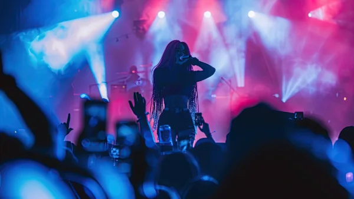

**\> Feeling burnt out? Subscribe to my [**Everyday Self-Care Newsletter**](https://seffsaid.com/newsletter/) for self-care tips and doable habits that support your well-being.**

Nicki Minaj has shared many powerful and memorable quotes over the years, making her a source of inspiration for fans around the world. In this article, you’ll find some of her best quotes that capture her unique perspective and wisdom. Read more [quotes from celebrities](https://seffsaid.com/quotes-by-famous-people/), authors, famous entrepreneurs, and musicians here.

1.  “You don’t have to feel the need to put somebody down to make yourself feel better.” — Nicki Minaj
2.  “You should never feel afraid to become a piece of art. It’s exhilarating.” — Nicki Minaj
3.  “Your victory is right around the corner. Never give up.” — Nicki Minaj
4.  “True confidence leaves no room for jealousy. When you know you are great, you have no need to hate.” — Nicki Minaj
5.  “When you’re a girl, you have to be everything, You have to be dope at what you do but you have to be super sweet and you have to be sexy…and you have to be nice. It’s like, I can’t be all those things at once. I’m a human being.” — Nicki Minaj
6.  “I think women are much smarter than men.” — Nicki Minaj
7.  “You wanna know what scares people? Success. When you don’t make moves and when you don’t climb up the ladder, everybody loves you because you’re not competition.” — Nicki Minaj
8.  “Don’t stay watching happiness, make it.” — Nicki Minaj
9.  “I’ve always been inspired by people who can speak their truth.” — Nicki Minaj
10.  “People will love you and support you when it’s beneficial.” — Nicki Minaj
11.  “To live doesn’t mean you’re alive.” — Nicki Minaj
12.  “I don’t promote giving up. I promote fighting and winning.” — Nicki Minaj
13.  “I don’t mind being a bad girl. I want to make my mark.” — Nicki Minaj
14.  “I think the way I dress and carry myself, a lot of people find it intimidating. It’s unfortunate because people don’t understand where it’s coming from.” — Nicki Minaj
15.  “I feel like my entire career and life, I’ve been judged by people who don’t know me.” — Nicki Minaj
16.  “I stand for girls wanting to be sexy and dance, but also having a strong sense of themselves.” — Nicki Minaj
17.  “My advice to women in general: Even if you’re doing a nine-to-five job, treat yourself like a boss.” — Nicki Minaj
18.  “You have to be a beast. That’s the only way they respect you.” — Nicki Minaj
19.  “I don’t have to do things just to please people.” — Nicki Minaj
20.  “No matter what he or she does, I will always love my mother.” — Nicki Minaj
21.  “I want people—especially young girls—to know that in life, nothing is going to be based on sex appeal.” — Nicki Minaj
22.  “There’s nothing more beautiful than a smile that has struggled through tears.” — Nicki Minaj
23.  “Call it a curse, or just call me blessed. If you can’t handle my worst, you ain’t getting my best.” — Nicki Minaj
24.  “I am not a word, I am not a line, I am not a girl that can ever be defined.” — Nicki Minaj
25.  “When I win and when I lose, I take ownership of it, because I really am in charge of what I do.” — Nicki Minaj
26.  “The people that are inclined to hate, are also inclined to be losers.” — Nicki Minaj
27.  “Life is a prize, but to live doesn’t mean you’re alive.” — Nicki Minaj
28.  “You wanna know what scares people? Success. When you don’t make moves, and you don’t climb up the ladder, everybody loves you because you’re not competition.” — Nicki Minaj
29.  “People will love you and support you when it’s beneficial.” — Nicki Minaj
30.  “Refuse to lose, refuse to be defeated, refuse to have regrets.” — Nicki Minaj
31.  “I’ve been told my whole life I needed to sound like someone else. But I am not someone else. I am me.” — Nicki Minaj
32.  “You don’t have to be perfect, but you have to be 100% committed.” — Nicki Minaj
33.  “Some people have to put up walls, not to keep others out, but to see who cares enough to break them down.” — Nicki Minaj
34.  “Good advice I always hated, but lookin’ back it made me greater.” — Nicki Minaj
35.  “I’m very proud of my team. They inspire me every day.” — Nicki Minaj
36.  “Cherish these nights, cherish these people. Life is a movie, but there’ll never be a sequel.” — Nicki Minaj
37.  “To make it to the top, you must be prepared to get your hands dirty.” — Nicki Minaj
38.  “I’m fighting to keep my fans. I never want to be the artist begging for attention.” — Nicki Minaj
39.  “You don’t have to play dumb to be cute. You don’t have to play submissive to be sexy.” — Nicki Minaj
40.  “If you don’t take control of your career, guess what? You’ll be stuck in the sunset watching the sunrise of another person’s success.” — Nicki Minaj
41.  “I believe that life is a prize, but to live doesn’t mean you’re alive.” — Nicki Minaj
42.  “I’m not a girl that can ever be defined.” — Nicki Minaj
43.  I will always remember this [moment in my life](https://seffsaid.com/three-word-quotes/) as one of the happiest moments.” — Nicki Minaj
44.  “When I am assertive, I’m a bitch. When a man is assertive, he’s a boss.” — Nicki Minaj
45.  “The more we can break the rules, the better off we’re going to be.” — Nicki Minaj
46.  “I think as long as you have something to believe in, it sort of keeps you grounded.” — Nicki Minaj
47.  “It’s about taking chances and learning as you grow.” — Nicki Minaj
48.  “I’d rather have an honest enemy than a fake friend.” — Nicki Minaj
49.  “You have to be able to accept failure to get better.” — Nicki Minaj
50.  “Your imperfections are what make you beautiful.” — Nicki Minaj

[Share](https://www.facebook.com/share.php?u=https%3A%2F%2Fselfsaid.30tools.com%2Fnicki-minaj-quotes%2F)

[Pin4](https://pinterest.com/pin/create/button/?url=https://seffsaid.com/nicki-minaj-quotes/&media=https%3A%2F%2Fselfsaid.30tools.com%2Fwp-content%2Fuploads%2FNicki-Minaj-Quotes-PIN.jpg&description=Experience+the+brilliance+of+Nicki+Minaj+with+this+compilation+of+her+50+best+quotes.+via+%40SeffSaid)

[Tweet](https://twitter.com/intent/tweet?text=Nicki+Minaj%27s+Best+Quotes&url=https%3A%2F%2Fselfsaid.30tools.com%2Fnicki-minaj-quotes%2F&via=SeffSaid)

[Reddit](https://www.reddit.com/submit?url=https%3A%2F%2Fselfsaid.30tools.com%2Fnicki-minaj-quotes%2F)

[Share](https://www.linkedin.com/cws/share?url=https%3A%2F%2Fselfsaid.30tools.com%2Fnicki-minaj-quotes%2F)

[More](#)

4 Shares
