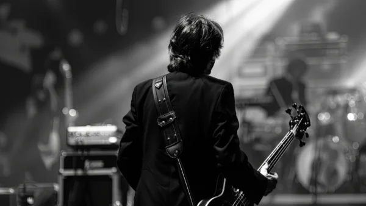

**\> Feeling burnt out? Subscribe to my [**Everyday Self-Care Newsletter**](https://seffsaid.com/newsletter/) for self-care tips and doable habits that support your well-being.**

Paul McCartney, the legendary singer, songwriter and bass player from The Beatles, has shared countless quotes over the years. This article presents 50 of his most memorable quotes, showcasing his wisdom, humor, and unique outlook on life. Whether you’re a lifelong fan of The Beatles or someone who appreciates thoughtful reflections on various aspects of life, this collection is for you. You can read more [quotes by The Beatles](https://seffsaid.com/beatles-quotes/) here.

1.  “I used to think anyone doing anything weird was weird. Now I know that it is the people that call others weird that are weird.” – Paul McCartney
2.  “Think globally, act locally.” – Paul McCartney
3.  “In the end, the love you take is equal to the love you make.” – Paul McCartney
4.  “I don’t work at being ordinary.” – Paul McCartney
5.  “I’ve got to admit it’s getting better. It’s a little better all the time.” – Paul McCartney
6.  “And in the end, the love you take, is equal to the love you make.” – Paul McCartney
7.  “You can judge a man’s true character by the way he treats his fellow animals.” – Paul McCartney
8.  “One of my biggest thrills for me still is sitting down with a guitar or a piano and just out of nowhere trying to make a song happen.” – Paul McCartney
9.  “Why would I retire? Sit at home and watch TV? No thanks. I’d rather be out playing.” – Paul McCartney
10.  “I feel like I’m just starting.” – Paul McCartney
11.  “Music is like a psychiatrist. You can tell your guitar things that you cannot tell people.” – Paul McCartney
12.  “I don’t ever try to make a serious social comment.” – Paul McCartney
13.  “I don’t take me seriously. If we get some giggles, I don’t mind.” – Paul McCartney
14.  “Some people want to fill the world with silly love songs. And what’s wrong with that?” – Paul McCartney
15.  “There are only four people who knew what the Beatles were about anyway.” – Paul McCartney
16.  “It’s time to end the cruel slaughter of whales and leave these magnificent creatures alone.” – Paul McCartney
17.  “We live in a world where we have to hide to make love, while violence is practiced in broad daylight.” – Paul McCartney
18.  “I’m not religious, but I’m very spiritual.” – Paul McCartney
19.  “If children are studying the 20th century, I’m in their text books.” – Paul McCartney
20.  “I don’t ever try to make a social comment. We’re just trying to write songs about the human condition and the human experience, and it’s up to the listener to take away what they want from it.” – Paul McCartney
21.  “The Beatles saved the world from boredom.” – Paul McCartney
22.  “The only time I end up feeling sad is when I’m hungry.” – Paul McCartney
23.  “I can’t deal with the press; I hate all those Beatles questions.” – Paul McCartney
24.  “Animation is not just for children – it’s also for adults who take drugs.” – Paul McCartney
25.  “Love is all you need.” – Paul McCartney
26.  “I don’t believe in yesterday, by the way.” – Paul McCartney
27.  “I’ve often said, the only thing standing between me and greatness is me.” – Paul McCartney
28.  “People who get nostalgic about childhood were obviously never children.” – Paul McCartney
29.  “Pain is inevitable, suffering is optional.” – Paul McCartney
30.  “Trying to please everybody is impossible – if you did that, you’d end up in the middle with nobody liking you. You’ve just got to make the decision about what you think is your best, and do it.” – Paul McCartney
31.  “Looking for a job in the middle of nowhere led me nowhere, so I decided to pursue my passion for music.” – Paul McCartney
32.  “To keep the record straight, it wasn’t always John and Yoko. We’ve all accused one another of various business things; we tend to be pretty paranoid by now, as you can imagine. There’s a lot of money involved.” – Paul McCartney
33.  “I’m often accused of being too optimistic, but isn’t that what life’s all about?” – Paul McCartney
34.  “I never look forward, I never look back. I live in the now.” – Paul McCartney
35.  “Having money is just a way of being free.” – Paul McCartney
36.  “Vegetarianism is a way of living consciously on the planet.” – Paul McCartney
37.  “If you want to save a species, simply decide to eat something else.” – Paul McCartney
38.  “I get by with a little help from my friends.” – Paul McCartney
39.  “When I sit down at my piano, I seem to be able to tap into the emotional essence of things.” – Paul McCartney
40.  “Each day is a drive through history.” – Paul McCartney
41.  “Freedom is not just a word, it’s a way of life.” – Paul McCartney
42.  “If slaughterhouses had glass walls, everyone would be a vegetarian.” – Paul McCartney
43.  “The movement you need is on your shoulder.” – Paul McCartney
44.  “It doesn’t matter how long my hair is or what colour my skin is or whether I’m a woman or a man.” – Paul McCartney
45.  “I always try to believe the best of everybody — it saves so much trouble.” – Paul McCartney
46.  “You’ve got to believe in yourself. That’s the secret.” – Paul McCartney
47.  “Take these broken wings and learn to fly.” – Paul McCartney
48.  “[Everything will be okay](https://seffsaid.com/everything-will-be-ok-quotes/) in the end. If it’s not okay, it’s not the end.” – Paul McCartney
49.  “Life is what happens to you while you’re busy making other plans.” – Paul McCartney
50.  “We all have our moments of brilliance and glory, and this was mine.” – Paul McCartney

[Share](https://www.facebook.com/share.php?u=https%3A%2F%2Fseffsaid.com%2Fpaul-mccartney-quotes%2F)

[Pin30](https://pinterest.com/pin/create/button/?url=https://seffsaid.com/paul-mccartney-quotes/&media=https%3A%2F%2Fseffsaid.com%2Fwp-content%2Fuploads%2FPaul-McCartney-Quotes-PIN.jpg&description=This+compilation+of+Paul+McCartney%27s+50+best+quotes+reveals+the+soul+behind+the+songs+that+defined+a+generation.+via+%40SeffSaid)

[Tweet](https://twitter.com/intent/tweet?text=Paul+McCartney%27s+50+Best+Quotes&url=https%3A%2F%2Fseffsaid.com%2Fpaul-mccartney-quotes%2F&via=SeffSaid)

[Reddit](https://www.reddit.com/submit?url=https%3A%2F%2Fseffsaid.com%2Fpaul-mccartney-quotes%2F)

[Share](https://www.linkedin.com/cws/share?url=https%3A%2F%2Fseffsaid.com%2Fpaul-mccartney-quotes%2F)

[More](#)

30 Shares
