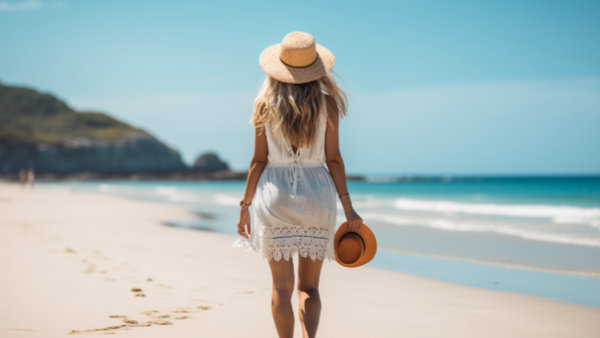

**\> Feeling burnt out? Subscribe to my [**Everyday Self-Care Newsletter**](https://seffsaid.com/newsletter/) for self-care tips and doable habits that support your well-being.**

Being single is a time rich with potential, a time where you can discover the joys of self-reliance, personal growth, and the true value of independence. It’s an opportunity to understand and embrace your [wild spirit](https://seffsaid.com/free-spirit-quotes/), to really [know your worth](https://seffsaid.com/know-your-worth-quotes/) outside the confines of a relationship. This collection of 185 quotes about being single captures the essence of this unique phase in life. It highlights the importance of finding your inner beauty and strength while navigating the world solo. These quotes offer perspectives and insights into the fulfilling nature of a single life. They remind you that being on your own is not just a status but a moment to grow, learn, and flourish independently.

1.  “The trouble is not that I am single and likely to stay single, but that I am lonely and likely to stay lonely.” – Charlotte Brontë
2.  “I think it’s very healthy to spend time alone. You need to know how to be alone and not be defined by another person.” – Oscar Wilde
3.  “I celebrate myself, and sing myself.” – Walt Whitman
4.  “If you really are going to be a happy single, you have to stop treating being single as the annoying time that you pass between relationships and embrace it. Rather than focusing on what you lack, focus on what you have: You.” – Natalie Lue
5.  “I don’t like to be labeled as lonely just because I am alone.” – Delta Burke
6.  “I like being single, I’m always there when I need me.” – Art Leo
7.  “I’m single because I was born that way.” – Mae West
8.  “Being single doesn’t necessarily mean you’re available. Sometimes you have to put up a sign that says, ‘Do Not Disturb’ on your heart.” – Wiz Khalifa
9.  “Being single is pretty good. It’s a nice sense of irresponsibility.” – Michael Douglas
10.  “He sleeps fastest who sleeps alone.” – Richard Avedon
11.  “You do not need to be loved, not at the cost of yourself. The single relationship that is truly central and crucial in a life is the relationship to the self.” – Joy Bell C.
12.  “My alone feels so good, I’ll only have you if you’re sweeter than my solitude.” – Warsan Shire
13.  “Being single is getting over the illusion that there is somebody out there to complete you.” – Omkar Phatakc
14.  “I never found a companion that was so companionable as solitude.” – Henry David Thoreau
15.  “I love being single. It’s almost like being rich.” – Sue Grafton
16.  “Being single isn’t a time to be looking for love, use that time to work on yourself and grow as an individual.” – Unknown
17.  “Single is not a status. It is a word that describes a person who is strong enough to live and enjoy life without depending on others.” – Prixie
18.  “There is something really cool about knowing that your destiny is SO big that you’re not meant to share it with anyone. At least not yet.” – Mandy Hale
19.  “Being single means you’re taking your time deciding how you want your life to be and who you want to spend it with.” – Unknown
20.  “Being brave enough to be alone frees you up to invite people into your life because you want them and not because you need them.” – Mandy Hale
21.  “A busy, vibrant, goal-oriented woman is so much more attractive than a woman who waits around for a man to validate her existence.” – Mandy Hale
22.  “As a self-described idealistic, I never consider myself as single. I like to say that I’m in between romances at the moment.” – Carl Henegan
23.  “Discover why you’re important, then refuse to settle for anyone who doesn’t completely agree.” – Fisher Amelie
24.  “Some people think it’s wrong, being single isn’t right. But you hurt the right person you’ll be wrong all your life.” – Tyga
25.  “I’m not single. I’m in a long-standing relationship with fun and freedom.” – Unknown
26.  “You do not need a significant other to lead a significant life.” – Mandy Hale
27.  “I’m single simply because I can’t find someone who’s worth my time.” – Unknown
28.  “Sometimes ‘I’m single’ means ‘I’m drama free, less stressed, and refuse to settle for less’.” – Unknown
29.  “A season of loneliness and isolation is when the caterpillar gets its wings. Remember that next time you feel alone.” – Mandy Hale
30.  “Hope for love, pray for love, wish for love, dream for love…but don’t put your life on hold waiting for love.” – Mandy Hale
31.  “Being single is smarter than being in the wrong relationship.” – Unknown
32.  “Single is no longer a lack of options – but a choice. A choice to refuse to let your life be defined by your relationship status but to live every day Happily and let your Ever After work itself out.” – Mandy Hale
33.  “Too many women throw themselves into romance because they’re afraid of being single, then start making compromises and losing their identity. I won’t do that.” – Julie Delpy
34.  “Yes, I’m alone. But I’m alone and free.” – Elsa (from “Frozen”)
35.  “I don’t really do that whole ‘single life’ thing. I’m kind of heads down and get things done.” – Ed Sheeran
36.  “Single? No, I am just in a relationship with freedom.” – Unknown
37.  “If you aren’t good at loving yourself, you will have a difficult time loving anyone, since you’ll resent the time and energy you give another person that you aren’t even giving to yourself.” – Barbara De Angelis
38.  “I’m not single. I’m in a long-term relationship with adventure and fun.” – Unknown
39.  “Being single means you can truly learn to love yourself and your independence.” – Unknown
40.  “Being single doesn’t mean you’re weak. It means you’re strong enough to wait for what you deserve.” – Niall Horan
41.  “I’m not single. I’m not taken. I’m simply on reserve for the one who deserves my heart.” – Unknown
42.  “The art of being single is learning how to be comfortable with solitude.” – Unknown
43.  “A single life is not a failed life.” – Elizabeth Gilbert
44.  “Stay single until someone actually complements your life in a way that it makes it better to not be single. If not, it’s not worth it.” – Unknown
45.  “I’m not single. I’m in a long-term relationship with action, adventure and fun.” – Unknown
46.  “Being single isn’t the cause of loneliness, and marriage is not necessarily the cure. There are many lonely married people as well.” – Renee Jones
47.  “Being single is better than being in a relationship with someone who fills your heart with doubt.” – Unknown
48.  “A single life does not equal a lonely life.” – Unknown
49.  “When you’re single, all you see are happy couples. When you’re committed, all you see are happy singles.” – Unknown
50.  “I decided to stay single just because, no one is loyal nowadays.” – Unknown
51.  “I enjoy being single, but I loved being married.” – Stephanie Mills
52.  “Just because you’re single doesn’t mean you’re not good enough for anyone. Just means no one is good enough for you, yet.” – Unknown
53.  “Being single doesn’t mean no one loves you. It means that God is busy writing your love story.” – Unknown
54.  “I’m not single, I’m not taken, I’m simply on reserve for the one who deserves my heart.” – Unknown
55.  “If you’re single, focus on being a better you instead of looking for someone better than your ex. A better you will attract a better next.” – Unknown
56.  “There’s something cool about knowing that your destiny is so big that you’re not meant to share it with anyone. At least not yet.” – Mandy Hale
57.  “Being single is definitely better than being with the wrong person.” – Hassan Choughari
58.  “I like being single — I’m always there when I need me.” – Art Leo
59.  “Single is not a status. It’s a word that best describes a person who is strong enough to live and enjoy life without depending on others.” – Unknown
60.  “Sometimes, being single is the script for a beautiful story about independence and self-empowerment.” – Unknown
61.  “Single is an opportunity to live life on your own terms and not apologize.” – Mandy Hale
62.  “I’m single, and I am proud. You have to embrace the moment.” – Rebel Wilson
63.  “A single rose can be my garden; a single friend, my world.” – Leo Buscaglia
64.  “Being single means you’re strong enough to wait for what you deserve.” – Niall Horan
65.  “The most profound relationship we will ever have is the one with ourselves.” – Shirley MacLaine
66.  “Single is not a status. It is a word that describes a person who is strong enough to enjoy life alone.” – Unknown
67.  “I’m not single, I’m in a long-term relationship with fun and freedom.” – Unknown
68.  “Being single is better than being in a bad relationship.” – Unknown
69.  “Sometimes ‘I’m single’ means ‘I’m drama free, less stressed, and I refuse to settle for less’.” – Unknown
70.  “Don’t be scared to walk alone. Don’t be scared to like it.” – John Mayer
71.  “Being single is about celebrating and appreciating your own space that you’re in.” – Kelly Rowland
72.  “Single? No, I’m just in a relationship with freedom.” – Unknown
73.  “You don’t have to be part of a couple to be happy, you know.” – Phyllis Reynolds Naylor
74.  “I’m single because I don’t need anyone to ruin my life. I’m ruining it perfectly on my own.” – Unknown
75.  “Being single doesn’t necessarily mean you’re available.” – Unknown
76.  “If you’re single, focus on being a better you instead of looking for someone better than your ex.” – Unknown
77.  “I’m not single. I’m not taken. I’m simply on reserve for the one who deserves my heart.” – Unknown
78.  “Too many women throw themselves into romance because they’re afraid of being single.” – Julie Delpy
79.  “Being single and having peace of mind is much better than being in a relationship where you feel single and have no peace of mind.” – Unknown
80.  “Just because you’re single doesn’t mean you’re not good enough for anyone.” – Unknown
81.  “Single is an opportunity to rethink your life and to come back stronger.” – Unknown
82.  “Being single isn’t a compromise. It’s a privilege.” – Unknown
83.  “I like being single — I’m always there when I need me.” – Art Leo
84.  “Single is not a status, it’s a word that shows that you’re strong enough to enjoy life without depending on others.” – Unknown
85.  “Single life is the best life until you get hit by lonely nights.” – Jonathan Burkett
86.  “Being single is not a time to look for love, but a time to love yourself.” – Unknown
87.  “A single life inspires others to live freely and unapologetically.” – Unknown
88.  “Embrace the beauty of your solo journey.” – Mandy Hale
89.  “Singlehood is not about the absence of love, but the ability to love yourself.” – Unknown
90.  “The joy of being single lies in the freedom it brings.” – Unknown
91.  “Single and happy is better than married and miserable.” – Unknown
92.  “In your single life, you’re the artist of your own experience.” – Unknown
93.  “Choosing to be single isn’t selfish, it’s just smarter to be alone than with the wrong person.” – Unknown
94.  “A single journey is a journey of self-discovery.” – Unknown
95.  “Being single is a situation, while being lonely is a feeling. You can be alone and not feel lonely.” – Unknown
96.  “I’m single because I’m strong enough to live and enjoy life without depending on others.” – Unknown
97.  “Celebrate singlehood, for it is your time to shine independently.” – Unknown
98.  “In the kingdom of your own heart, being single is being in power.” – Unknown
99.  “Single life is the seedbed of personal growth and exploration.” – Unknown
100.  “When you’re single, your possibilities are limitless.” – Unknown
101.  “Being single means you’re taking your time deciding what you want in life.” – Unknown
102.  “A life without a partner is a life full of freedom.” – Unknown
103.  “I am single because I have not yet found someone who deserves my essence.” – Unknown
104.  “Being single is an opportunity to live on your terms and not apologize for who you are.” – Unknown
105.  “Singlehood is about finding the meaning of self-love and self-worth.” – Unknown
106.  “I am not single, I am in a long-distance relationship because my future partner is on the other side of the world.” – Unknown
107.  “Choosing to be single is choosing to be respected, valued, and unconditionally loved by yourself.” – Unknown
108.  “Being single allows you to experience the world without the influence of a partner’s preferences.” – Unknown
109.  “In being single, you find the strength you never knew you had.” – Unknown
110.  “Single life: where adventures begin and independence is celebrated.” – Unknown
111.  “Single life isn’t about waiting for love, it’s about living and loving the moment you’re in.” – Unknown
112.  “Embrace your single status as a chance for self-improvement.” – Unknown
113.  “You’re not single because you’re not good enough for anyone, but because you’re too good for the wrong one.” – Chris Burkmenn
114.  “Being single means you’re strong enough to handle the freedom of making your own choices.” – Unknown
115.  “In the garden of life, being single is like being a rare, unique flower that blooms in its own time.” – Unknown
116.  “Singlehood is a journey of self-discovery and self-love.” – Unknown
117.  “Being single is an opportunity to create a life that’s reflective of your own aspirations and not someone else’s.” – Unknown
118.  “Enjoy your own company, for it is in those moments you learn the most about yourself.” – Unknown
119.  “A single life is an opportunity to live deeply, meaningfully, and without compromise.” – Unknown
120.  “Being single is better than being in a relationship that has no future.” – Unknown
121.  “Choosing single life is a statement that you don’t need anyone else to define you.” – Unknown
122.  “Single and proud, because I understand that love comes from within.” – Unknown
123.  “Being single means respecting yourself enough not to settle for less than you deserve.” – Unknown
124.  “There’s a difference between loneliness and solitude, one is empty and the other fulfilling.” – Unknown
125.  “Single life teaches you that you don’t need to be in love to be happy.” – Unknown
126.  “The freedom of being single allows for the exploration of self and the world around you.” – Unknown
127.  “Singlehood is not a compromise, it’s a choice to live life without dependencies.” – Unknown
128.  “Embracing singlehood is embracing the possibility of limitless self-growth.” – Unknown
129.  “Being single is not about the absence of people, it’s about being at peace with yourself.” – Unknown
130.  “Single life: a path to self-discovery and self-appreciation.” – Unknown
131.  “I’m single by choice, and I will wait until I meet someone that truly excites me.” – Unknown
132.  “Being single means you can truly listen to your heart and follow it wherever it leads.” – Unknown
133.  “A single life is full of potentials waiting to be explored.” – Unknown
134.  “Singlehood is a time to recharge and refocus on your personal goals.” – Unknown
135.  “Being single doesn’t mean you know nothing about love. Sometimes, it’s wiser than being in a wrong relationship.” – Unknown
136.  “Singlehood is not a pause in your love story; it’s a chapter of self-exploration.” – Unknown
137.  “A single life invites you to dance solo and write your own rhythm.” – Unknown
138.  “Being single isn’t a compromise; it’s a path to understand your own needs and desires.” – Unknown
139.  “Single and strong, independent and invincible, alone but not lonely.” – Unknown
140.  “Embrace single life as a period where your self-worth isn’t defined by a relationship status.” – Unknown
141.  “Singlehood: Where you’re not waiting for a hero, but being your own.” – Unknown
142.  “In the narrative of your life, being single is the chapter where you find your voice.” – Unknown
143.  “Choosing to be single is choosing personal freedom over societal expectations.” – Unknown
144.  “The power of being single lies in the freedom to explore yourself without apologies.” – Unknown
145.  “Being single means mastering the art of self-reliance.” – Unknown
146.  “Singlehood is an adventure into the depths of your soul.” – Unknown
147.  “Single life teaches you that happiness is not a two-player game.” – Unknown
148.  “A journey of singlehood is a journey towards self-fulfillment.” – Unknown
149.  “Being single is an opportunity to build strong foundations for your future self.” – Unknown
150.  “In your period of being single, you’re the artist of your dreams and aspirations.” – Unknown
151.  “Being single means you are brave enough to face the world with your head held high.” – Unknown
152.  “Single life is not a detour; it’s a path towards an authentic life.” – Unknown
153.  “Singlehood is a time of self-reflection and personal growth.” – Unknown
154.  “Choosing to be single is a form of self-respect.” – Unknown
155.  “Being single allows you to discover who you are when you’re not reflecting someone else.” – Unknown
156.  “In singlehood, every day is an opportunity to [reinvent yourself](https://seffsaid.com/reinvent-yourself/).” – Unknown
157.  “Single life is a journey where every step forward is a step towards knowing yourself.” – Unknown
158.  “Being single is not about being alone but about being enough for yourself.” – Unknown
159.  “Singlehood is a personal celebration of independence and freedom.” – Unknown
160.  “Embracing your single status is embracing the power of your individuality.” – Unknown
161.  “Single life is the ultimate freedom and a testament to self-sufficiency.” – Unknown
162.  “In being single, you find the joys of self-reliance and self-discovery.” – Unknown
163.  “A life lived singly is a life filled with potentials and possibilities.” – Unknown
164.  “Singlehood is not about waiting for love, it’s about living life in full bloom.” – Unknown
165.  “Being single is an opportunity to grow deep roots of self-love.” – Unknown
166.  “Choosing to be single means choosing yourself in a world that constantly seeks to pair you up.” – Unknown
167.  “Single life is not a compromise, it’s a richer version of life lived on your own terms.” – Unknown
168.  “The beauty of being single lies in the liberty to create your own narrative.” – Unknown
169.  “Being single means you’re brave enough to face life on your own terms.” – Unknown
170.  “Singlehood is an exploration, a journey to the center of your own heart.” – Unknown
171.  “Living single allows you to chase your dreams without the weight of compromise.” – Unknown
172.  “Single life: A stage for personal development and unfiltered independence.” – Unknown
173.  “In the realm of singlehood, every decision is yours and yours alone, a true freedom.” – Unknown
174.  “Singlehood is not a status, it’s a word that represents the strength to live and enjoy life solo.” – Unknown
175.  “Embrace being single; it’s a time to develop a deep, intimate relationship with yourself.” – Unknown
176.  “Being single is about learning how to stand alone and be proud of it.” – Unknown
177.  “Single life is a journey of personal mastery and self-awareness.” – Unknown
178.  “Choosing single life is choosing to face the world with the strongest partner – yourself.” – Unknown
179.  “Being single means you’re resilient enough to thrive in solitude.” – Unknown
180.  “Singlehood is not an absence of love but a deep, encompassing love for oneself.” – Unknown
181.  “In being single, you understand the profoundness of making choices for yourself.” – Unknown
182.  “Single life teaches you that solitude can be a canvas for extraordinary creativity and growth.” – Unknown
183.  “Being single is not a lack of options but a choice to be strong and self-sufficient.” – Unknown
184.  “Singlehood is a personal journey of discovery beyond societal norms.” – Unknown
185.  “Embracing singlehood is embracing a world of possibilities and self-growth.” – Unknown

[Share](https://www.facebook.com/share.php?u=https%3A%2F%2Fseffsaid.com%2Fquotes-about-being-single%2F)

[Pin6](https://pinterest.com/pin/create/button/?url=https://seffsaid.com/quotes-about-being-single/&media=https%3A%2F%2Fseffsaid.com%2Fwp-content%2Fuploads%2Fquotes-about-being-single-PIN.jpg&description=185+inspirational+quotes+about+being+single%2C+a+collection+that+celebrates+the+strength+and+freedom+of+embracing+life+on+your+own+terms.+via+%40SeffSaid)

[Tweet](https://twitter.com/intent/tweet?text=185+Quotes+About+Being+Single&url=https%3A%2F%2Fseffsaid.com%2Fquotes-about-being-single%2F&via=SeffSaid)

[Reddit](https://www.reddit.com/submit?url=https%3A%2F%2Fseffsaid.com%2Fquotes-about-being-single%2F)

[Share](https://www.linkedin.com/cws/share?url=https%3A%2F%2Fseffsaid.com%2Fquotes-about-being-single%2F)

[More](#)

6 Shares
