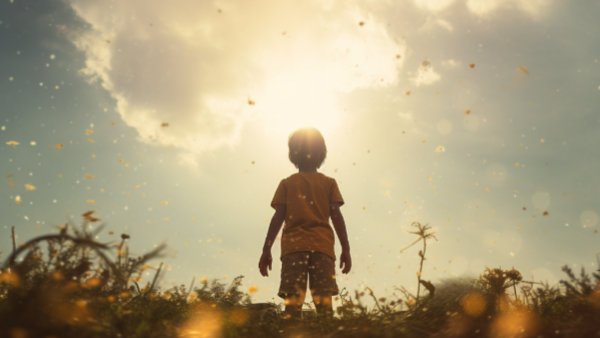

**\> Feeling burnt out? Subscribe to my [**Everyday Self-Care Newsletter**](https://seffsaid.com/newsletter/) for self-care tips and doable habits that support your well-being.**

Growing up is a process unique to each individual, filled with moments of learning, self-discovery, and personal growth. This collection of 130 quotes about growing up brings together a wide range of voices from different walks of life – writers, philosophers, celebrities, and thinkers – each offering their unique insights on this universal experience. I hope you enjoy them.

1.  “You don’t stop dreaming when you grow old, you grow old when you stop dreaming.” – Unknown
2.  “You don’t grow up, you just get older.” – Jon Bon Jovi
3.  “The older I grow, the more I distrust the familiar doctrine that age brings wisdom.” – H.L. Mencken
4.  It’s only when we truly know and understand that we have a limited time on earth – and that we have no way of knowing when our time is up – that we will begin to [live each day to the fullest](https://seffsaid.com/live-life-to-the-fullest/), as if it was the only one we had.” – Elisabeth Kübler-Ross
5.  “The most important thing that parents can teach their children is how to get along without them.” – Frank A. Clark
6.  “The awkward moment when you’re wearing Nike’s and you can’t do it.” – Unknown
7.  “A grownup is a child with layers on.” – Woody Harrelson
8.  “Sometimes you have to be apart from people you love, but that doesn’t make you love them any less. Sometimes you love them more.” – Nicholas Sparks
9.  “It takes courage to grow up and become who you really are.” – E.E. Cummings
10.  “Youth is the gift of nature, but age is a work of art.” – Stanislaw Jerzy Lec
11.  “No matter how old you get, if you can keep the desire to be creative, you’re keeping the man-child alive.” – John Cassavetes
12.  “To be able to watch your children’s children grow up is truly a blessing from above.” – Byron Pulsifer
13.  “Everyone thinks you make mistakes when you’re young. But I don’t think we make any fewer when we’re grown up.” – Jodi Picoult
14.  “Sometimes the hardest part of growing up is that you have to do what is right for you, even if it means breaking someone’s heart. Including your own.” – Unknown
15.  Youth is not a time of life; it is a [state of mind.”](https://seffsaid.com/how-i-cultivated-a-focused-state-of-mind/) – Samuel Ullman
16.  “You don’t stop laughing when you grow old, you grow old when you stop laughing.” – George Bernard Shaw
17.  “The best part about growing up is that you decide who you want to be.” – Unknown
18.  “Aging is not lost youth but a new stage of opportunity and strength.” – Betty Friedan
19.  “Growing up is not the problem, forgetting is.” – Antoine de Saint-Exupéry
20.  “One of the oddest things about being grown-up was looking back at something you thought you knew and finding out you didn’t know it at all.” – Jodi Picoult
21.  “The day the child realizes that all adults are imperfect, he becomes an adolescent; the day he forgives them, he becomes an adult; the day he forgives himself, he becomes wise.” – Alden Nowlan
22.  “Growing up is not being so dead-set on making everybody happy.” – Reba McEntire
23.  “Youth is happy because it has the capacity to see beauty. Anyone who keeps the ability to see beauty never grows old.” – Franz Kafka
24.  “Growing up happens in a heartbeat. One day you’re in diapers; the next day you’re gone. But the memories of childhood stay with you for the long haul.” – The Wonder Years
25.  “Parents can only give good advice or put them on the right paths, but the final forming of a person’s character lies in their own hands.” – Anne Frank
26.  “Growing old is mandatory; growing up is optional.” – Chili Davis
27.  “Maturity is a high price to pay for growing up.” – Tom Stoppard
28.  “We cannot become what we want by remaining what we are.” – Max Depree
29.  “Don’t grow up too quickly, lest you forget how much you love the beach.” – Michelle Held
30.  “Growing up is a trap, but growing old is a journey.” – Unknown
31.  “Growing up means learning to wait.” – Unknown
32.  “Age is a high price to pay for maturity.” – Tom Stoppard
33.  “The beauty of growing older is that you’ve lived to see another day.” – Unknown
34.  “The day we fret about the future is the day we leave our childhood behind.” – Patrick Rothfuss
35.  “Don’t try to make children grow up to be like you, or they may do it.” – Russell Baker
36.  “The only time you really live fully is from thirty to sixty. The young are slaves to dreams; the old servants of regrets. Only the middle-aged have all their five senses in the keeping of their wits.” – Theodore Roosevelt
37.  “Growing up is such a barbarous business, full of inconvenience… and pimples.” – J.M. Barrie
38.  “The hardest part about growing up is letting go of what you were used to, and moving on with something you’re not.” – Lyrikal
39.  “You are always too young to give up, and never too old to start over.” – Richie Norton
40.  “The mark of the immature man is that he wants to die nobly for a cause, while the mark of the mature man is that he wants to live humbly for one.” – J.D. Salinger
41.  “We don’t mature momentarily, but over the long-term.” – John C. Maxwell
42.  “Growing up is such a barbarous business, full of inconvenience and pimples.” – J.M. Barrie
43.  “We never really grow up, we only learn how to act in public.” – Bryan White
44.  “I am convinced that growing up is a process of managing to find opportunities for learning in the midst of overwhelming chaos.” – Kay Redfield Jamison
45.  “As you grow up, your priorities change. Nights out are swapped for nights in, your circle gets smaller and games, drama and [partying every day](https://seffsaid.com/party-quotes/) just aren’t entertaining anymore. You get to a point where it’s quality over quantity, like your career, who you spend your time with and your goals for the future. What matters to you most is peace, stability, loyalty, and growth.” – Unknown
46.  “Growing up is losing some illusions, in order to acquire others.” – Virginia Woolf
47.  “No matter how much suffering you went through, you never wanted to let go of those memories.” – Haruki Murakami
48.  “Most people won’t realize that writing is a craft. You have to take your apprenticeship in it like anything else.” – Katherine Anne Porter
49.  “When I was a boy of 14, my father was so ignorant I could hardly stand to have the old man around. But when I got to be 21, I was astonished at how much he had learned in seven years.” – [Mark Twain](https://seffsaid.com/25-inspirational-mark-twain-quotes/)
50.  “To grow up is to wonder about things; to be grown up is to slowly forget the things you wondered about.” – Jostein Gaarder
51.  Aging is an extraordinary process where you become the person you always should have been.” – [David Bowie](https://seffsaid.com/david-bowie-quotes/)
52.  “Life is about change, sometimes it’s painful, sometimes it’s beautiful, but most of the time it’s both.” – Kristin Kreuk
53.  “Do not regret growing older. It is a privilege denied to many.” – Unknown
54.  “We grow neither better nor worse as we get old, but more like ourselves.” – May Lamberton Becker
55.  “Growing up, I have discovered over time, is rather like housework, never finished.” – Lois McMaster Bujold
56.  “When we are no longer able to change a situation, we are challenged to change ourselves.” – Viktor E. Frankl
57.  “Growing up is such a barbarous business, full of inconvenience.” – J.M. Barrie
58.  “Maturity is when you stop complaining and making excuses, and start making changes.” – Roy T. Bennett
59.  “That’s one of the things we learn as we grow older – how to forgive. It comes easier at forty than it did at twenty.” – L.M. Montgomery
60.  “Adulthood is like the vet, and we’re all the dogs that were excited for the car ride until we realized where we’re going.” – Unknown
61.  “I spent a long time trying to find my center. Now I just say I’m always centered, just sometimes off balance.” – Alex Grey
62.  “We grow too soon old and too late smart.” – Pennsylvania Dutch Proverb
63.  “It’s a sad moment, really, when parents first become a bit frightened of their children.” – Ama Ata Aidoo
64.  “We don’t mature through age; we mature in awareness.” – Byron Katie
65.  “Growing up happens when you start having things you look back on and wish you could change.” – Clary Fray
66.  “The hardest part of growing up is that you have to do what is right for you, even if it hurts someone you love.” – Unknown
67.  “You grow up the day you have your first real laugh – at yourself.” – Ethel Barrymore
68.  “The day we lose our need for dreams is the day we lose our humanity.” – Anthony Robbins
69.  “As we grow up, we realize it’s less important to have lots of friends and more important to have real ones.” – Unknown
70.  “As we grow older, our bodies get shorter and our anecdotes longer.” – Robert Quillen
71.  “Growing up, I slowly had this process of realizing that all the things around me that people had told me were just the natural way things were, the natural order of things, was just completely wrong.” – Win Butler
72.  “The older I get, the more I understand that it’s okay to live a life others don’t understand.” – Jenna Woginrich
73.  “Part of growing up is just taking what you learn from that and moving on and not taking it to heart.” – Beverley Mitchell
74.  “To grow up requires a whole life. But at the end of your life, you still are unsure whether you have grown up.” – Ilya Prigogine
75.  “Growing up happens when you start having things you look back on and wish you could change.” – Cassandra Clare
76.  “The great thing about getting older is that you get a chance to tell the stories you love over and over again.” – Kenneth Branagh
77.  “The older I get, the more I see how much I behaved like a child.” – Criss Jami
78.  “I think that’s part of growing up – learning to forgive yourself.” – Rachel Weisz
79.  “One’s first step in wisdom is to question everything – and one’s last is to come to terms with everything.” – Georg Christoph Lichtenberg
80.  “The great thing about getting older is that you don’t lose all the other ages you’ve been.” – Madeleine L’Engle
81.  “The day you realize you’re not just a survival story, you become the author of your own.” – Unknown
82.  “You are never too old to set another goal or to dream a new dream.” – C.S. Lewis
83.  “Growing up means realizing a lot of your friends aren’t really your friends.” – Unknown
84.  “The only time you really live fully is from thirty to sixty.” – Theodore Roosevelt
85.  “The hardest part of growing up is letting go of what you used to believe.” – Unknown
86.  “Growing up is understanding that life is less about you and more about others.” – Unknown
87.  “Growing old is mandatory, but growing up is optional.” – Carroll Bryant
88.  “You grow up on the day you have your first real laugh at yourself.” – Ethel Barrymore
89.  “Sometimes you have to accept that people’s part in your story is over.” – Unknown
90.  “Sometimes you have to grow up not because you want to but because it’s the right thing to do.” – Unknown
91.  “Growing up is learning that some lies are just kindness.” – Unknown
92.  “Sometimes growing up means growing apart.” – Unknown
93.  “Everyone must take time to sit and watch the leaves turn.” – Elizabeth Lawrence
94.  “Maturity is when your world opens up and you realize that you are not the center of it.” – M.J. Croan
95.  “Sometimes you have to grow up before you appreciate how you grew up.” – Daniel Black
96.  “The beauty of growing older is that it takes such a long time.” – Unknown
97.  “Growing up is optional. Growing old is inevitable.” – Unknown
98.  “We don’t stop playing because we grow old; we grow old because we stop playing.” – George Bernard Shaw
99.  “You grow up the day you have your first real laugh at yourself.” – Ethel Barrymore
100.  “I am convinced that most people do not grow up… We marry and dare to have children and call that growing up. I think what we do is mostly grow old.” – [Maya Angelou](https://seffsaid.com/maya-angelou-quotes/)
101.  “I guess that’s part of growing up, too – saying goodbye to the things you used to love.” – Jenny Han
102.  “To be old and wise, you must first be young and stupid.” – Unknown
103.  Everyone’s a star and deserves the right to twinkle.” – [Marilyn Monroe](https://seffsaid.com/marilyn-monroe-quotes/)
104.  “Aging is mandatory, growing up is optional.” – Walt Disney
105.  “Don’t just teach your children to read. Teach them to question what they read. Teach them to question everything.” – George Carlin
106.  “To grow up is to stop putting blame on parents.” – Maya Angelou
107.  “Youth fades; love droops; the leaves of friendship fall; A mother’s secret hope outlives them all.” – Oliver Wendell Holmes
108.  “The trick is growing up without growing old.” – Casey Stengel
109.  “As we grow up, we realize it becomes less important to have more friends and more important to have real ones.” – Laguna Beach
110.  “Growing up is never straightforward. There are moments when everything is fine and other moments where you realize that there are certain memories you’ll never get back, and certain people that are going to change, and the hardest part is knowing that there’s nothing you can do except watch them.” – Alden Nowlan
111.  “Age merely shows what children we remain.” – Johann Wolfgang von Goethe
112.  “Growing up means admitting the things you never thought you would become.” – Unknown
113.  “Some people are old at 18 and some are young at 90. Time is a concept that humans created.” – Yoko Ono
114.  “The day you realize you’re not just a survival story, you become the author of your own.” – Andrea Gibson
115.  “Adolescence is just one big walking pimple.” – Carol Burnett
116.  “I am not a product of my circumstances. I am a product of my decisions.” – Stephen R. Covey
117.  “You can’t help getting older, but you don’t have to get old.” – George Burns
118.  “Age is a necessary but insufficient requirement for growing up. There are immature old people, and there are appropriately mature young people.” – Henry Cloud
119.  “I guess real maturity, which most of us never achieve, is when you realize that you’re not the center of the universe.” – Katherine Paterson
120.  “We grow up the day we take our first laugh at ourselves.” – Ethel Barrymore
121.  “Growing up means learning what life is. When you’re little, you have a set of ideals, standards, criteria, plans, outlooks. Then you hit the real world.” – Ben Stein
122.  “I put my heart and my soul into my work, and have lost my mind in the process.” – Vincent Van Gogh
123.  “Growing up is never easy. You hold on to things that were. You wonder what’s to come.” – The Wonder Years
124.  “As I grow older, I pay less attention to what men say. I just watch what they do.” – Andrew Carnegie
125.  “Growing up means learning what life is. When you’re little, you have a set of ideals, standards, criteria, plans, outlooks. Then you hit the real world. Suddenly, you get it: This is what it’s like. This is how it works. Not those dreams you had. This is reality.” – Ben Stein
126.  “Growing up is learning to start saying no to things you couldn’t do without yesterday.” – Unknown
127.  “It’s not that our family has no taste, it’s just that our family’s taste is inconsistent.” – Wes Anderson
128.  “Some day you will be old enough to start reading fairy tales again.” – C.S. Lewis
129.  “Adulthood is like looking both ways before you cross the street and then getting hit by an airplane.” – Unknown
130.  “It’s never too late to have a happy childhood.” – Tom Robbins

[Share](https://www.facebook.com/share.php?u=https%3A%2F%2Fselfsaid.30tools.com%2Fquotes-about-growing-up%2F)

[Pin3](https://pinterest.com/pin/create/button/?url=https://seffsaid.com/quotes-about-growing-up/&media=https%3A%2F%2Fselfsaid.30tools.com%2Fwp-content%2Fuploads%2Fquotes-about-growing-up-PIN.jpg&description=Let+these+130+inspirational+quotes+about+growing+up+guide+you+through+the+ups+and+downs+of+getting+older.+via+%40SeffSaid)

[Tweet](https://twitter.com/intent/tweet?text=130+Inspirational+Quotes+About+Growing+Up&url=https%3A%2F%2Fselfsaid.30tools.com%2Fquotes-about-growing-up%2F&via=SeffSaid)

[Reddit](https://www.reddit.com/submit?url=https%3A%2F%2Fselfsaid.30tools.com%2Fquotes-about-growing-up%2F)

[Share](https://www.linkedin.com/cws/share?url=https%3A%2F%2Fselfsaid.30tools.com%2Fquotes-about-growing-up%2F)

[More](#)

3 Shares
