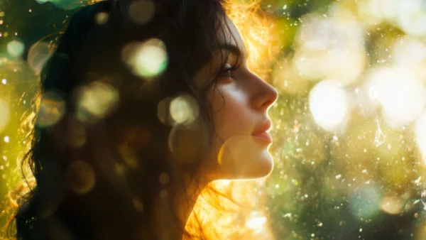

**\> Feeling burnt out? Subscribe to my [**Everyday Self-Care Newsletter**](https://seffsaid.com/newsletter/) for self-care tips and doable habits that support your well-being.**

Inner beauty is about qualities that go beyond appearance, reflecting the kindness, confidence, and strength within. These quotes offer simple reminders of the deeper beauty that shines through a person’s character and actions.

## Inner Beauty Quotes

“People are like stained-glass windows. They sparkle and shine when the sun is out, but when the darkness sets in, their true beauty is revealed only if there is a light from within.” – Elisabeth Kübler-Ross

“Our hearts are drunk with a beauty our eyes could never see.” – George W. Russell

“Glamour only radiates if there is a sublime courage & bravery within: glamour is like the moon; it only shines because the sun is there.” – C. JoyBell C.

“You are not born with beauty, your beauty is created by who you are.” – Sasha Azevedo

“The beauty of a woman must be seen from in her eyes, because that is the doorway to her heart, the place where love resides.” – Audrey Hepburn

“Character develops in stream of struggle and adversity. Character is foundation of your inner beauty which reflects in your personality.” – Anil Sinha

Inner beauty should be the most important part of [improving one’s self.”](https://seffsaid.com/6-self-improvement-tips-that-will-change-your-life/) – Priscilla Presley

“Beauty is the illumination of your soul.” – John O’Donohue

“Do you love me because I’m beautiful, or am I beautiful because you love me?” – Oscar Hammerstein II

“At the core of your heart, you are perfect and pure. No one and nothing can alter that.” – Amit Ray

“Confidence and intelligence will never stop being beautiful.” – Anonymous

“Beauty is not something you buy; instead, beauty is what lies within.” – Byron Pulsifer

“Outer beauty pleases the EYE. Inner beauty captivates the HEART.” – Mandy Hale

“Some people, no matter how old they get, never lose their beauty – they merely move it from their faces into their hearts.” – Martin Buxbaum

“What you do, the way you think, makes you beautiful.” – Scott Westerfeld

“Beauty has a lot to do with character.” – Kevyn Aucoin

“Inner beauty is confidence, determination, empathy, love – it’s the key to all beauty in this world.” – Alime Zaino

“Through simplicity comes great beauty.” – Anonymous

Inner beauty shines when you have a [positive attitude](https://seffsaid.com/easy-ways-to-develop-a-positive-attitude/), gratitude, and kindness.” – Debasish Mridha

“When you do something noble and beautiful and nobody noticed, do not be sad. For the sun every morning is a beautiful spectacle and yet most of the audience still sleeps.” – [John Lennon](https://seffsaid.com/john-lennon-quotes/)

“Inner beauty is not in the face; it’s a light in the heart.” – Khalil Gibran

“The fountain of beauty is the heart, and every generous thought illustrates the walls of your chamber.” – Francis Quarles

“Beauty is the purest feeling of the soul. Beauty arises when the soul is satisfied.” – Amit Ray

“Outer beauty is a gift. Inner beauty is an accomplishment.” – Randi G. Fine

“People are more than just the way they look.” – Madeleine L’Engle

“Let the beauty of what you love be what you do.” – Rumi

“True beauty springs from the heart and dwells in the eyes.” – Judith McNaught

“The soul that sees beauty may sometimes walk alone.” – Johann Wolfgang von Goethe

“Where Beauty was, nothing ever ran quite straight, which, no doubt, was why so many people looked on it as immoral.” – John Galsworthy

“Your beauty should not come from outward adornment… Rather, it should be that of your inner self.” – 1 Peter 3:3-4

“Inner beauty is eternal and it’s what matters most.” – Jennifer L. Armentrout

“Beauty is about being comfortable in your own skin.” – Gwyneth Paltrow

“Be kind. It will reveal your true inner beauty.” – Debasish Mridha

“Beautiful people are not always good, but good people are always beautiful.” – Imam Ali

“When beauty lives in the heart, it doesn’t need to show up anywhere else.” – Steve Goodier

“Your inner beauty never needs makeup or fancy clothes. True beauty radiates from the soul.” – Tapan Ghosh

“It’s that heart of gold, and stardust soul that make you beautiful.” – R.M. Broderick

“The most beautiful things in the world cannot be seen or even touched. They must be felt with the heart.” – Helen Keller

“Remember, beauty is more than skin deep. It’s about the person you are and the light you share with the world.” – Anonymous

“Confidence is the ability to feel beautiful without needing someone to tell you.” – Mandy Hale

“Your heart is the real temple. It is there that you must install the deity of beauty.” – Jaggi Vasudev

“People often say that ‘beauty is in the eye of the beholder,’ and I say that the most liberating thing about beauty is realizing you are the beholder.” – Salma Hayek

“It is amazing how complete is the delusion that beauty is goodness.” – Leo Tolstoy

“Real beauty is to be true to oneself.” – Laetitia Casta

“The most beautiful makeup for a woman is passion. But cosmetics are easier to buy.” – Yves Saint Laurent

“The best and most beautiful things in the world cannot be seen nor even touched, but just felt in the heart.” – Anne Sullivan

“To be beautiful means to be yourself. You don’t need to be accepted by others. You need to accept yourself.” – Thich Nhat Hanh

“Beauty begins the moment you decide to be yourself.” – Coco Chanel

“The most powerful weapon on earth is the human soul on fire.” – Ferdinand Foch

“Beauty is the shadow of God on the universe.” – Gabriela Mistral

“The beauty that addresses itself to the eyes is only the spell of the moment; the eye of the body is not always that of the soul.” – George Sand

“True beauty is the flame of self-confidence that shines from the inside out.” – Barrie Davenport

“The most beautiful people wear their hearts on their sleeves and their souls in their smiles.” – Mark Anthony

“Character contributes to beauty. It fortifies a woman as her youth fades.” – Jacqueline Bisset

“The beauty of a person is found in their heart and spirit, not in their appearance.” – Anonymous

“Inner beauty is when you have a positive impact on the people around you.” – Anonymous

“True beauty is the light in your soul. Be who you are. Glow from the inside out.” – Anonymous

“Beauty isn’t about having a pretty face. It’s about having a pretty mind, pretty heart, and pretty soul.” – Anonymous

“You are beautiful. Know this. Anyone who tells you otherwise is simply lying.” – Steve Maraboli

“The most beautiful thing a person can wear is a kind and compassionate heart.” – Anonymous

“There is nothing more beautiful than someone who goes out of their way to make life beautiful for others.” – Mandy Hale

“The real beauty of a person is not in their face or appearance, but in their heart and soul.” – Anonymous

[Share](https://www.facebook.com/share.php?u=https%3A%2F%2Fselfsaid.30tools.com%2Fquotes-about-inner-beauty%2F)

[Pin6](https://pinterest.com/pin/create/button/?url=https://seffsaid.com/quotes-about-inner-beauty/&media=https%3A%2F%2Fselfsaid.30tools.com%2Fwp-content%2Fuploads%2Fquotes-about-inner-beauty-PIN.jpg&description=These+quotes+about+inner+beauty+offer+simple+reminders+of+the+deeper+beauty+that+shines+through+a+person%E2%80%99s+character+and+actions.+via+%40SeffSaid)

[Tweet](https://twitter.com/intent/tweet?text=Quotes+About+Inner+Beauty&url=https%3A%2F%2Fselfsaid.30tools.com%2Fquotes-about-inner-beauty%2F&via=SeffSaid)

[Reddit](https://www.reddit.com/submit?url=https%3A%2F%2Fselfsaid.30tools.com%2Fquotes-about-inner-beauty%2F)

[Share](https://www.linkedin.com/cws/share?url=https%3A%2F%2Fselfsaid.30tools.com%2Fquotes-about-inner-beauty%2F)

[More](#)

6 Shares
