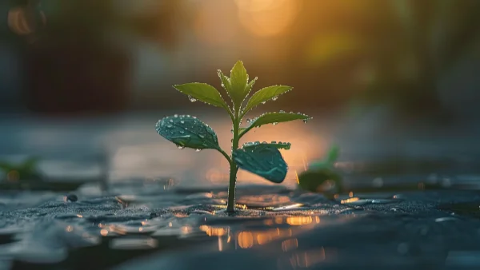

**\> Feeling burnt out? Subscribe to my [**Everyday Self-Care Newsletter**](https://seffsaid.com/newsletter/) for self-care tips and doable habits that support your well-being.**

Life can be really hard sometimes. Losses, failures, tragedies, setbacks, and health issues are all a part of life. And when life is treating us harshly is when we really need to fight through even the most challenging adversities without giving up. Unfortunately, it can often be an incredible challenge to find the determination to access our inner strength in order to persevere.

This is when quotes about strength and resilience can help. They can inspire you, comfort you, and help you realize that your hardships are but brief moments of [time that will soon pass](https://seffsaid.com/the-20-greatest-time-passing-quotes/).

If you are currently suffering, I really hope these [great quotes](https://seffsaid.com/the-greatest-quotes-of-all-time/) will give you the strength you need. On a similar theme, read these incredibly powerful [quotes about courage](https://seffsaid.com/quotes-about-courage/).

## Quotes about Strength & Resilience

*   “Your hardest times often lead to the greatest moments of your life. Keep going. Tough situations build strong people in the end.” – Roy T. Bennett
*   “The struggle you’re in today is developing the strength you need for tomorrow. Don’t give up.” – Robert Tew
*   “When you lose something, don’t think of it as a loss; accept it as the gift that gets you on the path you were meant to travel on.” – Anonymous
*   “The story of your life has many chapters. One bad chapter doesn’t mean it’s the end of the book.” – Anonymous
*   “Hardships often prepare ordinary people for an extraordinary destiny.” – C.S. Lewis
*   “Forget mistakes. Forget failure. Forget everything except what you’re going to do now and do it. Today is your lucky day.” – Will Durant
*   “I am thankful for my struggle because without it, I wouldn’t have stumbled upon my strength.” – Alexandra Elle
*   “Sometimes the bad things that happen in our lives put us directly on the path to the most wonderful things that will ever happen to us.” – Nicole Reed
*   “Never be ashamed of a scar. It means you were stronger than whatever tried to hurt you.” – Anonymous
*   “Sometimes it takes a heartbreak to shake us awake and help us see we are worth so much more than we’re settling for.” – Mandy Hale
*   “Within sorrow is grace. When we come close to those things that break us down, we touch those things that also break us open. And in that breaking open, we uncover our true nature.” – Wayne Muller
*   “The darkest night is often the bridge to the brightest tomorrow.” – Jonathan Lockwood Huie
*   “When one door of happiness closes, another opens; but often we look so long at the closed door that we do not see the one which has been opened for us.” – Helen Keller
*   “The one who falls and gets up is so much stronger than the one who never fell.” – Roy T. Bennett
*   “I survived because the fire inside me burned brighter than the fire around me.” – Joshua Graham
*   “Once you choose hope, anything is possible.” – Christopher Reeve
*   “Staying positive doesn’t mean that things will turn out okay. Rather it is knowing that you will be okay no matter how things turn out.” – Anonymous
*   “Until you’re broken you don’t know what you’re made of. It gives you the ability to build yourself all over again, but stronger than ever.” – Anonymous
*   “Nothing goes to waste on the journey of life. Both good and bad experiences shape your mind and heart for what is to come.” – Leon Brown
*   “Our greatest glory is not in never falling, but in rising every time we fall.” – Confucius
*   “Broken crayons still color.” – Anonymous
*   You never know how strong you are until being strong is your only choice.” – [Bob Marley](https://seffsaid.com/bob-marley-quotes/)
*   “Hope can be a powerful force. Maybe there’s no actual magic in it, but when you know what you hope for most and hold it like a light within you, you can make things happen, almost like magic.” – Laini Taylor
*   “When you’re at the end of your rope, tie a knot and hold on.” – Theodore Roosevelt  
      
    “Every experience, no matter how bad it seems, holds within it a blessing of some kind. The goal is to find it.” – Buddha
*   “If one dream should fall and break into a thousand pieces, never be afraid to pick one of those pieces up and begin again.” – Flavia Weedn
*   “Most people are stronger than they know. They just forget to believe in it sometimes.” – Keith Scott
*   “Never lose hope. Never forget the power of intentions and desires.” – Debasish Mridha
*   “The most beautiful people I’ve known are those who have known trials, have known struggles, have known loss, and have found their way out of the depths.” – Elisabeth Kübler-Ross
*   “It doesn’t matter what cards you’re dealt. It’s what you do with those cards. Never complain. Just keep pushing forward. Find a positive in anything and just fight for it.” – Baker Mayfield
*   “It’s not the absence of fear. It’s overcoming it. Sometimes you’ve got to blast through and have faith.” – [Emma Watson](https://seffsaid.com/emma-watson-quotes/)
*   “Every day may not be good, but there is some good in every day.” – Alice Morse Earle
*   “Even the darkest night will end and the sun will rise.” – Victor Hugo
*   “Great changes may not happen right away, but with effort even the difficult may become easy.” – Bill Blackman
*   “Don’t be pushed around by the fears in your mind. Be led by the dreams in your heart.” – Roy T. Bennett
*   “Sometimes we’re tested not to show our weaknesses, but to discover our strengths.” – Anonymous
*   “As I look back on my life, I realize that every time I thought I was being rejected from something good, I was actually being re-directed to something better.” – Steve Maraboli
*   “Sometimes you win, sometimes you learn.” – Anonymous
*   “Anyone can give up; it is the easiest thing in the world to do. But to hold it together when everyone would expect you to fall apart, now that is true strength.” – Chris Bradford
*   “When life gives you a hundred reasons to cry, show life that you have a thousand reasons to smile.” – Anonymous
*   “Your present circumstances don’t determine where you can go; they merely determine where you start.” – Nido Qubein
*   “An entire sea of water can’t sink a ship unless it gets inside the ship. Similarly, the negativity of the world can’t put you down unless you allow it to get inside you.” – Goi Nasu
*   “The pain you feel today is the strength you feel tomorrow. For every challenge encountered there is the opportunity for growth.” – Anonymous
*   “When nothing goes right, go left.” – Martha Cecilia

[Share](https://www.facebook.com/share.php?u=https%3A%2F%2Fselfsaid.30tools.com%2Fquotes-about-strength%2F)

[Pin144](https://pinterest.com/pin/create/button/?url=https://seffsaid.com/quotes-about-strength/&media=https%3A%2F%2Fselfsaid.30tools.com%2Fwp-content%2Fuploads%2Fquotes-about-strength-PIN.jpg&description=Struggling+through+difficult+times+and+need+help+in+facing+your+hardships%3F+Read+these+44+powerful+quotes+about+strength+and+resilience.+via+%40SeffSaid)

[Tweet](https://twitter.com/intent/tweet?text=44+Quotes+About+Strength+To+Comfort+You+During+Hard+Times&url=https%3A%2F%2Fselfsaid.30tools.com%2Fquotes-about-strength%2F&via=SeffSaid)

[Reddit](https://www.reddit.com/submit?url=https%3A%2F%2Fselfsaid.30tools.com%2Fquotes-about-strength%2F)

[Share](https://www.linkedin.com/cws/share?url=https%3A%2F%2Fselfsaid.30tools.com%2Fquotes-about-strength%2F)

[More](#)

144 Shares
