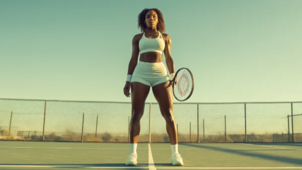

**\> Feeling burnt out? Subscribe to my [**Everyday Self-Care Newsletter**](https://seffsaid.com/newsletter/) for self-care tips and doable habits that support your well-being.**

These Serena Williams quotes highlight Serena’s resilience, humility, and unwavering determination throughout her career.

## Serena Williams Quotes

“I don’t like to lose, at anything, yet I’ve grown most not from victories, but setbacks.” – Serena Williams

“Luck has nothing to do with it, because I have spent many hours on the court working for my one moment in time.” – Serena Williams

“You can become strong, and powerful, and beautiful.” – Serena Williams

“The success of every woman should be the inspiration to another. We should raise each other up.” – Serena Williams

“Is greatness winning? Is it losing? Is it recovery? It’s all of them, plus being good to yourself.” – Serena Williams

“Am I the greatest? I don’t know. I’m the greatest that I can be.” – Serena Williams

“Nothing comes to a sleeper but a dream.” – Serena Williams

“Everything comes at a cost. Just what are you willing to pay for it?” – Serena Williams

“I don’t like to lose – at anything. Yet, I’ve grown most not from victories but setbacks.” – Serena Williams

“I am who I am. I love who I am.” – Serena Williams

“You have to be fearless to have success.” – Serena Williams

“If Plan A isn’t working, I have Plan B, Plan C, and even Plan D.” – Serena Williams

“I really think a champion is defined not by their wins but by how they can recover when they fall.” – Serena Williams

“Family first, and that’s what matters most.” – Serena Williams

“I’m a perfectionist. I’m pretty much insatiable. I feel there’s so much I can improve on.” – Serena Williams

“Since I don’t look like every other girl, it takes a while to be okay with that. To be different. But different is good.” – Serena Williams

“Think of all the girls who could become top athletes but quit sports because they’re afraid of having too many defined muscles.” – Serena Williams

“Growing up, I wasn’t the richest, but I had a rich family in spirit.” – Serena Williams

“I don’t have anything to prove ever, ever in my life.” – Serena Williams

“If you smile, things will work out.” – Serena Williams

“Victory is very, very sweet. It tastes better than any dessert.” – Serena Williams

“You can’t underestimate anyone.” – Serena Williams

“I always believe I can beat the best, achieve the best. I always see myself in the top position.” – Serena Williams

“You have to believe in yourself when no one else does.” – Serena Williams

“When I’m down, I talk to myself a lot.” – Serena Williams

“I’ve always been a fighter, and I’ve always fought through things my whole life.” – Serena Williams

“There’s always another record; then there’s always another person to catch up with.” – Serena Williams

“I am lucky that whatever fear I have inside me, my desire to win is always stronger.” – Serena Williams

“The only limits are the ones you create for yourself.” – Serena Williams

“I’ve had to learn to fight all my life – got to learn to keep smiling.” – Serena Williams

“Everyone’s dream can come true if you just stick to it and work hard.” – Serena Williams

“I’m really exciting. I smile a lot, I win a lot, and I’m really sexy.” – Serena Williams

“I’m Serena Williams on the court, but away I have so many different names.” – Serena Williams

“I was just tired of losing… Life was passing me by.” – Serena Williams

“People see me on the court only as a superhero, grunting and winning. They think you’re a robot, and I’m not.” – Serena Williams

“I’m an athlete, and I’m Black, and a lot of Black athletes go broke. I do not want to become a statistic.” – Serena Williams

“I just never give up. I fight to the end.” – Serena Williams

“The day I stop fighting for equality and for people that look like you and me will be the day I’m in my grave.” – Serena Williams

“I believe in me more than anything in this world.” – Serena Williams

“I think in life you should work on yourself until the day you die.” – Serena Williams

“I’m not used to crying. It’s a little difficult. All my life I’ve had to fight.” – Serena Williams

“All my life I’d woken up to tennis, tennis, tennis.” – Serena Williams

“To this day, I don’t love my arms… But I’m not complaining. They pay my bills.” – Serena Williams

“There’s one thing I’m really good at, and that’s hitting the ball over a net, in a box.” – Serena Williams

“If anything, you know, I think losing makes me even more motivated.” – Serena Williams

“I try not to have too many rituals because I believe that rituals don’t help you win.” – Serena Williams

“I decided I can’t pay a person to rewind time, so I may as well get over it.” – Serena Williams

“Venus told me the other day that champions don’t get nervous in tight situations.” – Serena Williams

“I am not a robot. I have a heart and I bleed.” – Serena Williams

“I don’t know what the future holds, but I do know that I’m going to be positive and not wake up feeling desperate.” – Serena Williams  
  
Read more [quotes from famous athletes](https://seffsaid.com/quotes-by-famous-people/).

[Share](https://www.facebook.com/share.php?u=https%3A%2F%2Fseffsaid.com%2Fserena-williams-quotes%2F)

[Pin4](https://pinterest.com/pin/create/button/?url=https://seffsaid.com/serena-williams-quotes/&media=https%3A%2F%2Fseffsaid.com%2Fwp-content%2Fuploads%2FSerena-Williams-Quotes-PIN.jpg&description=These+50+inspiring+Serena+Williams+quotes+highlight+her+incredible+resilience%2C+humility%2C+and+unwavering+determination.+via+%40SeffSaid)

[Tweet](https://twitter.com/intent/tweet?text=50+Inspiring+Serena+Williams+Quotes&url=https%3A%2F%2Fseffsaid.com%2Fserena-williams-quotes%2F&via=SeffSaid)

[Reddit](https://www.reddit.com/submit?url=https%3A%2F%2Fseffsaid.com%2Fserena-williams-quotes%2F)

[Share](https://www.linkedin.com/cws/share?url=https%3A%2F%2Fseffsaid.com%2Fserena-williams-quotes%2F)

[More](#)

4 Shares
