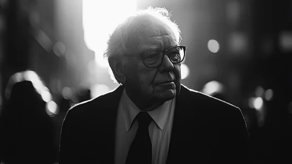

**\> Feeling burnt out? Subscribe to my [**Everyday Self-Care Newsletter**](https://seffsaid.com/newsletter/) for self-care tips and doable habits that support your well-being.**

Warren Buffett’s wisdom is timeless and practical, offering valuable insights for anyone interested in business and investing. Here are some of his most memorable quotes that capture his straightforward approach to achieving success and financial stability. Read more [quotes from famous people](https://seffsaid.com/quotes-by-famous-people/) here.

*   “Rule No. 1: Never lose money. Rule No. 2: Never forget rule No. 1.” — Warren Buffett
*   “Price is what you pay. Value is what you get.” — Warren Buffet
*   “It’s far better to buy a wonderful company at a fair price than a fair company at a wonderful price.” — Warren Buffett
*   “The stock market is designed to transfer money from the Active to the Patient.” — Warren Buffett
*   “Someone’s sitting in the shade today because someone planted a tree a long time ago.” — Warren Buffett
*   “Risk comes from not knowing what you’re doing.” — Warren Buffett
*   “In the business world, the rearview mirror is always clearer than the windshield.” — Warren Buffett
*   “Only buy something that you’d be perfectly happy to hold if the market shut down for ten years.” — Warren Buffett
*   “It’s better to hang out with people better than you. Pick out associates whose behavior is better than yours and you’ll drift in that direction.” — Warren Buffett
*   “The most important quality for an investor is temperament, not intellect.” — Warren Buffett
*   “We simply attempt to be fearful when others are greedy and to be greedy only when others are fearful.” — Warren Buffett
*   “I always knew I was going to be rich. I don’t think I ever doubted it for a minute.” — Warren Buffett
*   “Our favorite holding period is forever.” — Warren Buffett
*   “The best thing I did was to choose the right heroes.” — Warren Buffett
*   “Wide diversification is only required when investors do not understand what they are doing.” — Warren Buffett
*   “In the world of business, the people who are most successful are those who are doing what they love.” — Warren Buffett
*   “You only have to do a very few things right in your life so long as you don’t do too many things wrong.” — Warren Buffett
*   “The business schools reward difficult complex behavior more than simple behavior, but simple behavior is more effective.” — Warren Buffett
*   “Chains of habit are too light to be felt until they are too heavy to be broken.” — Warren Buffett
*   “Forecasts may tell you a great deal about the forecaster; they tell you nothing about the future.” — Warren Buffett
*   “You can’t produce a baby in one month by getting nine women pregnant.” — Warren Buffett
*   “It takes 20 years to build a reputation and five minutes to ruin it. If you think about that, you’ll do things differently.” — Warren Buffett
*   “What the wise do in the beginning, fools do in the end.” — Warren Buffett
*   “You know… you keep doing the same things and you keep getting the same result over and over again.” — Warren Buffett
*   “I will tell you how to become rich. Close the doors. Be fearful when others are greedy. Be greedy when others are fearful.” — Warren Buffett
*   “When you combine ignorance and leverage, you get some pretty interesting results.” — Warren Buffett
*   “If you buy things you do not need, soon you will have to sell things you need.” — Warren Buffett
*   “Do not save what is left after spending, but spend what is left after saving.” — Warren Buffett
*   “If you don’t find a way to make money while you sleep, you will work until you die.” — Warren Buffett
*   The difference between [successful people](https://seffsaid.com/6-things-successful-people-never-do/) and really successful people is that really successful people say no to almost everything.” — Warren Buffett
*   “The most important investment you can make is in yourself.” — Warren Buffett
*   “Time is the friend of the wonderful company, the enemy of the mediocre.” — Warren Buffett
*   “I do more reading and thinking, and make less impulse decisions than most people in business.” — Warren Buffett
*   “Opportunities come infrequently. When it rains gold, put out the bucket, not the thimble.” — Warren Buffett
*   “There seems to be some perverse human characteristic that likes to make easy things difficult.” — Warren Buffett
*   “We enjoy the process far more than the proceeds.” — Warren Buffett
*   “It’s better to have a partial interest in the Hope diamond than to own all of a rhinestone.” — Warren Buffett
*   “The best chance to deploy capital is when things are going down.” — Warren Buffett
*   “It’s not necessary to do extraordinary things to get extraordinary results.” — Warren Buffett
*   “Honesty is a very expensive gift, don’t expect it from cheap people.” — Warren Buffett
*   “The investor of today does not profit from yesterday’s growth.” — Warren Buffett
*   “You can’t make a good deal with a bad person.” — Warren Buffett
*   “You only learn who has been swimming naked when the tide goes out.” — Warren Buffett
*   “Never depend on a single income. Make an investment to create a second source.” — Warren Buffett
*   “It’s better to be approximately right than precisely wrong.” — Warren Buffett
*   “Cash… is to a business as oxygen is to an individual.” — Warren Buffett
*   “In the short run, the market is a voting machine but in the long run, it is a weighing machine.” — Warren Buffett
*   “You should invest in a business that even a fool can run, because someday a fool will.” — Warren Buffett
*   “I am a better investor because I am a businessman, and a better businessman because I am an investor.” — Warren Buffett
*   “You cannot build a reputation on what you are going to do.” — Warren Buffett

[Share](https://www.facebook.com/share.php?u=https%3A%2F%2Fselfsaid.30tools.com%2Fwarren-buffett-quotes%2F)

[Pin70](https://pinterest.com/pin/create/button/?url=https://seffsaid.com/warren-buffett-quotes/&media=https%3A%2F%2Fselfsaid.30tools.com%2Fwp-content%2Fuploads%2Fwarren-buffett-quotes-PIN.jpg&description=Unlock+the+secrets+to+successful+investing+and+business+strategies+with+our+collection+of+Warren+Buffett%27s+best+quotes.+via+%40SeffSaid)

[Tweet](https://twitter.com/intent/tweet?text=Warren+Buffett%27s+Best+Quotes&url=https%3A%2F%2Fselfsaid.30tools.com%2Fwarren-buffett-quotes%2F&via=SeffSaid)

[Reddit](https://www.reddit.com/submit?url=https%3A%2F%2Fselfsaid.30tools.com%2Fwarren-buffett-quotes%2F)

[Share](https://www.linkedin.com/cws/share?url=https%3A%2F%2Fselfsaid.30tools.com%2Fwarren-buffett-quotes%2F)

[More](#)

70 Shares
